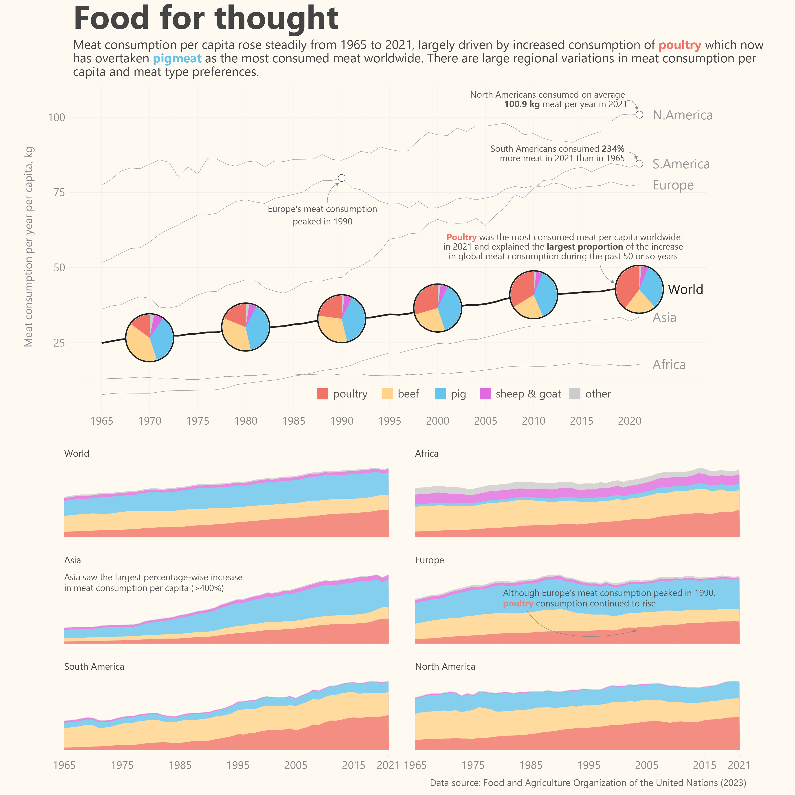
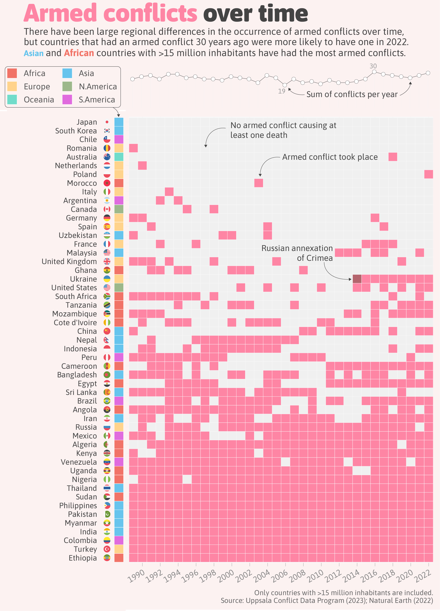
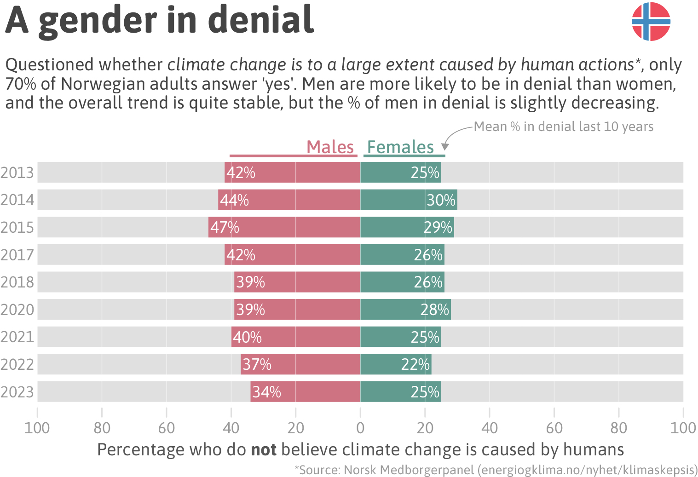
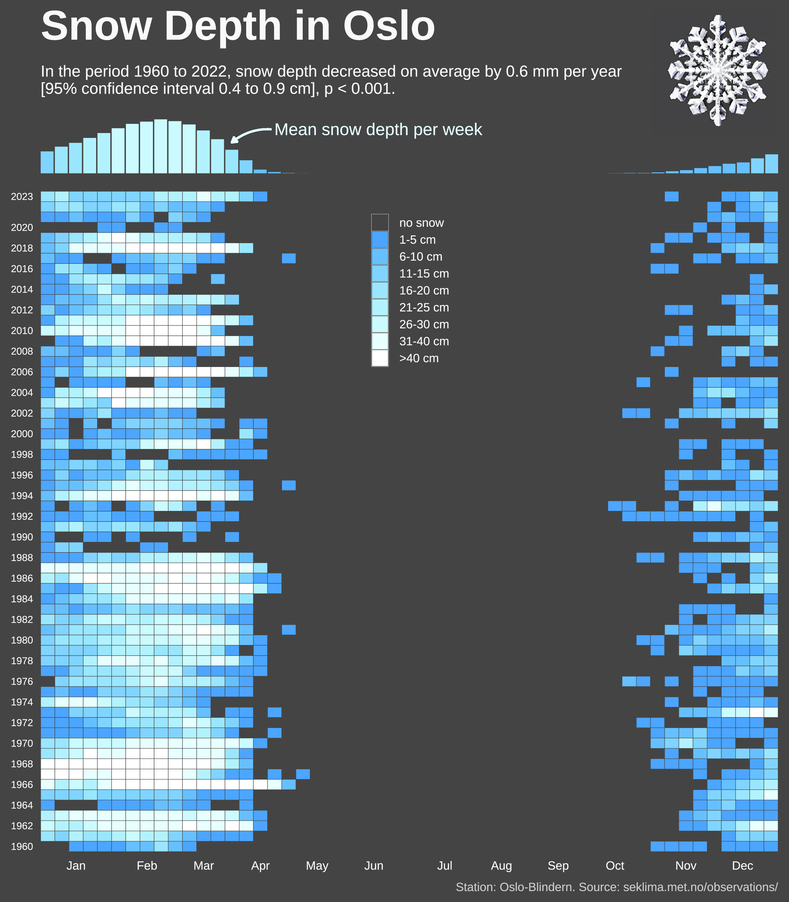
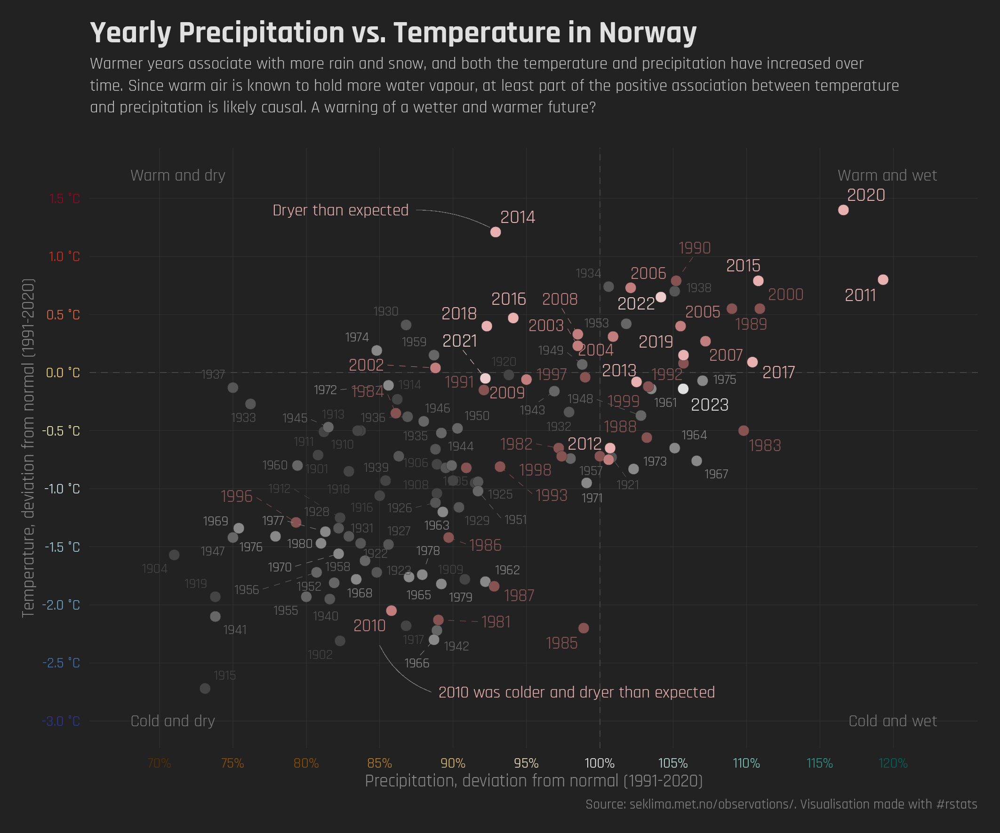
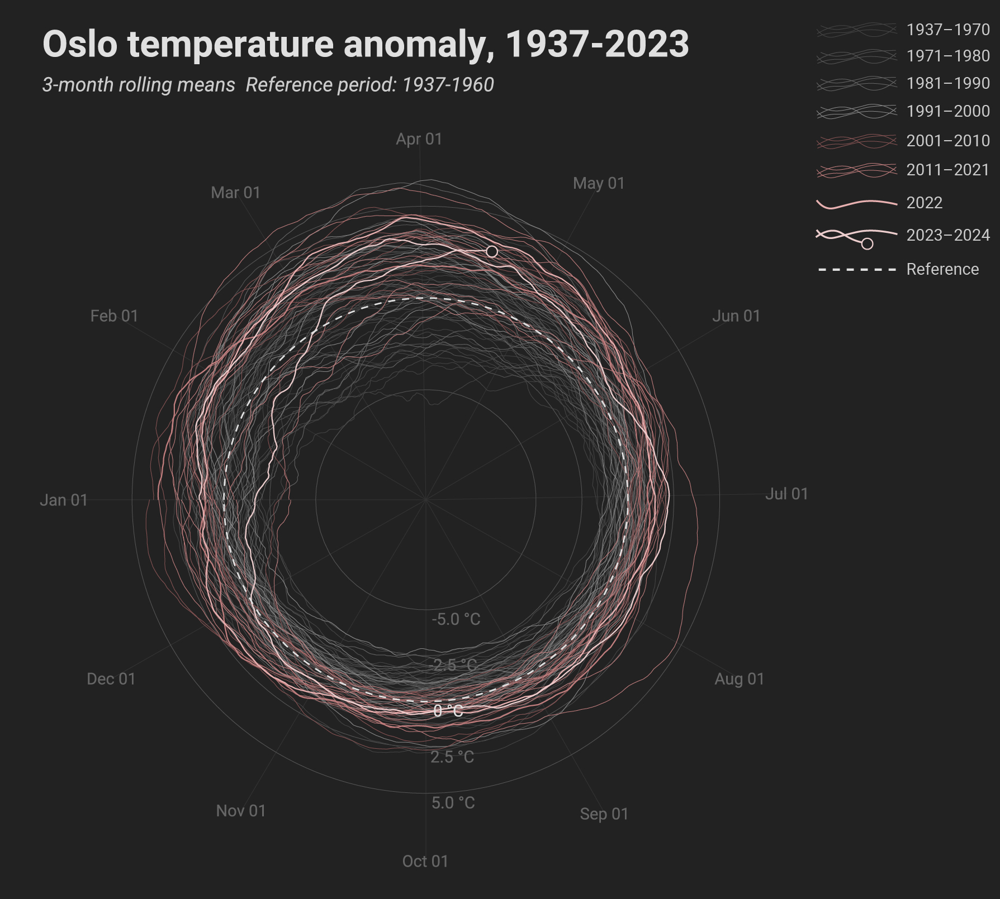

[**R code, sources and more information**](../../posts/apr_30day_p2/index.qmd)

## April 1st - part to whole

{group="apr30daygallery"}

  

## April 4th - Waffle

{group="apr30daygallery"}

  

## April 5th - Diverging

{group="apr30daygallery"}

  

## April 8th - Circular

{group="apr30daygallery"}

  

## April 9th - major/minor

  

## April 10th - Physical

{group="apr30daygallery"}

  

## April 12th - Reuters Graphics (theme day)

{group="apr30daygallery"}

  

## April 14th - Heatmap

{group="apr30daygallery"}

  

## April 16th - Weather

{group="apr30daygallery"}

  

## April 20th - Correlation

{group="apr30daygallery"}

  

## April 23rd - Tiles

{group="apr30daygallery"}

  
  

## April 27th - Good/Bad

{group="apr30daygallery"}

  
  

## April 28th - Trend

{group="apr30daygallery"}

{group="apr30daygallery"}
