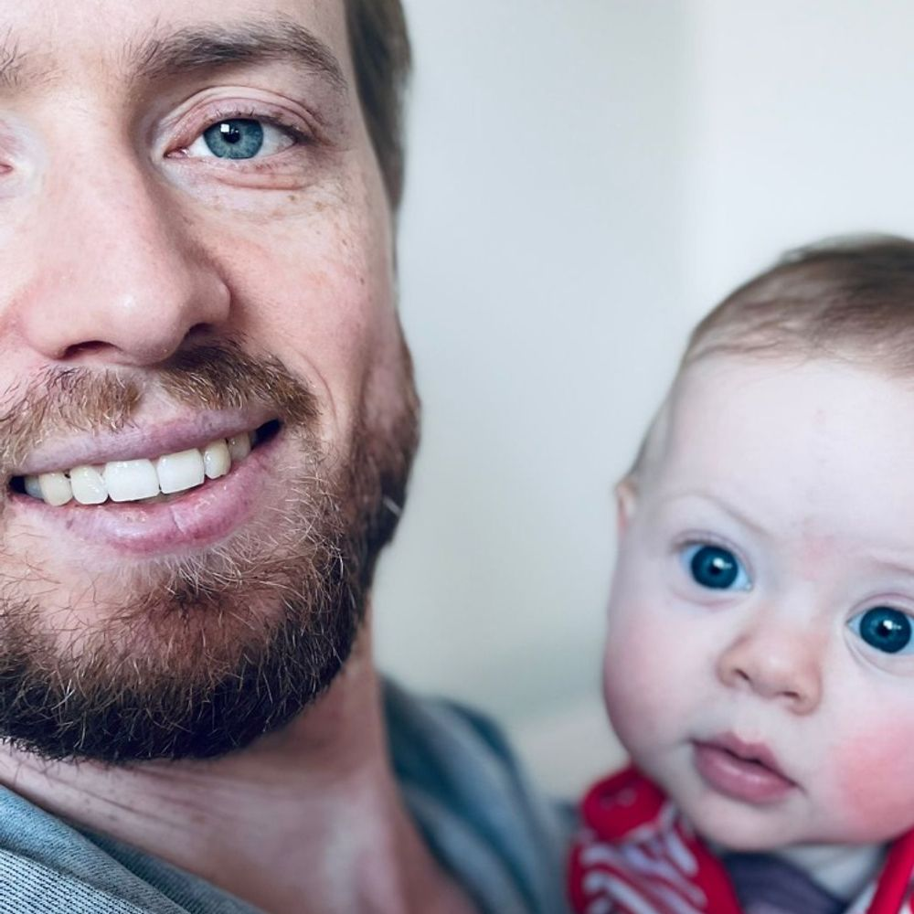

Hi <iconify-icon icon="emojione:waving-hand" width="1.6em" height="1.6em"></iconify-icon>

::: grid
::: {.g-col-12 .g-col-md-9}
My name is Peder Rustøen Braadland. I was born in Oslo, Norway in 1988. I studied biotechnology at the Norwegian University of Science and Technology (NTNU, Trondheim, Norway), where I specialized in biochemistry and biopolymers. After the 4th year of studies I decided to work on molecular tumor biology of prostate cancer for my Master's project at the Institute for Cancer Research in Oslo, which I finished in 2014. The next two years or so I worked as a research assistant at the same institute, continuing my work on prostate cancer, which culminated in the successful acquisition of a research grant for a PhD position.
:::
::: {.g-col-12 .g-col-md-3}
{.round-image}
:::
:::

Between 2016 and 2020 I did my PhD, focusing on how prostate cancer cells undergo lineage switching during targeted therapy. While close to all untreated prostate cancer cells are dependent on androgens (male sex hormones) binding to the androgen receptor to grow, treatments targeting the androgen receptor axis lead to treatment resistance in most cases. This resistance may manifest in several ways. In my project, I was mostly interested in a mechanism where the cells transdifferentiate into a neurodendocrine-like, androgen independent phenotype. In brief, I found that cells with knocked down (i.e. reduced) cellular levels of the transmembrane protein ADRB2 (beta2-adrenergic receptor) failed to undergo this switch when challenged with androgen deprivation.

My group at the time had previously found that men with prostate cancer taking beta blockers (ADRB antagonists) had improved overall survival compared to those not taking beta blockers. And men with prostate cancer rarely die from the disease without undergoing androgen receptor-targeted therapy(ies). We could not rule out that that specific observation could be explained at least in part by residual confounding. But, in light of my new findings, a role of ADRB2 in the development of treatment resistance was plausible.

After defending my thesis on the 27th of February 2020 I was home with my second-born child until August when I started a postdoc position at the Norwegian PSC Research Center (Oslo), where I'm currently employed for my second postdoc (contract ends around November 2026). Here I work on a rare, chronic, inflammatory disease of the liver and bile ducts called primary sclerosing cholangitis (PSC). The disease is characterized by progressive stricturings of the bile ducts, causing the build-up of bile in the liver (cholestasis), fibrosis and ultimately liver failure (cirrhosis). The only available treatment for PSC today is liver transplantation, which is a major surgical procedure with several comorbidities. In fact, PSC is the second leading indication for liver transplantation in Norway!

The etiology of PSC is largely unknown, but the gut is heavily implicated: Firstly, around 80% of people with PSC also have inflammatory bowel disease (IBD). Secondly, the gut microbiome of people with PSC has lower diversity and an altered composition compared to people without PSC. Finally, the gut microbiome of people with PSC who have been liver transplanted does not return to normal, and there is a high risk (\~60%) of PSC returning in the new livers.

Blood from the gut is directly transported to the liver via the portal vein (often termed the *gut-liver axis*). My work revolves around investigating whether the gut-liver axis plays a role in PSC, which is a large part of my group's agenda. In my project, I work on discovering gut microbiota-derived metabolites (we normally refer to these as **signals**). Through close collaborations with experts in biochemistry and cell-based model systems, my aim is to identify novel metabolites produced by the dysbiotic guts of people with PSC and test their effects in relevant model systems.
