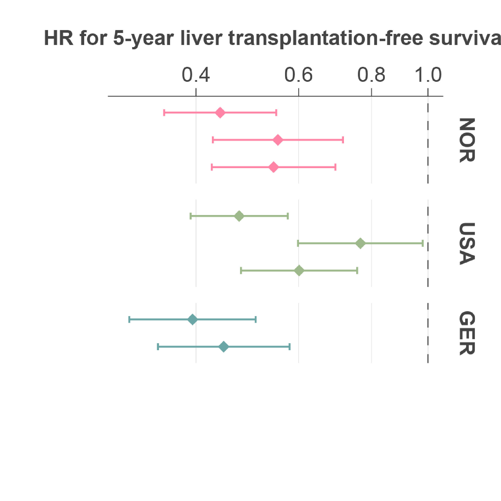
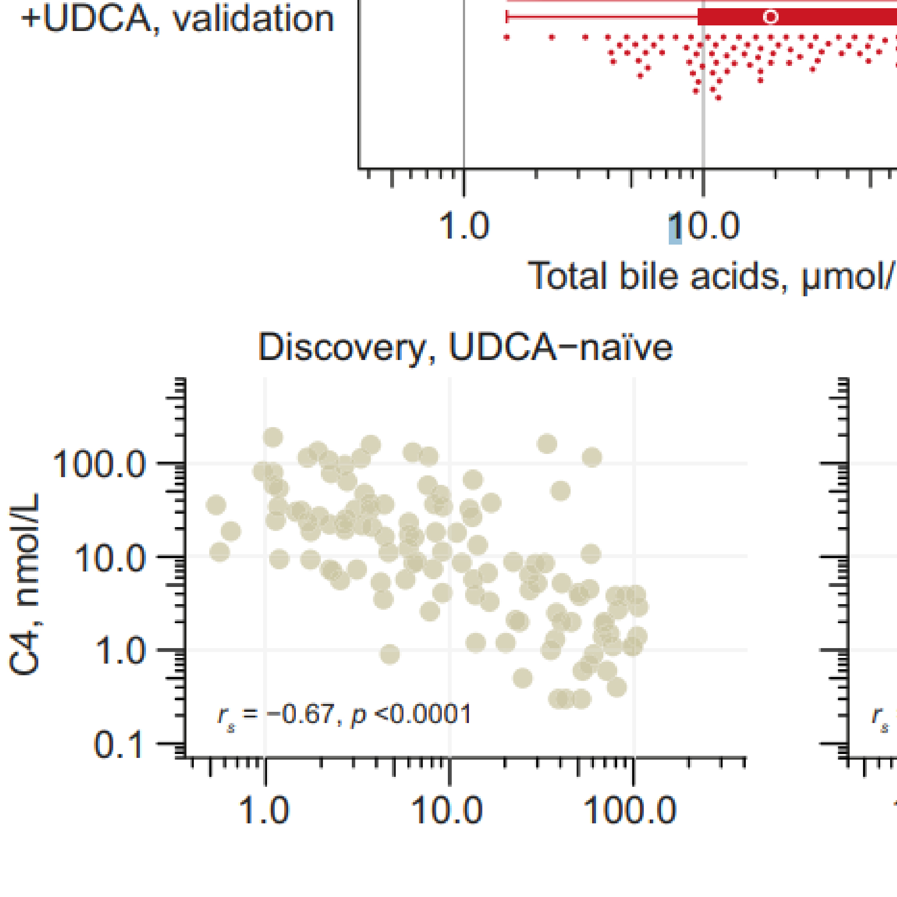
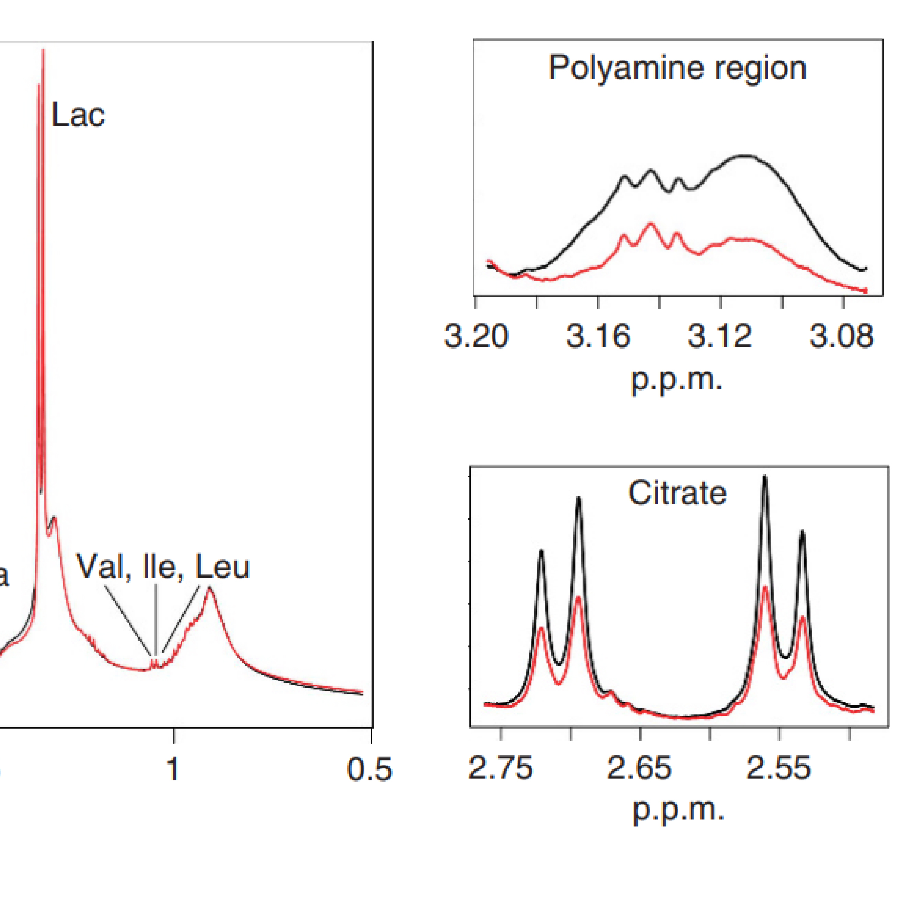
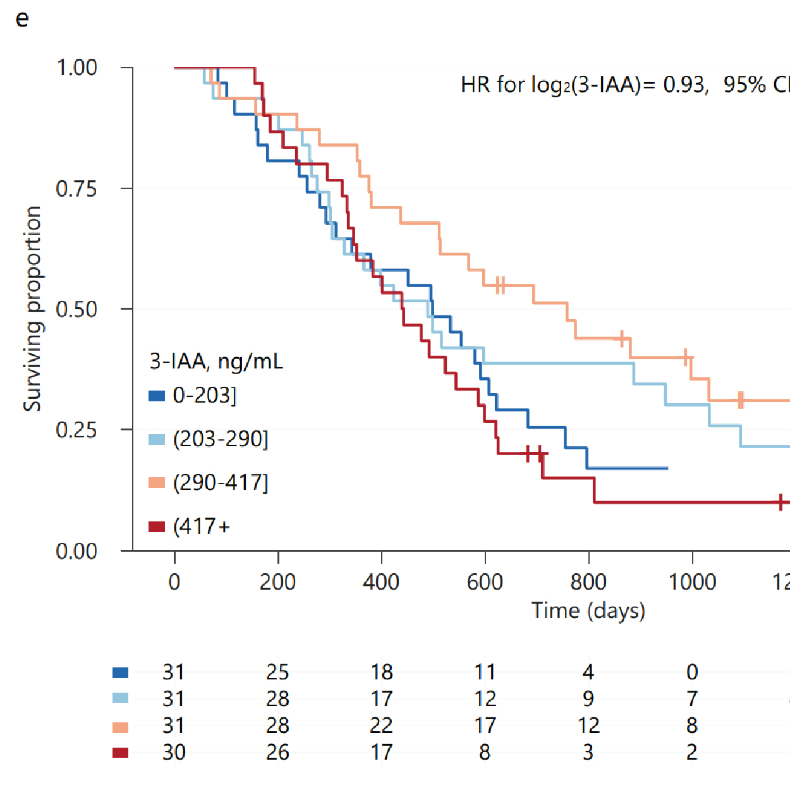

::: grid
::: {.g-col-12 .g-col-md-4}
{.rounded-image}
:::

::: {.g-col-12 .g-col-md-8}
Hi <iconify-icon icon="emojione:waving-hand" width="1.6em" height="1.6em"></iconify-icon> I'm Peder!    I'm a trained molecular biologist with a great interest in biostatistics, data visualisation and `rstats`. Currently I'm employed as a postdoc in the [Genomics and Metagenomics in Inflammatory Disorders group](https://www.ous-research.no/hov/) at the Norwegian PSC Research Center in Oslo.    I've made this blog primarily as a repository for my data visualizations and code, which can come in handy when colleagues ask me for help with `rstats`, coding and biostatistics, or if they simply need inspiration for how they can visualize/tell stories with their data. In fact I sometimes visit the blog to remind myself of how to perform particular tasks in `rstats`. This blog is also a place where I can rant about various work-related frustrations.
:::
:::
<a href="#blog" class="read-button"> Click here to go to my blog posts<iconify-icon icon="weui:arrow-filled" height="1.2em"></iconify-icon></a>

## Selected research <iconify-icon icon="material-symbols:article-rounded">
::: scroll-container
::: box
00203-5/fulltext)

[Journal of Hepatology, 2026]{.journal-name}

[Vitamin B6 predicts poor outcomes in geographically distinct populations with primary sclerosing cholangitis]{.article-name}

[We expand on our previous findings by investigating vitamin B6's prognostic value in >1,200 people from three geographically independent PSC cohorts. We verify PLP's value to predict liver transplant-free survival, and also show that it has prognostic value to predict hepatic decompensation - often considered a more objective endpoint.]{.article-desc}

<a href="https://www.journal-of-hepatology.eu/article/S0168-8278(26)00203-5/fulltext" class="read-button" target="_blank">Read<iconify-icon icon="weui:arrow-filled" height="1.2em"></iconify-icon> </a>

:::
::: box
00415-4)

[Journal of Hepatology, 2024]{.journal-name}

[Clinical and biochemical impact of vitamin B6 deficiency in primary sclerosing cholangitis before and after liver transplantation]{.article-name}

[We show that vitamin B6 deficiency is prevalent among people with primary sclerosing cholangitis both before and after liver transplantation. Low vitamin B6 associates with altered flux of B6-dependent biochemical pathways and reduced survival both before and after liver transplantation.]{.article-desc}

<a href="https://linkinghub.elsevier.com/retrieve/pii/S0168-8278(23)00415-4" class="read-button" target="_blank">Read<iconify-icon icon="weui:arrow-filled" height="1.2em"></iconify-icon> </a>

:::
::: box
00133-1/fulltext)

[Journal of Hepatology Reports, 2022]{.journal-name}

[Suppression of bile acid synthesis as a tipping point in the disease course of primary sclerosing cholangitis]{.article-name}

[We found bile acid accumulation-associated suppression of bile acid synthesis in advanced PSC, as indicated by reduced C4. Low C4 associated with poor outcomes. In a subset of the patients, bile acid synthesis was likely suppressed beyond a tipping point where pharmacological suppression may be futile.]{.article-desc}

<a href="https://www.jhep-reports.eu/article/S2589-5559(22)00133-1/fulltext" class="read-button" target="_blank">Read<iconify-icon icon="weui:arrow-filled" height="1.2em"></iconify-icon> </a>

:::
::: box

[British Journal of Cancer, 2018]{.journal-name}

[Ex vivo metabolic fingerprinting identifies biomarkers predictive of prostate cancer recurrence following radical prostatectomy]{.article-name}

[Using ex vivo magnetic resonance spectroscopy, we find reduced levels of citrate and spermine in prostate cancer tumors. Low spermine and high levels of the ratio of choline and creatine to spermine in primary tumors were associated with reduced recurrence-free survival after radical prostatectomy.]{.article-desc}

<a href="https://www.nature.com/articles/bjc2017346" class="read-button" target="_blank">Read<iconify-icon icon="weui:arrow-filled" height="1.2em"></iconify-icon> </a>

:::
::: box

[Frontiers in Oncology, 2024]{.journal-name}

[Indole 3-acetate and response to therapy in borderline resectable or locally advanced pancreatic cancer]{.article-name}

[A 2022 Nature study found that circulating levels of microbial 3-IAA associated with improved outcomes in people with metastatic pancreatic cancer undergoing chemotherapy. We measured circulating 3-IAA in borderline resectable or locally advanced pancreatic cancer, but found no association with outcomes.]{.article-desc}

<a href="https://www.frontiersin.org/journals/oncology/articles/10.3389/fonc.2024.1488749/full" class="read-button" target="_blank">Read<iconify-icon icon="weui:arrow-filled" height="1.2em"></iconify-icon> </a>

:::
:::

### Blog

