In this blog post I will post all my contributions to the 2025 #30DayChartChallenge.

## Day 1 Comparisons::Fractions

### Alternative 1

```{r echo = TRUE, message = FALSE, warning = FALSE}
library(sf)
library(tidyverse)
library(rnaturalearth)
library(showtext)
library(png)
library(ggtext)
"%ni%" <- Negate("%in%")
logo <- readPNG("../../images/logo_gray_png.png")
logo_red <- readPNG("../../images/logo_red_png.png")
font_add_google("IBM Plex Sans", regular.wt = 300)
update_geom_defaults("text", list(family = "IBM Plex Sans"))

# Get Norway map and transform the target coordinate reference system
norway_map <- ne_countries(scale = "medium", country = "Norway", returnclass = "sf") %>%
  st_transform(crs = 25832)

# Define a bounding box that covers only mainland Norway
mainland_bbox <- st_bbox(c(xmin = 0, xmax = 35, ymin = 57, ymax = 71), crs = 4326) %>%
  st_as_sfc() %>%
  st_transform(crs = 25832)

# Intersect Norway's map with the bounding box to exclude Svalbard & Jan Mayen
norway_mainland <- st_intersection(norway_map, mainland_bbox)

# We can now find the area of Mainland Norway using st_area()
# This we can use later to calculate the percentage of protected land area
area_nor_mainland <- st_area(norway_mainland) # 3.25e11 m2
# We divide by 1 million to get squared kilometeres
area_nor_mainland <- units::set_units(area_nor_mainland, km^2)

# Create a hexagonal grid over Norway's extent
# Could have made each hexagon e.g. 1/100th of Norway's area but I found the hexagons to be too large that way so I instead played around with the size manually (each hexagon is 1/120th of Norway's area)
grid <- st_make_grid(norway_mainland, cellsize = area_nor_mainland / 120, what = "polygons", square = FALSE)

# Keep only the grid cells that overlap with mainland Norway
grid <- st_intersection(grid, st_union(norway_map))

# Convert to sf object
grid_sf <- st_sf(geometry = grid)

# Compute centroids of grid cells and sort by latitude (so that we "fill" up Norway like a glass)
grid_sf$centroid_y <- st_coordinates(st_centroid(grid_sf))[, 2]
grid_sf <- grid_sf %>% arrange(centroid_y)

# We now load data from https://miljostatus.miljodirektoratet.no/miljomal/naturmangfold/miljomal-1.3/miljoindikator-1.3.1
# Containing data on protected areas by category, given in square kilometer
percentages_df <- read_delim("day1/vern_year.txt") %>%
  mutate(
    protected = national_park + nature_reserve + protected_landscape_area + other_protected_area,
    non_protected = as.numeric(area_nor_mainland) - protected,
    p_protected = protected / (protected + non_protected)
  ) %>%
  filter(year %in% c(1980, 1990, 2000, 2010, 2020, 2023)) %>%
  select(year, p_protected)

# Ensure years and percentages match
years <- percentages_df$year
percentages <- percentages_df$p_protected

# Create a faceted dataset with different fill levels (corresponding to percentages for each year)
# This iterates through each year's proportion of protected land
# It determines how many grid cells (num_fill) should be fill to represent the protection level
# This part was really tricky to do in an automated way so I had an LLM do it for me
grid_facet <- bind_rows(lapply(seq_along(percentages), function(i) {
  p <- percentages[i]
  num_fill <- round(p * nrow(grid_sf))
  grid_sf %>%
    mutate(
      fill = ifelse(seq_len(nrow(grid_sf)) <= num_fill, "filled", "empty"),
      fill_percentage = paste0(round(p * 100, 2), "% fill"),
      year = years[i]
    )
}))

map_plot <-
  grid_facet %>%
  ggplot() +
  geom_sf(aes(fill = fill), color = "#f5e6d3") +
  geom_sf(data = norway_mainland, fill = NA, color = "#222222", size = 0.01) +
  scale_fill_manual(values = c("filled" = "#d18681", "empty" = "#edd492")) +
  facet_wrap(~year, nrow = 1) + # Facet by year instead of fill_percentage
  labs(
    title = "Nature Conservation Area Change Over Time in Norway",
    subtitle = "Over the past 50 years there has been an increase in the protected land area of mainland Norway. In 2023, 17.5% of the mainland area (324,700 square kilometers) was protected, primarily as national parks. The <strong style='color: #d18681;'>red-colored hexagons</strong> indicate the fraction of Norway protected, and not the actual geographical locations.",
    fill = "Status"
  ) +
  theme_minimal(base_size = 7, base_family = "IBM Plex Sans") +
  theme(
    plot.background = element_rect(fill = "#f5e6d3", color = NA),
    legend.position = "none",
    plot.subtitle = element_textbox_simple(color = "#222222", margin = margin(2, 0, 5, 0), size = 6),
    plot.title = element_textbox_simple(color = "#222222", size = 9.5, margin = margin(4, 0, 5, 0), face = "bold"),
    axis.title = element_blank(),
    axis.text = element_blank(),
    panel.grid = element_blank()
    # plot.margin = unit(c(-15, 5, -15, 5), "mm")
  )

# Create bar plots showing fractions of the total protected area by type of protection
bar_prot_df <-
  read_delim("day1/vern_year.txt") %>%
  filter(year %in% c(1980, 1990, 2000, 2010, 2020, 2023)) %>%
  select(year, `National park` = national_park, `Nature reserve` = nature_reserve, `Protected landscape area` = protected_landscape_area) %>%
  pivot_longer(cols = -year, names_to = "type_of_protection")

bar_prot_perc <-
  bar_prot_df %>%
  group_by(year) %>%
  summarise(sum = sum(value)) %>%
  mutate(perc = paste0(round(100 * (sum / as.numeric(area_nor_mainland)), 1), "% protected"))

bar_prot <-
  bar_prot_df %>%
  left_join(bar_prot_perc) %>%
  ggplot(aes(x = value, y = type_of_protection, fill = type_of_protection, label = perc)) +
  geom_col(width = 0.6, color = "#222222", size = 0.1) +
  facet_grid(cols = vars(year), switch = "x") +
  scale_fill_manual(values = c("#7c9a78", "#B57F50", "#6a8782")) +
  theme_minimal(base_size = 6, base_family = "IBM Plex Sans") +
  theme(
    plot.background = element_rect(fill = "#f5e6d3", color = NA),
    legend.position = "bottom",
    legend.key.height = unit(1.1, "mm"),
    plot.caption = element_textbox_simple(color = "#666666", hjust = 0.5, margin = margin(5, 0, 3, 0)),
    axis.title = element_blank(),
    axis.text.y = element_blank(),
    axis.text.x = element_text(vjust = 0),
    axis.line.x = element_line(color = "#444444", size = 0.1),
    axis.ticks.x = element_line(color = "#444444", size = 0.1),
    axis.ticks.length.x = unit(1, "mm"),
    panel.grid = element_blank(),
    strip.text = element_blank(),
    panel.spacing = unit(0.75, "cm"),
    plot.margin = unit(c(2, 5, 2, 2), "mm")
  ) +
  guides(fill = guide_legend(label.position = "bottom", title = NULL, reverse = TRUE)) +
  scale_x_continuous(limits = c(0, 4e4), expand = c(0, 0), breaks = c(0, 2e4, 4e4), labels = c(expression(0), expression("20,000"), expression("40,000" ~ km^2))) +
  geom_text(y = 4.1, x = 0, size = 1.75, color = "#444444", hjust = 0) +
  coord_cartesian(clip = "off") +
  labs(
    caption = "**Source:** Miljodirektoratet | **Data <visualization:** Peder Braadland "
  )

library(patchwork)
composite <-
  map_plot + bar_prot +
  plot_layout(nrow = 2, heights = c(12, 1.5)) +
  plot_annotation(theme = theme(plot.background = element_rect(color = NA, fill = "#f5e6d3")))

# showtext_auto()
# showtext_opts(dpi = 500)
# ggsave("day1/out/p_nor_protect.jpg", composite, width = 160, height = 90, unit = "mm", dpi = 500)
```

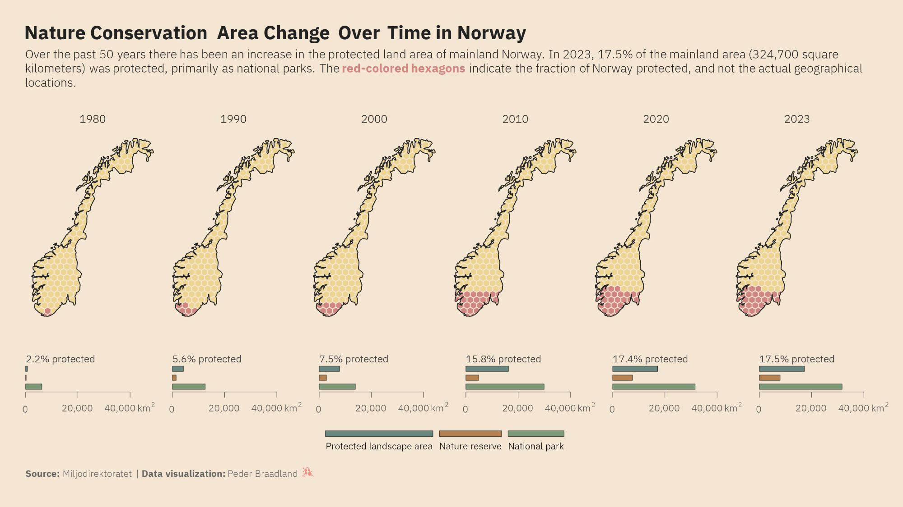{group="apr30daygallery"}

### Alternative 2

```{r echo = TRUE, message = FALSE, warning = FALSE}
library(tidyverse)
library(ggbeeswarm)
library(ggplotify)
library(cowplot)
library(grid)
library(ggtext)
library(ggrepel)
library(png)
library(showtext)
"%ni%" <- Negate("%in%")
# Themes and aesthetics
update_geom_defaults("text", list(family = "IBM Plex Sans"))
update_geom_defaults("label_repel", list(family = "IBM Plex Sans"))

font_add_google("IBM Plex Sans", "ibm", regular.wt = 300)
font_add_google("Roboto Condensed", "roboto_head")


waffle_theme <- function() {
  theme_minimal(base_family = "ibm", base_size = 7) +
    theme(
      panel.grid = element_blank(),
      axis.text = element_blank(),
      axis.title = element_blank(),
      axis.ticks = element_blank(),
      strip.text = element_text(size = 6, hjust = 0, face = "bold"),
      panel.margin.y = unit(0.1, "lines"),
      plot.title = element_textbox_simple(family = "roboto_head", face = "bold", size = 16, margin = margin(2, 0, 5, 0)),
      plot.subtitle = element_textbox_simple(margin = margin(4, 0, 8, 0)),
      plot.caption = element_textbox_simple(color = "#999999", hjust = 0, margin = margin(10, 0, 0, 0)),
      plot.margin = unit(c(5, 2, 5, 2), "mm"),
      legend.position = "none"
    )
}

leg_theme <- function() {
  theme_minimal(base_family = "ibm", base_size = 6) +
    theme(
      panel.grid = element_blank(),
      axis.text.y = element_blank(),
      axis.title.y = element_blank(),
      axis.ticks.y = element_blank(),
      axis.ticks.x = element_line(size = 0.15, color = "#222222"),
      axis.line.x = element_line(size = 0.15, color = "#222222"),
      axis.ticks.length.x = unit(1.5, "mm"),
      plot.background = element_rect(fill = "white", color = NA),
      legend.position = "none"
    )
}

# Colors for R2 categories
fill_r2 <- c(
  "Low" = "#e7ebed",
  "Int. low" = "#a1b0b8",
  "Int. high" = "#4e6a78",
  "High" = "#111111"
)

# A picture of a bacterium
bact <- readPNG("day1/bacteria.png")

# My logo
logo <- readPNG("../../images/logo_gray_png.png")
logo_red <- readPNG("../../images/logo_red_png.png")

# Load metabolite annotation data
met_ann <- read_delim("day1/met_ann.txt") %>%
  select(biochem = Biochemical, super_pathw = SuperPathway) %>%
  mutate(super_pathw = case_when(
    super_pathw == "Amino Acid" ~ "Amino acids",
    super_pathw == "Carbohydrate" ~ "Carbohydrates",
    super_pathw == "Cofactors and Vitamins" ~ "Cofactors/vitamins",
    super_pathw == "Lipid" ~ "Lipids",
    super_pathw == "Nucleotide" ~ "Nucleotides",
    super_pathw == "Peptide" ~ "Peptides",
    TRUE ~ super_pathw
  ))

# Load variance explained by gut microbiome data
var_expl <- read_delim("day1/dekkers_var_expl.txt", locale = locale(decimal_mark = ",")) %>%
  select(biochem, r2) %>%
  # Join in metabolite annotation data
  left_join(met_ann, by = "biochem") %>%
  mutate(super_pathw = ifelse(is.na(super_pathw), "Unknown pathway", super_pathw)) %>%
  # Categorize variance explained by microbiome
  mutate(r2_cat = case_when(
    r2 > 0.3 ~ "High",
    r2 <= 0.3 & r2 > 0.15 ~ "Int. high",
    r2 <= 0.15 & r2 > 0.05 ~ "Int. low",
    r2 <= 0.05 ~ "Low"
  )) %>%
  # Remove pathways with few observations
  filter(super_pathw %ni% c("Partially Characterized Molecules", "Energy"))

# Ordering by number of metabolites per super_pathw
pathw_ord <-
  var_expl %>%
  group_by(super_pathw) %>%
  count() %>%
  arrange(desc(n)) %>%
  pull(super_pathw)

# Wide screen friendly
# ----------------------------------------------------------------------------->
# Wrangle the data for a waffle, with 10 columns per row
var_expl_waffle <-
  var_expl %>%
  group_by(super_pathw) %>%
  mutate(
    row = (row_number() - 1) %% 10 + 1,
    col = (row_number() - 1) %/% 10 + 1
  ) %>%
  mutate(super_pathw = factor(super_pathw, levels = pathw_ord)) %>%
  mutate(ann_lab = case_when(biochem %in% c("p-cresol sulfate", "phenylacetylglutamine", "phenylacetate", "isoursodeoxycholate") ~ "lab", TRUE ~ "nolab")) %>%
  mutate(biochem = case_when(
    biochem == "phenylacetylglutamine" ~ "PAGln",
    biochem == "isoursodeoxycholate" ~ "iso-UDCA",
    TRUE ~ biochem
  ))

# Plot the waffle plot
p_fractions <-
  ggplot(var_expl_waffle, aes(y = col, x = row, fill = r2_cat)) +
  geom_tile(color = "white") + # Tile grid
  scale_y_reverse(expand = c(0, 0)) + # Reverse y-axis so it reads top-to-bottom
  facet_grid(cols = vars(super_pathw), space = "free", scales = "free") +
  waffle_theme() +
  labs(
    title = "Gut bacterial byproducts",
    subtitle = "Using an <span style = 'color:#4e6a78;'>**integrated blood metabolomics—stool metagenomics**</span> dataset, we can classify metabolites of various classes by how much their circulating **variation is explained by the gut microbiome**. While the metabolite library may be biased, these datasets nonetheless serve as a resource to identify metabolites of more-or-less gut microbial origin. *Some known microbial metabolites are annotated.*",
    caption = "**Source:** Dekkers et al., Nat Commun **2022** Sep 23;13(1):5370<br>Data visualization by Peder Braadland."
  ) +
  geom_label_repel(aes(label = ifelse(ann_lab == "lab", biochem, NA)), size = 1.8, box.padding = 0.5, min.segment.length = 0, alpha = 0.8, segment.size = 0.3, segment.curvature = -0.3, label.padding = 0.15, color = "#222222", fill = "#F9F9F9") +
  scale_fill_manual(values = fill_r2) +
  geom_vline(xintercept = 12, linetype = "dashed", linewidth = 0.1, color = "#F0F0F0")

leg <-
  var_expl %>%
  ggplot(aes(x = r2, color = r2_cat, y = "")) +
  geom_quasirandom(size = 1, shape = 16, width = 0.55) +
  leg_theme() +
  scale_color_manual(values = fill_r2) +
  scale_x_continuous(breaks = c(0, 0.05, 0.15, 0.30, 0.5), limits = c(0, 0.5), expand = expansion(mult = c(0, 0))) +
  scale_y_discrete(expand = c(0.05, 0.05)) +
  geom_segment(aes(x = 0.002, xend = 0.049, y = 0.35, yend = 0.35), linewidth = 3.2, color = "#e7ebed") +
  geom_segment(aes(x = 0.051, xend = 0.149, y = 0.35, yend = 0.35), linewidth = 3.2, color = "#a1b0b8") +
  geom_segment(aes(x = 0.151, xend = 0.299, y = 0.35, yend = 0.35), linewidth = 3.2, color = "#4e6a78") +
  geom_segment(aes(x = 0.301, xend = 0.50, y = 0.35, yend = 0.35), linewidth = 3.2, color = "#111111") +
  # Empty spacer for more space
  geom_segment(aes(x = 0.301, xend = 0.50, y = 0.25, yend = 0.25), linewidth = 3, color = "#FFFFFF") +
  # Text annotations
  annotate(geom = "text", label = "Low", x = 0.025, hjust = 0.5, y = 0.35, size = 1.8, vjust = 0.5, color = "#222222") +
  annotate(geom = "text", label = "Low int.", x = 0.15 - 0.05, hjust = 0.5, y = 0.35, size = 1.8, vjust = 0.5, color = "#222222") +
  annotate(geom = "text", label = "High int.", x = 0.15 + (0.30 - 0.15) / 2, hjust = 0.5, y = 0.35, size = 1.8, vjust = 0.5, color = "#F9F9F9") +
  annotate(geom = "text", label = "High", x = 0.30 + (0.50 - 0.30) / 2, hjust = 0.5, y = 0.35, size = 1.8, vjust = 0.5, color = "#F9F9F9") +
  labs(
    x = expression("Variance explained by the microbiome, R"^2)
  )

# Composite
final_plot <- ggdraw() +
  draw_plot(p_fractions, 0, 0, 1, 1) +
  draw_grob(as.grob(leg), x = 0.49, y = 0.05, width = 0.50, height = 0.5) +
  draw_grob(rasterGrob(bact), x = 0.33, y = 0.91, width = 0.05, height = 0.05) +
  draw_grob(rasterGrob(logo), x = 0.95, y = 0.02, width = 0.05, height = 0.05)

showtext_auto()
showtext_opts(dpi = 500)
#ggsave("day1/out/p_fractions_wide.jpg", final_plot, width = 180, height = 100, unit = "mm", dpi = 500)

# Cell phone screen friendly
# ----------------------------------------------------------------------------->
# Wrangle the data for a waffle, with 5 rows per column
var_expl_waffle <-
  var_expl %>%
  group_by(super_pathw) %>%
  mutate(
    row = (row_number() - 1) %% 5 + 1,
    col = (row_number() - 1) %/% 5 + 1
  ) %>%
  mutate(super_pathw = factor(super_pathw, levels = pathw_ord)) %>%
  mutate(ann_lab = case_when(biochem %in% c("p-cresol sulfate", "phenylacetylglutamine", "phenylacetate", "isoursodeoxycholate") ~ "lab", TRUE ~ "nolab")) %>%
  mutate(biochem = case_when(
    biochem == "phenylacetylglutamine" ~ "PAGln",
    biochem == "isoursodeoxycholate" ~ "iso-UDCA",
    TRUE ~ biochem
  ))

# Plot the waffle plot
p_fractions <-
  ggplot(var_expl_waffle, aes(x = col, y = row, fill = r2_cat)) +
  geom_tile(color = "white") + # Tile grid
  scale_x_continuous(expand = c(0, 0)) + # Reverse y-axis so it reads top-to-bottom
  facet_wrap(~super_pathw, nrow = 8) +
  waffle_theme() +
  theme(
    strip.text = element_text(size = 6, hjust = 0, margin = margin(l = 0, b = 1), face = "bold")
  ) +
  labs(
    title = "Gut bacterial byproducts",
    subtitle = "Using an <span style = 'color:#4e6a78;'>**integrated blood metabolomics—stool metagenomics**</span> dataset, we can classify metabolites of various classes by how much their circulating **variation is explained by the gut microbiome**. While the metabolite library may be biased, these datasets nonetheless serve as a resource to identify metabolites of more-or-less gut microbial origin. *Some known microbial metabolites are annotated.*",
    caption = "**Source:** Dekkers et al., Nat Commun **2022** Sep 23;13(1):5370<br>Data visualization by Peder Braadland."
  ) +
  geom_label_repel(aes(label = ifelse(ann_lab == "lab", biochem, NA)), size = 1.8, box.padding = 0.5, min.segment.length = 0, alpha = 0.8, segment.size = 0.3, segment.curvature = -0.3, label.padding = 0.15, color = "#222222", fill = "#F9F9F9") +
  scale_fill_manual(values = fill_r2)

leg <-
  var_expl %>%
  ggplot(aes(x = r2, color = r2_cat, y = "")) +
  leg_theme() +
  theme(
    plot.background = element_rect(fill = "#F9F9F9", color = NA),
    plot.margin = unit(c(1, 4, 1, 4), "mm")
  ) +
  scale_color_manual(values = fill_r2) +
  scale_x_continuous(breaks = c(0, 0.05, 0.15, 0.30, 0.5), limits = c(0, 0.5), expand = expansion(mult = c(0, 0))) +
  scale_y_discrete(expand = c(0.05, 0.05)) +
  # Empty spacer for more space
  geom_segment(aes(x = 0.301, xend = 0.50, y = 0.075, yend = 0.075), linewidth = 3, color = "#F9F9F9") +
  # Annotating the categories: segments
  geom_segment(aes(x = 0.002, xend = 0.049, y = 0.15, yend = 0.15), linewidth = 3.2, color = "#e7ebed") +
  geom_segment(aes(x = 0.051, xend = 0.149, y = 0.15, yend = 0.15), linewidth = 3.2, color = "#a1b0b8") +
  geom_segment(aes(x = 0.151, xend = 0.299, y = 0.15, yend = 0.15), linewidth = 3.2, color = "#4e6a78") +
  geom_segment(aes(x = 0.301, xend = 0.50, y = 0.15, yend = 0.15), linewidth = 3.2, color = "#111111") +
  # Annotating the categories: text
  annotate(geom = "text", label = "Low", x = 0.025, hjust = 0.5, y = 0.15, size = 1.8, vjust = 0.5, color = "#222222") +
  annotate(geom = "text", label = "Low int.", x = 0.15 - 0.05, hjust = 0.5, y = 0.15, size = 1.8, vjust = 0.5, color = "#222222") +
  annotate(geom = "text", label = "High int.", x = 0.15 + (0.30 - 0.15) / 2, hjust = 0.5, y = 0.15, size = 1.8, vjust = 0.5, color = "#F9F9F9") +
  annotate(geom = "text", label = "High", x = 0.30 + (0.50 - 0.30) / 2, hjust = 0.5, y = 0.15, size = 1.8, vjust = 0.5, color = "#F9F9F9") +
  labs(
    x = expression("Variance explained by the microbiome, R"^2)
  )

# Composite
final_plot <- ggdraw() +
  draw_plot(p_fractions, 0, 0, 1, 1) +
  draw_grob(as.grob(leg), x = 0.3, y = 0.25, width = 0.6, height = 0.12) +
  draw_grob(rasterGrob(bact), x = 0.66, y = 0.89, width = 0.12, height = 0.12) +
  draw_grob(rasterGrob(logo), x = 0.93, y = 0.01, width = 0.05, height = 0.05)

showtext_opts(dpi = 500)
#ggsave("day1/out/p_fractions_cellph.jpg", final_plot, width = 90, height = 150, unit = "mm", dpi = 500)
```


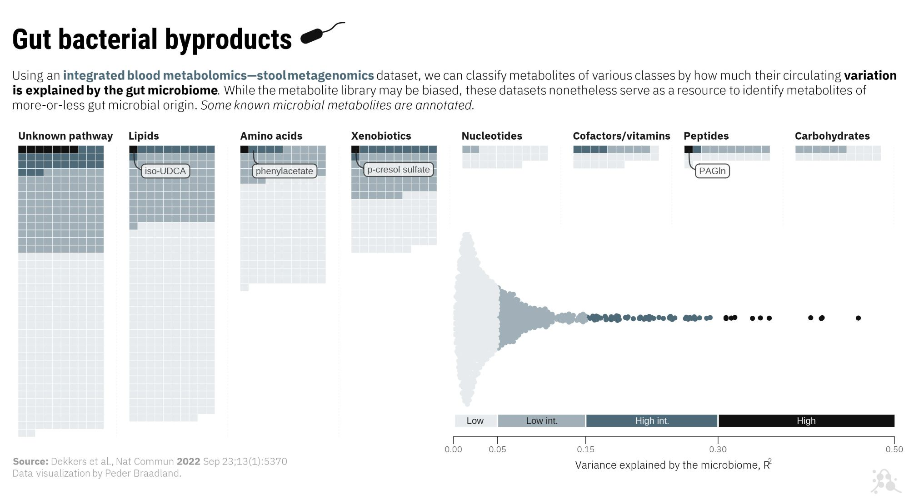{group="apr30daygallery"}

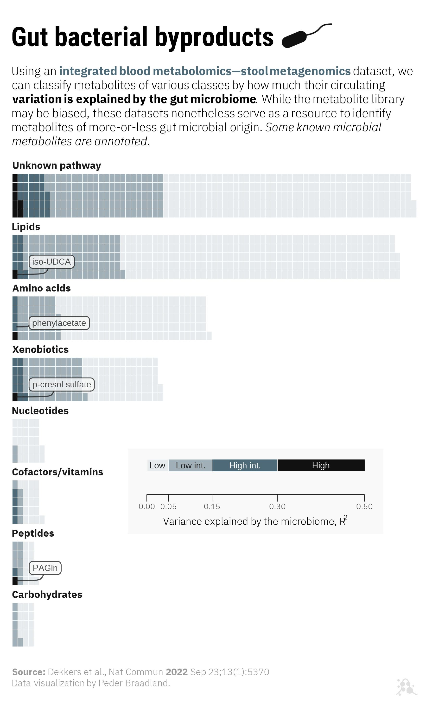{width=60% fig-align="left" group="apr30daygallery"}

## Day 2 Comparisons::Slope

```{r echo = TRUE, message = FALSE, warning = FALSE}
# https://www.ifw-kiel.de/publications/ukraine-support-tracker-data-20758/
# The data indicates total bilateral aid allocations to Ukraine in <U+20AC> billion with traceable months between February 1, 2022 and December 31, 2024. Allocations are defined as aid which has been delivered or specified for delivery.

# the ggflags package is available here: https://github.com/jimjam-slam/ggflags
library(tidyverse)
library(showtext)
library(ggflags)
font_add_google("IBM Plex Sans")

ua_aid_eu_us <-
  read_delim("day2/ua_aid_eu_us.txt", locale = locale(decimal_mark = ",")) %>%
  pivot_longer(cols = -date, values_to = "allocated_bn_eur", names_to = "region") %>%
  mutate(region = ifelse(str_detect(region, "us"), "USA", "EU")) %>%
  mutate(date = dmy(date)) %>%
  # Calculate cumulative sum by region
  group_by(region) %>%
  mutate(cumulative_sum = cumsum(allocated_bn_eur)) %>%
  # Add country codes for the geom_flag
  mutate(country_code = ifelse(region == "USA", "us", "eu"))


gradient_fill <- grid::linearGradient(
  c("#FFFFFF", "#FFFFFF", "#1fa99f10", "#1fa99f10"),
  stops = c(0, 0.05, 0.95, 1),
  x2 = unit(0, "npc")
) #fffbf3

ua_aid_eu_us_p <-
  ua_aid_eu_us %>%
  ggplot(aes(x = date, y = cumulative_sum, group = region, color = region)) +
  geom_segment(aes(x = as.Date(-Inf), xend = as.Date(Inf), y = 0, yend = 0), color = "#333333", size = 0.2) +
  geom_line(size = 2, alpha = 0.8) +
  geom_point(
    data = ua_aid_eu_us %>% filter(date < max(ua_aid_eu_us$date) & date > min(ua_aid_eu_us$date)),
    aes(x = date, y = cumulative_sum),
    color = "#F0F0F0", size = 0.7
  ) +
  geom_flag(
    data = ua_aid_eu_us %>% filter(date == max(data = ua_aid_eu_us$date)),
    aes(country = country_code), size = 4.5
  ) +
  scale_x_date() +
  scale_y_continuous(breaks = seq(0, 120, 20), labels = c("0", "20", "40", "60", "80", "100", "120bn €"), expand = c(0, 0)) +
  labs(
    title = "Who have donated more?",
    subtitle = "Cumulative sum of aid allocations to Ukraine from <strong style='color: #1277b0;'>Europe</strong> and the <strong style='color: #ec7477;'>United States</strong> between February 2022 and December 2024."
  ) +
  theme_minimal(base_family = "IBM Plex Sans", base_size = 6.5) +
  theme(
    axis.title.y = element_blank(), axis.title.x = element_blank(),
    axis.text.y = element_text(margin = margin(r = -26), vjust = -0.5, hjust = 0, size = 6.5),
    axis.text.x = element_text(size = 6.5),
    panel.grid.minor = element_blank(),
    panel.grid.major.x = element_blank(),
    panel.grid.major.y = element_line(color = "#e0e0e0"),
    axis.ticks.x = element_line(color = "#333333", size = 0.2),
    # axis.line.x = element_line(color = "#333333", size = 0.2),
    axis.ticks.length.x = unit(2, "mm"),
    legend.position = "none",
    plot.margin = unit(c(5, 2, 5, 2), "mm"),
    plot.background = element_rect(fill = gradient_fill, color = NA),
    plot.subtitle = element_textbox_simple(color = "#333333", size = 6, margin = margin(2, 0, 5, 0)),
    plot.title = element_text(size = 12, color = "#333333", face = "bold"),
    plot.caption = element_textbox_simple(margin = margin(5, 0, 0, 0), color = "#999999", size = 4.5)
  ) +
  scale_color_manual(values = c("#1277b0", "#ec7477")) +
  coord_cartesian(clip = "off") +
  labs(
    caption = "**Source:** Ukraine Support Tracker; ifw-kiel.de/publications/ukraine-support-tracker-data-20758/<br>**Data visualization:** Peder Braadland "
  )

showtext_auto()
showtext_opts(dpi = 500)
ggsave("day2/out/ua_aid_eu_us.jpg", ua_aid_eu_us_p, width = 90, height = 70, unit = "mm", dpi = 500)
```

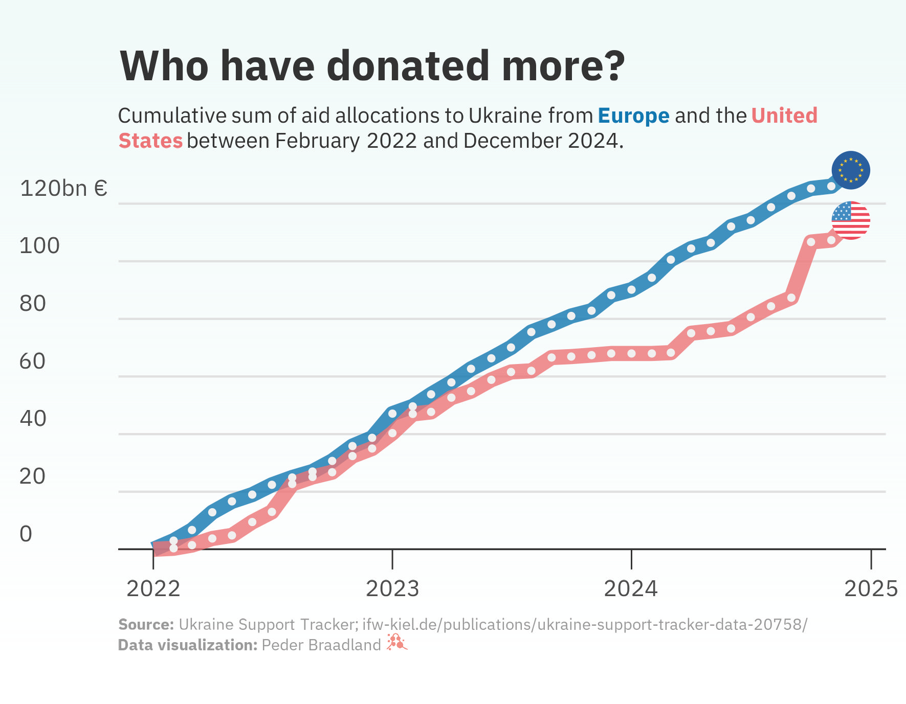{width=60% fig-align="left" group="apr30daygallery"}

## Day 3 Comparisons::Circular

```{r echo = TRUE, message = FALSE, warning = FALSE}
# Total bilateral allocations to Ukraine from February 1st 2022 to today, as % of 2021 GDP
# Data downloaded from https://www.ifw-kiel.de/publications/ukraine-support-tracker-data-20758/
# Allocations are defined as aid which has been delivered or specified for delivery.
font_add_google("Bebas Neue")

library(tidyverse)
library(ggbrick)
library(ggtext)
library(glue)
library(showtext)
"%ni%" <- Negate("%in%")

ua_aid_country <-
  read_delim("day3/ua_aid_country.txt", locale = locale(decimal_mark = ",")) %>%
  arrange(desc(tot_bilat_alloc_perc_gdp2021)) %>%
  filter(country != "EU (Commission and Council)") %>%
  mutate(country = case_when(
    country == "United Kingdom" ~ "UK",
    country == "United States" ~ "US",
    TRUE ~ country
  )) %>%
  # Filter only the top 20 contributors
  slice_head(n = 20) %>%
  # Define a size parameter for CSS styling of the country_lab % of GDP
  # This enables the font-size of the % of GDP to correspond to its level
  mutate(
    alloc_cat =
      cut(
        tot_bilat_alloc_perc_gdp2021,
        breaks = seq(0, max(tot_bilat_alloc_perc_gdp2021, na.rm = TRUE) + 0.5, by = 0.5),
        labels = seq(8, 8 + (length(seq(0, max(tot_bilat_alloc_perc_gdp2021, na.rm = TRUE), by = 0.5)) - 1) * 2, by = 2),
        right = FALSE
      )
  ) %>%
  # Append "px" for the CSS-styling
  mutate(alloc_cat = glue("{alloc_cat}px")) %>%
  # Create a text string containing % GDP with a "%"
  mutate(alloc_perc = paste0(round(tot_bilat_alloc_perc_gdp2021, 1), "%")) %>%
  # Create the x-axis labels. Here, countries appearing at the bottom half of
  # the circle should have the % GDP string "above" the country name,
  # otherwise the % GDP string appears below the country name
  mutate(country_lab = ifelse(country %in% c("Estonia", "Denmark", "Lithuania", "Latvia", "Finland", "Sweden", "Belgium", "Luxembourg", "Bulgaria"),
    glue("**{country}**<br><br><i style='font-size:{alloc_cat}'>{alloc_perc}</i>"),
    glue("<i style='font-size:{alloc_cat}'>{alloc_perc}</i><br><br>**{country}**")
  )) %>%
  # Define the y-axis level as a rounded `tot_bilat_alloc_perc_gdp2021`
  # We anyways overwrite these labels using scale_y_continuous() later
  mutate(row_n = round(tot_bilat_alloc_perc_gdp2021 * 100, 0)) %>%
  # This variable creates the "underlying" white waffle
  mutate(row_perc = 250) %>%
  #
  mutate(fill_cols = c(rep(LETTERS[1:2], 10))) %>%
  ggplot(aes(x = reorder(country_lab, -1 * row_n), y = row_n)) +
  geom_waffle(aes(y = row_perc), fill = "#F9F9F9", color = NA, bricks_per_layer = 10) +
  geom_waffle(aes(fill = fill_cols), color = "#F9F9F9", bricks_per_layer = 10, size = 0.01) +
  coord_brick() +
  theme_minimal(base_family = "IBM Plex Sans", base_size = 7) +
  theme(
    plot.background = element_rect(fill = "#f4efed", color = NA),
    panel.grid = element_blank(),
    axis.ticks.x = element_blank(),
    axis.ticks.y = element_line(size = 0.15, color = "#444444"),
    axis.text.x = element_markdown(size = 6.5),
    plot.caption = element_textbox_simple(color = "#999999", hjust = 0.5, margin = margin(4, 0, 0, 0)),
    plot.subtitle = element_textbox_simple(color = "#444444", hjust = 0.5, margin = margin(10, 0, 5, 0)),
    plot.title = element_textbox(size = 26.6, margin = margin(10, 0, 0, 0), face = "bold", family = "Bebas Neue", color = "#444444"),
    legend.position = "none"
  ) +
  scale_y_continuous(breaks = seq(0, 250, 50), labels = c("0", "0.5", "1.0", "1.5", "2.0", "2.5%"), limits = c(-50, 250)) +
  labs(x = "", y = "", ) +
  coord_radial(theta = "x", start = 2 * pi, end = pi * 1.75) +
  guides(
    theta = guide_axis_theta(angle = 0),
    r     = guide_axis(angle = 0)
  ) +
  labs(
    title = "Bilateral donations to Ukraine",
    subtitle = "The total donations to Ukraine from February 1st 2022 to today, as a percentage of 2021 GDP, for the top 20 donating countries. Each <strong>box</strong> represents 0.01% of the GDP.",
    x = "",
    y = "",
    caption = "**Total bilateral allocations to Ukraine** from February 1st 2022 to today, as % of 2021 GDP.<br>Data downloaded from ifw-kiel.de/publications/ukraine-support/tracker-data-20758/.<br><br>Data visualization by Peder Braadland "
  ) +
  scale_fill_manual(values = c("#0057b7", "#ffd700"))

# showtext_auto()
# showtext_opts(dpi = 500)
# ggsave("day3/out/ua_aid_country.jpg", ua_aid_country, width = 140, height = 140, unit = "mm", dpi = 500)
```

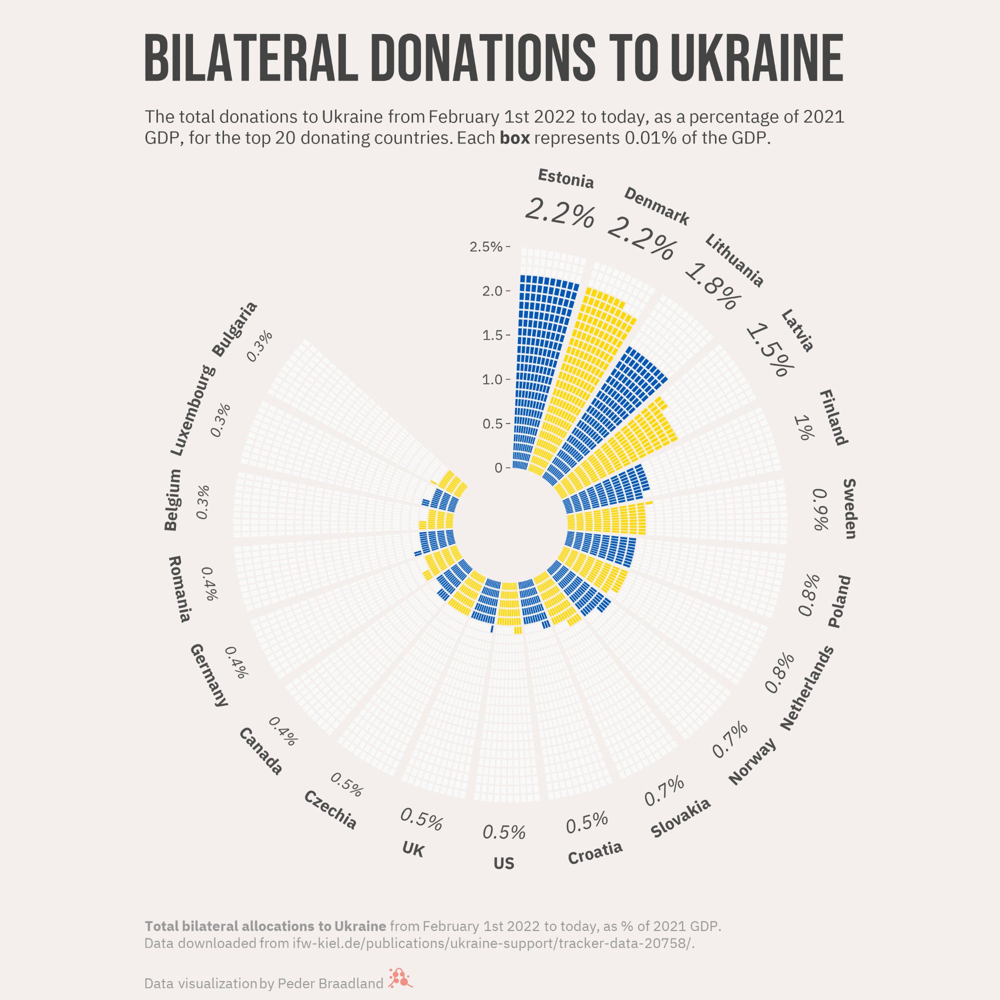{group="apr30daygallery"}

## Day 4 Comparisons::Big or Small

```{r echo = TRUE, message = FALSE, warning = FALSE}
library(ggforce)
library(ggrepel)
library(ggpubr)
library(showtext)
library(tidyverse)
library(ggtext)
font_add_google("Audiowide", "spacey_font", regular.wt = 400)
update_geom_defaults("text_repel", list(family = "IBM Plex Sans"))
theme_space <- function() {
  theme_minimal(base_size = 5, base_family = "IBM Plex Sans") +
    theme(
      panel.grid.major.y = element_blank(),
      panel.grid.major = element_line(color = "#222222"),
      panel.grid.minor = element_blank(),
      plot.background = element_rect(fill = "#151515", color = NA),
      axis.title.y = element_blank(),
      plot.title = element_textbox_simple(family = "spacey_font", color = "#E0E0E0", size = 11, margin = margin(4, 0, 0, 0)),
      plot.subtitle = element_textbox_simple(color = "#999999", margin = margin(3, 0, 8, 0), size = 5),
      plot.caption = element_markdown(color = "#999999"),
      axis.text = element_text(color = "#999999"),
      legend.position = "bottom",
      legend.title = element_blank(),
      axis.title.x = element_text(color = "#999999", hjust = 0),
      axis.text.y = element_blank(),
      legend.text = element_text(color = "#999999"),
      legend.key.spacing.x = unit(5, "mm"),
      legend.key.width = unit(0, "mm")
    )
}

planet_pal <- c(
  Mercury = "#8d8a88",
  Venus = "#f4dbc4",
  Earth = "#386f61",
  Mars = "#f27b5f",
  Jupiter = "#bfb19d",
  Saturn = "#f3ce88",
  Uranus = "#95bbbe",
  Neptune = "#657ba5",
  Pluto <- c("#999999")
)

# How many Earths could fit inside Jupiter?
# We borrow data from the tibble below
sphere_volume <- function(x) {
    (4/3)*pi*(x/2)^3
}
#sphere_volume(142984)/sphere_volume(12756) # Around 1400

planets_diameter <-
  tibble(
    planet = c("Mercury", "Venus", "Earth", "Mars", "Jupiter", "Saturn", "Uranus", "Neptune", "Pluto"),
    mass = c(0.33, 4.87, 5.97, 0.642, 1898, 568, 86.8, 102, 0.013), # https://nssdc.gsfc.nasa.gov/planetary/factsheet/
    diameter = c(4979, 12104, 12756, 6792, 142984, 120536, 51118, 49528, 2376),
    dist_sun = c(57.9, 108.2, 149.6, 228, 778.5, 1432, 2867, 4515, 5906.4)
  ) %>%
  mutate(
    rel_diam = (diameter / 12756)*1.3, # 1.3 is just a scaling factor
    rel_mass = mass / 5.97
  ) %>%
  ggplot(aes(x = dist_sun, y = 1, size = rel_diam, color = planet)) +
  geom_point() +
  ggforce::geom_ellipse(aes(x0 = 1432, y0 = 1, a = 0.3, b = 0.05, angle = 45), size = 0.6, color = "#f3ce88") +
  scale_size_identity(
    guide = "legend",
    name = "Diameter relative to planet Earth",
    breaks = c(0.5, 1, 5, 11), labels = c(
        "Half the diameter\nof Earth", 
        "One Earth equivalent", 
        "Wide enough to fit five\nearths side by side", 
        "...11 Earths, approximately\nJupiter's diameter")
  ) +
  scale_x_log10() +
  scale_y_continuous(limits = c(0.5, 1.5)) +
  theme_space() +
  geom_text_repel(aes(label = planet),
    size = 2,
    direction = "x",
    nudge_y = c(0.2, 0.2, 0.2, 0.2, 0.35, 0.35, 0.3, 0.2, 0.2),
    segment.size = 0.1
  ) +
  scale_color_manual(values = planet_pal) +
  guides(
      color = "none", 
      size = guide_legend(
          label.position = "right",
          # Since the planets have a stroke and I'm lazy, I just override the size of the legend slightly (0.5-->0.7 and 1.0-->1.3)
          override.aes = list(color = NA, shape = 21, fill = "#999999", stroke = 0, size = c(0.7, 1.3, 5, 11)*1.3)), 
  ) +
  labs(
    x = "Distance from the sun, million km",
    title = "The Solar System",
    subtitle = "If you place around 11 Earths side by side, their collective width will be comparable to the diameter of Jupiter. The **mass** of Jupiter, on the other hand, is **318 times** that of Earth, and you could fit a whopping **1400** Earths inside Jupiter if you imagine Jupiter as a hollow shell.
    <strong style='color: #8d8a88;'>Mercury</strong>, 
    <strong style='color: #f4dbc4;'>Venus</strong>, 
    <strong style='color: #386f61;'>Earth</strong>, 
    <strong style='color: #f27b5f;'>Mars</strong> and 
    <strong style='color: #999999;'>Pluto</strong> are rocky planets, whereas 
    <strong style='color: #bfb19d;'>Jupiter</strong>,
    <strong style='color: #f3ce88;'>Saturn</strong>,
    <strong style='color: #95bbbe;'>Uranus</strong> and 
    <strong style='color: #657ba5;'>Neptune</strong> are gas giants.",
    caption = "**Source**: NSSDCA | **Data visualization:** Peder Braadland "
  )

# showtext_auto()
# showtext_opts(dpi = 500)
# ggsave("day4/out/planets_diameter.jpg", planets_diameter, width = 120, height = 70, unit = "mm", dpi = 500)
```

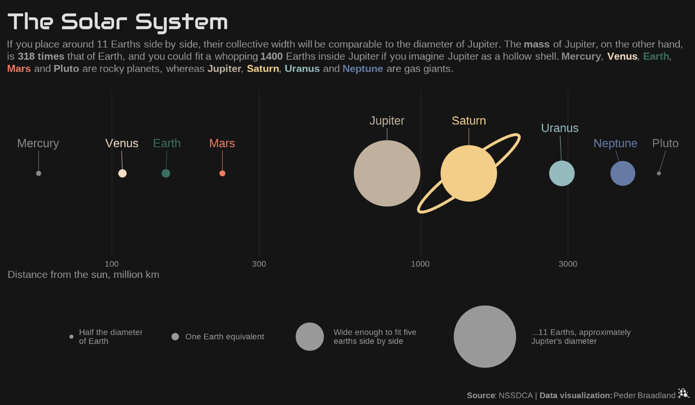{group="apr30daygallery"}


## Day 5 Comparisons::Ranking

```{r echo = TRUE, message = FALSE, warning = FALSE}
library(threadr); library(tidyverse); library(ggrepel); library(RColorBrewer); library(geomtextpath); library(ggpubr); library(showtext); library(zoo); library(glue); library(ggplotify); library(ggtext)
font_add_google("Bebas Neue")
"%ni%" <- Negate("%in%")

# contents <- threadr::list_files_ftp("ftp://sidads.colorado.edu/DATASETS/NOAA/G02135")
# We identify the path to the daily data sea ice extent csv for north (i.e. Arctic)
# url <- "ftp://sidads.colorado.edu/DATASETS/NOAA/G02135/north/daily/data/N_seaice_extent_daily_v4.0.csv"
# We can download the file to a directory in the project folder
# download_ftp_file(url, "ice/noaa_download/noaa_data.csv", verbose = TRUE)
noaa_arctic <- read_csv("ice/noaa_download/noaa_data.csv")
# The raw data has a top row that we do not need
noaa_arctic <- noaa_arctic[-1, ] %>%
  mutate_at(vars(Year, Month, Day, Extent), as.numeric) %>%
  mutate(date = dmy(paste0(Day, "-", Month, "-", Year))) %>%
  select(-c(Year, Month, Day)) %>%
  mutate(
    yr = year(date),
    mo = month(date)
  ) %>%
  # Create a 'day' variable
  group_by(yr) %>%
  mutate(day = as.numeric(date - floor_date(date, "year")) + 1)

# Compute 14-day rolling avg for quite smooth lines
zoo_data <- zoo(noaa_arctic$Extent, order.by = noaa_arctic$date)
moving_avg <- rollapply(zoo_data, width = 14, FUN = mean, align = "right", fill = NA)
noaa_arctic$roll <- as.vector(moving_avg[noaa_arctic$date])

# We can investigate the earliest and latest dates (for each year) where the minimum extent was reached for that year. We use the rolling values for this, although it would perhaps be more appropriate to use the actual extents. But since we show rolling means for the lines, we keep it simple.

min_max <-
  noaa_arctic %>%
  filter(yr %ni% c(1978, 2025)) %>% # We do not consider incomplete years since they may not have had their actual minimums recorded
  mutate(yr = as.factor(yr)) %>%
  group_by(yr) %>%
  filter(roll == min(roll)) %>%
  ungroup() %>%
  summarise(
    min_day = min(day),
    max_day = max(day)
  )

# Find the lowest and highest minimum extents recorded
low_high_min_extent <-
  noaa_arctic %>%
  filter(yr %ni% c(1978, 2025)) %>%
  group_by(yr) %>%
  slice(which.min(roll)) %>%
  arrange(Extent) %>%
  ungroup()

low_min_extent <- low_high_min_extent %>%
  select(yr, Extent) %>%
  filter(Extent == min(Extent))
high_min_extent <- low_high_min_extent %>%
  select(yr, Extent) %>%
  filter(Extent == max(Extent))
# Check 2024
#low_high_min_extent %>% filter(yr == 2024) # 4.396, which is a 42.5% reduction compared to 1980

# Define a color palette
num_years <- length(unique(noaa_arctic$yr))
color_palette <- colorRampPalette(c("#313695", "#FFFFBF", "#A50026"))

# A plot which indicates when the (rolling) minimums appear
arctic_ice_min <-
  noaa_arctic %>%
  mutate(yr = as.factor(yr)) %>%
  filter(day >= min_max$min_day - 10 & day <= min_max$max_day + 10) %>%
  ggplot(aes(x = day, y = roll, color = yr)) +
  geom_line(size = 0.2, alpha = 0.75) +
  geom_point(
    data = noaa_arctic %>%
      filter(yr %ni% c(1978, 2025)) %>%
      mutate(yr = as.factor(yr)) %>%
      group_by(yr) %>%
      filter(roll == min(roll)),
    aes(x = day, y = roll)
  ) +
  geom_text_repel(
    data = noaa_arctic %>%
      mutate(
        yr_lab = case_when(
          yr == low_min_extent$yr[1] ~ glue("{yr} ({round(low_min_extent$Extent[1], 2)} million sq.km.)"),
          yr == high_min_extent$yr[1] ~ glue("{yr} ({round(high_min_extent$Extent[1], 2)} million sq.km.)"),
          TRUE ~ as.character(yr) # Convert factor to character for consistency
        )
      ) %>%
      filter(yr %ni% c(1978, 2025)) %>%
      mutate(yr = as.factor(yr)) %>%
      group_by(yr) %>%
      filter(roll == min(roll)),
    aes(x = day, y = roll, label = yr_lab),
    size = 3, family = "IBM Plex Sans", box.padding = 0.3, segment.size = 0.15
  ) +
  scale_color_manual(values = color_palette(49)) +
  theme_void() +
  theme(
    panel.background = element_rect(color = NA, fill = "#222222"),
    plot.background = element_rect(color = NA, fill = "#222222"),
    plot.margin = unit(c(0, 2, 2, 2), "mm"),
    axis.text.x = element_text(color = "#666666", size = 6.5),
    plot.title = element_text(family = "Bebas Neue", size = 20, lineheight = 0.3, color = "#e0e0e0", face = "bold"),
    plot.subtitle = element_textbox_simple(family = "IBM Plex Sans", size = 8, margin = margin(5, 0, 5, 0), color = "#CCCCCC", face = "italic"),
    legend.position = "none",
    plot.caption = element_textbox_simple(size = 6.5, color = "#666666", margin = margin(5, 0, 2, 0))
  ) +
  scale_size(range = c(0.8, 3)) +
  scale_y_discrete(expand = c(0.05, 0.05)) +
  scale_x_continuous(expand = c(0, 0), breaks = c(244, 274), labels = c("Sep 01", "Oct 01")) +
  labs(
    title = "Arctic sea ice minimums",
    subtitle = "The Arctic sea ice minimum normally occurs in mid-to-late September. The 2024 sea ice extent was **42.5%** lower than in 1980. The lowest sea ice minimum ever recorded was in 2012.",
    caption = "**Source**: NOAA G02135 (N_seaice_extent_daily_v4.0.csv)<br>**Data visualization:** Peder Braadland "
  )

# Create a legend
leg <-
  tibble(
    x = c(1:num_years),
    yr = c(1978:2025),
  ) %>%
  ggplot(aes(x = x, y = 0.6, fill = as.factor(x), color = as.factor(x))) +
  geom_col(color = NA, alpha = 0.75) +
  scale_fill_manual(values = color_palette(49)) +
  scale_color_manual(values = color_palette(49)) +
  annotate("text", size = 3, family = "IBM Plex Sans", label = "Earlier years", x = 0.5, hjust = 0, y = 1.1, color = "#313695", fontface = "bold", alpha = 0.95) +
  annotate("text", size = 3, family = "IBM Plex Sans", label = "Recent years", x = num_years + 0.5, hjust = 1, y = 1.1, color = "#A50026", fontface = "bold", alpha = 0.95) +
  theme_void() +
  theme(legend.position = "none") +
  scale_y_continuous(limits = c(0, 1.3))

comp <-
  arctic_ice_min +
  annotation_custom(
    grob = as.grob(leg),
    xmin = 239.7, xmax = 265, ymin = 8.3, ymax = 8.55
  )

# showtext_auto()
# showtext_opts(dpi = 500)
# ggsave("day5/out/arctic_ice_min.jpg", comp, width = 90, height = 140, unit = "mm", dpi = 500)
```

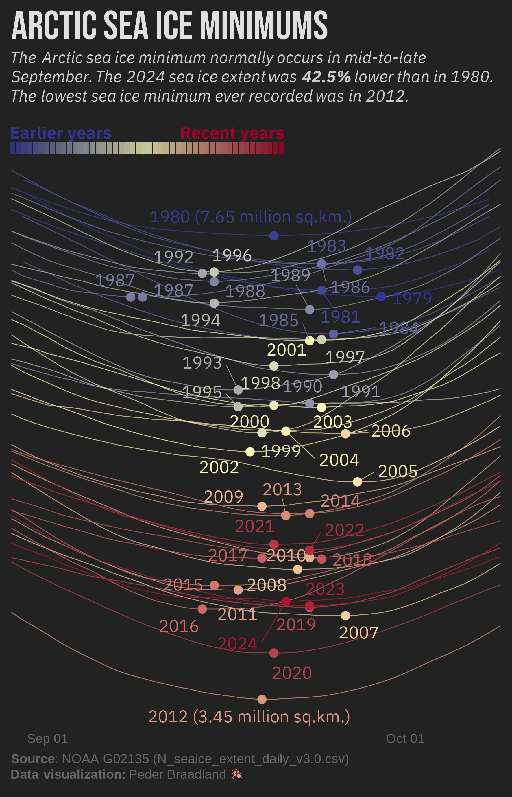{width=60% group="apr30daygallery" fig-align="left"}

## Day 6 Comparisons::Florence Nightinggale

```{r echo = TRUE, message = FALSE, warning = FALSE}
library(showtext)
library(tidyverse)
library(glue)
library(ggtext)
library(geomtextpath)
font_add_google("Inconsolata")
font_add_google("Nanum Pen Script")

# I downloaded the data manually from Strava since this seems to be the fastest option.
strava <- read_csv("day6/strava_activities.csv") %>%
  filter(`Activity Type` == "Run") %>%
  select(name = `Activity Name`, date = `Activity Date`, duration_s = `Elapsed Time...6`, distance_km = `Distance...7`, avg_hr = `Average Heart Rate`, avg_gap = `Average Grade Adjusted Pace`, max_hr = `Max Heart Rate...8`, elev_gain = `Elevation Gain`) %>%
  mutate(date = mdy_hms(date)) %>%
  arrange(date) %>%
  mutate(cum_distance = cumsum(distance_km)) %>%
  mutate(yr = year(date)) %>%
  # Remove really quick runs
  filter(duration_s > 500)

strava_df <-
  strava %>%
  group_by(yr) %>%
  mutate(
    day_of_year = yday(date),
    cum_distance_yr = cumsum(distance_km)
  ) %>%
  filter(yr >= 2014) %>%
  # Describe the years
  mutate(desc = case_when(
    yr == 2014 ~ "It's something",
    yr == 2015 ~ "Steady but short",
    yr == 2016 ~ "2015 repeat",
    yr == 2017 ~ "Rough start but overall great",
    yr == 2018 ~ "Not bad not great",
    yr == 2019 ~ "Winter depression",
    yr == 2020 ~ "Covid shutdown = top year",
    yr == 2021 ~ "Nothing special",
    yr == 2022 ~ "The beginning of the end?",
    yr == 2023 ~ "It's definitely over",
    yr == 2024 ~ "Renewed energy",
    yr == 2025 ~ "Go!"
  )) %>%
  ungroup()
# Ensure that every year has a row where day_of_year == 365 (except for 2025)

# Identify which years are missing day_of_year == 365
missing_365 <- strava_df %>%
  group_by(yr) %>%
  summarise(has_365 = any(day_of_year == 365)) %>%
  filter(!has_365)

last_per_year <- strava_df %>%
  semi_join(missing_365, by = "yr") %>%
  group_by(yr) %>%
  slice_tail(n = 1) %>%
  ungroup() %>%
  mutate(
    date = ymd(paste0(yr, "-12-31")),
    day_of_year = 365
  )

# Combine with original
strava_complete <- bind_rows(strava_df, last_per_year) %>%
  arrange(date)

# To annotate the facets by total distance per year (the max cumulative distance for a year)
# we need to create a new df and join it with the original one

total_distance <- strava_complete %>%
  group_by(yr) %>%
  summarize(total_km = sum(distance_km, na.rm = TRUE)) %>%
  mutate(facet_lab = glue("<span style='color:#530600'><strong>{yr}</strong></span><br>Total: {round(total_km)} km"))

# Step 3: Join back
strava_final <- strava_complete %>%
  left_join(total_distance, by = "yr") %>%
  # Remove last date of 2025
  filter(!(yr == 2025 & day_of_year == 365))


gradient_fill <- grid::linearGradient(
  c("#fffbf3", "#fdf6ed", "#fcf9ef", "#fef7ec"),
  stops = c(0, 0.30, 0.6, 1),
  x2 = unit(0, "npc")
)


p_strava <-
  strava_final %>%
  ggplot(aes(x = day_of_year, y = cum_distance_yr)) +
  geom_area(fill = "#b2d2dc", color = NA) +
  geom_line(color = "#08060b90", linewidth = 0.2) +
  geom_textsmooth(aes(label = desc), color = "#08060b90", size = 2, linewidth = 0, vjust = -0.5) +
  geom_rug(sides = "b", linewidth = 0.20, alpha = 1, length = unit(1.5, "mm"), color = "#b2d2dc") +
  scale_y_continuous(
    limits = c(0, 1200),
    breaks = seq(0, 1200, 200),
    labels = c("0", "200", "400", "600", "800", "1000", "1200 km"),
    expand = expansion(mult = c(0.08, 0))
  ) +
  scale_x_continuous(expand = c(0, 0), breaks = seq(0, 365, length.out = 12)) +
  facet_wrap(~facet_lab, nrow = 2) +
  theme_minimal(base_family = "Inconsolata", base_size = 9) +
  theme(
    panel.grid.major.x = element_line(color = "#b7b7b7", size = 0.1),
    panel.grid.minor = element_blank(),
    panel.grid.major.y = element_line(color = "#b7b7b7", size = 0.1),
    axis.ticks.y = element_line(color = "#08060b", size = 0.15),
    plot.background = element_rect(fill = gradient_fill, color = NA),
    strip.text = element_markdown(hjust = 0, lineheight = 1.1, margin = margin(l = 0)),
    panel.spacing.y = unit(4, "mm"),
    axis.title = element_blank(),
    axis.text.x = element_blank(),
    plot.title = element_text(size = 16, color = "#444444", margin = margin(l = -28, t = 5)),
    plot.subtitle = element_textbox_simple(size = 8, color = "#444444", lineheight = 0.9, margin = margin(l = -28, t = 10, b = 15))
  ) +
  geom_segment(aes(x = 0, xend = 0, y = 0, yend = 1200), color = "#08060b", size = 0.15) +
  geom_segment(aes(x = Inf, xend = Inf, y = 0, yend = 1200), color = "#08060b", size = 0.15) +
  geom_segment(aes(x = 0, xend = Inf, y = 0, yend = 0), color = "#08060b", size = 0.15) +
  geom_segment(aes(x = 0, xend = Inf, y = 1200, yend = 1200), color = "#08060b", size = 0.15) +
  labs(
    title = "WHAT ARE YOU RUNNING FROM?",
    subtitle =
      "I don't know If Florence Nightingale was a runner. If she was, and she had recorded her runs, she might have visualised her data like this. These are my running stats, shown as <strong>cumulative length of runs per year</strong> for the past ~12 years. It's quite clear that the winter cold and darkness put a break on my running motivation."
  )

# showtext_auto()
# showtext_opts(dpi = 500)
# ggsave("day6/out/florence_strava.jpg", p_strava, width = 180, height = 100, unit = "mm", dpi = 500)
```

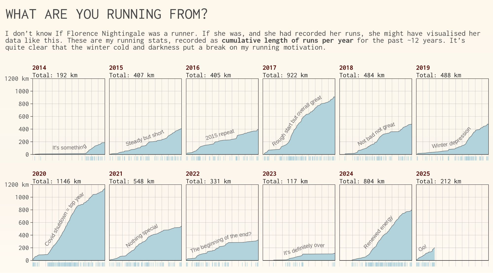{group="apr30daygallery"}

## Day 8 Distributions::Histogram

```{r echo = TRUE, message = FALSE, warning = FALSE}
library(tidyverse); library(ggdist)

hist_df <- 
    strava %>%
  # Calculate pace so that we can exclude walks
  mutate(pace_kph = distance_km / (duration_s / 3600)) %>%
  filter(pace_kph > 7) %>%
  # Also remove very short runs
  filter(distance_km > 1) %>%
  mutate(yr_grp = ifelse(yr < 2020, "pre-2020", "post-2020")) %>%
  mutate(
    yr_grp = as.factor(yr_grp),
    yr_grp = fct_rev(yr_grp)
  )

n_runs <- hist_df %>%
    group_by(yr_grp) %>%
    count()
  
hist <- 
ggplot()+
    stat_histinterval(data = hist_df %>% filter(yr_grp == "pre-2020"), aes(x = distance_km, y = ""), stroke = 0.5, position = position_nudge(y = 0.05), breaks = 70, fill = "#b2d2dc", .width = 0.66, shape = 24, color = "#444444", linewidth = 0.15, height = 0.9)+
    stat_histinterval(data = hist_df %>% filter(yr_grp == "post-2020"), aes(x = distance_km, y = ""), stroke = 0.5, side = "bottom", position = position_nudge(y = -0.05), breaks = 70, fill = "#b2d2dc", .width = 0.66, shape = 25, color = "#444444", linewidth = 0.15, height = 0.9) +
  scale_x_continuous(breaks = seq(0, 25, 5), labels = c("0km", "5km", "10km", "15km", "20km", "25km"), expand = c(0, 0), limits = c(0, 27)) +
  theme_minimal(base_family = "IBM Plex Sans", base_size = 9) +
  theme(
    panel.grid.major.y = element_blank(),
    plot.caption = element_textbox_simple(color = "#999999", hjust = 0.5, margin = margin(10, 0, 3, 0), size = 5.5),
    panel.grid.major.x = element_line(color = "#c9c9c9", size = 0.15),
    panel.grid.minor = element_blank(),
    plot.background = element_rect(fill = "#faf8f5", color = NA),
    strip.text = element_markdown(hjust = 0, lineheight = 1.1, margin = margin(l = 0)),
    panel.spacing.x = unit(10, "mm"),
    axis.text.y = element_text(vjust = -0.2),
    axis.title = element_blank(),
    axis.text.x = element_text(hjust = -0.1, margin = margin(t = -8), color = "#999999"),
    plot.title = element_text(size = 13, color = "#444444", margin = margin(l = 0, t = 5), face = "bold"),
    plot.subtitle = element_textbox_simple(size = 7, color = "#444444", lineheight = 1.1, margin = margin(t = 5, b = 8, l = 0))
  ) +
  labs(
    title = "Distribution of run lengths by year",
    subtitle = "The triangle indicates the median run length. The horizontal lines indicate the interquartile range, i.e. the middle 50% of runs fall within this distance range. Over time my runs have become shorter and somewhat less variable.",
    caption = "**Data visualization:** Peder Braadland "
  ) +
    annotate(geom = "text", label = paste0("Before 2020\n", n_runs[[1,2]], " runs"), lineheight = 0.8, x = 16, y = 1.5, family = "IBM Plex Sans", color = "#444444", size = 2.5, face = "bold", hjust = 0, vjust = 1)+
    annotate(geom = "text", label = paste0("After 2020\n", n_runs[[2,2]], " runs"), lineheight = 0.8, x = 16, y = 0.7, family = "IBM Plex Sans", color = "#444444", size = 2.5, face = "bold", hjust = 0, vjust = 1)

# showtext_auto()
# showtext_opts(dpi = 500)
# ggsave("day8/out/hist.jpg", hist, width = 120, height = 80, unit = "mm", dpi = 500)
```

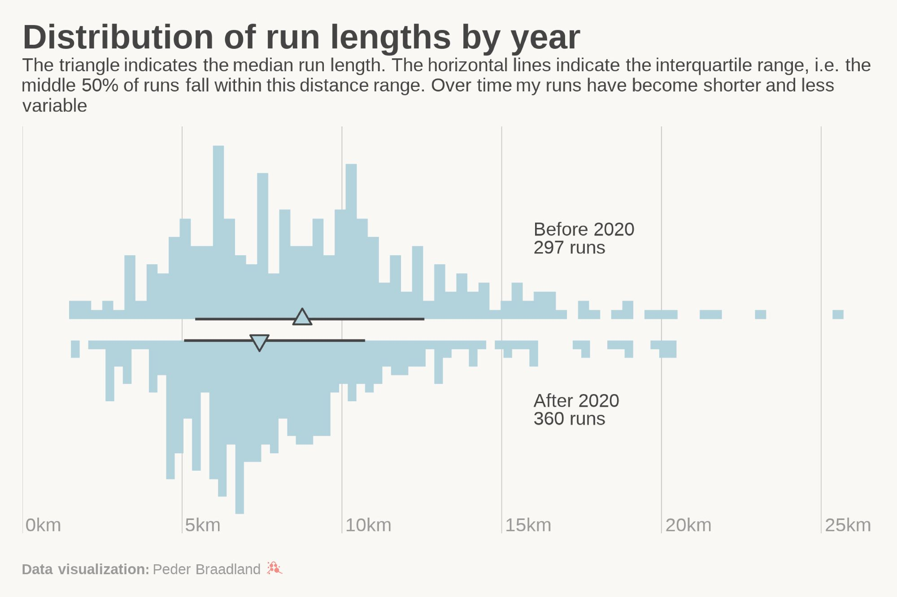{group="apr30daygallery"}


## Day 11 Distributions::Stripes

```{r echo = TRUE, message = FALSE, warning = FALSE}
library(RColorBrewer)
hadcrut5_northern <- read_csv("../../climate/temperature/HadCRUT.5.0.2.0.analysis.summary_series.northern_hemisphere.monthly.csv")

df <- 
hadcrut5_northern %>%
    separate(col = Time, into = c("yr", "mo"), sep = "-") %>%
    mutate_at(vars(c(yr, mo)), as.integer) %>%
    mutate(mo = as.factor(mo)) %>%
    mutate(timepoint = c(1:nrow(.))) %>%
    rename(anom = `Anomaly (deg C)`) %>%
    mutate(facet_no = 
               case_when(
                   yr < 1900 ~ "1850-1899",
                   yr >= 1900 & yr < 1950 ~ "1900-1949",
                   yr >= 1950 & yr < 2000 ~ "1950-1999",
                   yr >= 2000 ~ "2000-today"
               )) 

# For the period 2000 to today, we fill in "empty" rows to get the same number of rows as the other facets
# The other facets have 600 rows (12months*50years)
df_2000_padded <- bind_rows(
  df %>% filter(facet_no == "2000-today"),
  tibble(
    yr = NA_integer_,
    mo = NA,
    timepoint = NA_integer_,
    anom = NA_real_,
    facet_no = "2000-today"
  )[rep(1, 300), ]
) %>%
  mutate(timepoint = 1:nrow(.))

# Assign a theme
theme_stripes <- function() {
  theme_void()+
    theme(
        axis.text.x = element_text(family = "IBM Plex Sans", size = 5, color = "#444444"),
        legend.position = "none"
    )
}

# From left to right
row1 <- 
    df %>% filter(facet_no == "1850-1899") %>%
    ggplot(aes(x = timepoint, y = "", color = anom))+
    geom_segment(aes(y = 0, yend = 1, xend = timepoint))+
    scale_color_gradientn(colours = rev(brewer.pal(11, "RdYlBu")), breaks = seq(-1.5, 1.5, 0.5), limits = c(min(df$anom), max(df$anom)))+
    theme_minimal(base_size = 3)+
    scale_x_continuous(breaks = seq(10, 590, length.out = 6), labels = c("1850", "1860", "1870", "1880", "1890", "1899"))+
    theme_stripes()+
    geom_segment(aes(x = 0, xend = 580, y = 0.2, yend = 0.2), arrow = arrow(length = unit(0.3, "cm"), type = "closed"), color = "white", size = 1, alpha = 0.1)

# From right to left
row2 <-
    df %>% filter(facet_no == "1900-1949") %>%
    ggplot(aes(x = timepoint, y = "", color = anom))+
    geom_segment(aes(y = 0, yend = 1, xend = timepoint))+
    scale_color_gradientn(colours = rev(brewer.pal(11, "RdYlBu")), breaks = seq(-1.5, 1.5, 0.5), limits = c(min(df$anom), max(df$anom)))+
        theme_minimal(base_size = 3)+
        scale_x_reverse(breaks = seq(610, 1190, length.out = 6), labels = c("1900", "1910", "1920", "1930", "1940", "1949"))+
    theme_stripes()+
    geom_segment(aes(x = 600, xend = 1180, y = 0.2, yend = 0.2), arrow = arrow(length = unit(0.3, "cm"), type = "closed"), color = "white", size = 1, alpha = 0.1)

# From left to right 
row3 <- 
    df %>% filter(facet_no == "1950-1999") %>%
    ggplot(aes(x = timepoint, y = "", color = anom))+
    geom_segment(aes(y = 0, yend = 1, xend = timepoint))+
    scale_color_gradientn(colours = rev(brewer.pal(11, "RdYlBu")), breaks = seq(-1.5, 1.5, 0.5), limits = c(min(df$anom), max(df$anom)))+
    theme_minimal(base_size = 3)+
    scale_x_continuous(breaks = seq(1210, 1790, length.out = 6), labels = c("1950", "1960", "1970", "1980", "1990", "1999"))+
    theme_stripes()+
    geom_segment(aes(x = 1200, xend = 1780, y = 0.2, yend = 0.2), arrow = arrow(length = unit(0.3, "cm"), type = "closed"), color = "white", size = 1, alpha = 0.1)


# From right to left
row4 <- 
    df_2000_padded %>%
    ggplot(aes(x = timepoint, y = "", color = anom))+
    geom_segment(aes(y = 0, yend = 1, xend = timepoint))+
    scale_color_gradientn(colours = rev(brewer.pal(11, "RdYlBu")), breaks = seq(-1.5, 1.5, 0.5), limits = c(min(df$anom), max(df$anom)), na.value = "white")+
    theme_minimal(base_size = 3)+
    scale_x_reverse(breaks = c(10, 120, 240, 291), labels = c("2000", "2010", "2020", "2025"))+
    theme_stripes()+
    geom_segment(aes(x = 0, xend = 280, y = 0.2, yend = 0.2), arrow = arrow(length = unit(0.3, "cm"), type = "closed"), color = "white", size = 1, alpha = 0.1)

# Create the legend
leg_ <-
df %>%
    rename(`Near surface temperature anomalies relative to 1961-1990 in\nthe Northern Hemisphere. Source: HadCrut.5.0.2.0\nData Visualization by Peder Braadland` = anom) %>%
    ggplot(aes(x = "", y = "", color = `Near surface temperature anomalies relative to 1961-1990 in\nthe Northern Hemisphere. Source: HadCrut.5.0.2.0\nData Visualization by Peder Braadland`))+
    geom_point()+
    scale_color_gradientn(colours = rev(brewer.pal(11, "RdYlBu")), breaks = seq(-1.5, 1.5, 0.5), limits = c(min(df$anom), max(df$anom)), na.value = "white")+
        theme_minimal(base_family = "IBM Plex Sans", base_size = 5)+
    theme(
        legend.position = "top",
        legend.title = element_text(color = "#444444"),
        legend.text = element_text(color = "#444444"),
        legend.key.height = unit(2, "mm"),
        legend.title.position = "bottom"
    )
leg <- get_legend(leg_)

row4 <- 
row4 +
    annotation_custom(grob = as.grob(leg), xmin = -940, xmax = 0, ymin = -0.1, ymax = 0.6)

#ggsave("day11/out/climate_stripes.jpg",  ggarrange(row1, row2, row3, row4, nrow = 4), width = 120, height = 70, unit = "mm", dpi = 500)
```

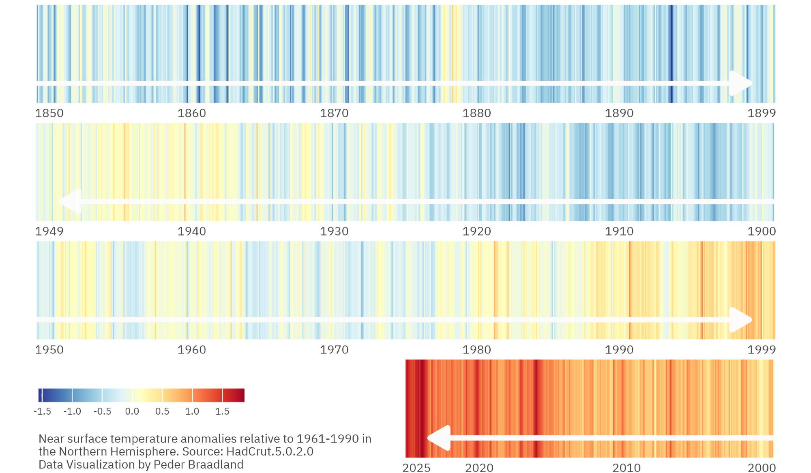{group="apr30daygallery"}

## Day 15 Relationships::Complicated

```{r echo = TRUE, message = FALSE, warning = FALSE}
font_add_google("Bebas Neue")
font_add_google("Roboto")
# The birthday problem
# Similar to in my blog post on simulation and uncertainty (https://peder.quarto.pub/blog/posts/uncertainty/)

# We run 50 iterations, but repeat those iterations 10 times, so that we get a distribution of probabilities for each number of people in the room. This then adds to the illustration the influence of sample size (n_it) on the probabilities. Of course, we could skip the outermost loop and increased n_it to, say, 1000 (as in my blog post), but for the sake of this exercise we pretend we repeat our simulation experiment 10 times but each with only 50 iterations.

n_rep <- 10     # Repetitions of the outer loop (repetition of the simulation)
n_it <- 50      # Number of simulations

# repeat_res <- data.frame()
# 
# for (rep in 1:n_rep) {
#   for (n in seq(2, 70, 1)) {
# 
#     overlap_bdays <- logical(n_it)
# 
#     for (i in 1:n_it) {
#       sim_res <- data.frame(
#         person = 1:n,
#         bdates = sample(1:365, size = n, replace = TRUE)
#       ) %>%
#         group_by(bdates) %>%
#         summarise(count = n()) %>%
#         summarise(any_duplicates = any(count > 1))
# 
#       overlap_bdays[i] <- sim_res$any_duplicates
#     }
# 
#     perc_success <- (sum(overlap_bdays) / n_it) * 100
# 
#     # Append the result of this repetition to the dataframe
#     repeat_res <- rbind(repeat_res,
#                         data.frame(rep = rep,
#                                    n_subjects = n,
#                                    perc_success = perc_success))
#   }
# }
# save(repeat_res, file = "day11/birthdays.RData")
load(file = "day11/birthdays.RData")


# We can add segments as gridlines. I don't want the grid lines to fully reach the swarm of geom_points.
# To acheive this, we can calculate the mean perc_success from our simulation experiment, and use this to
# interpolate x-values for the Y-values where we want a grid line. Since the grid lines should not reach
# all the way to the geom_points, we add a thick geom_smooth above them

mean_probs <- repeat_res %>%
  group_by(n_subjects) %>%
  summarise(mean_perc_success = mean(perc_success)) %>%
  ungroup()

# Y-values where we want a gridline
target_probs <- seq(10, 90, 10)

# Interpolate!
interp <- approx(x = mean_probs$mean_perc_success,
                 y = mean_probs$n_subjects,
                 xout = target_probs)

# Create a data frame containing the grid line data
gridline_df <-
data.frame(probability = interp$x,
           estimated_n = round(interp$y, 1)) %>%
    mutate(xend = estimated_n)


library(ggrounded)
p_birthday <- 
ggplot(repeat_res, aes(x = n_subjects, y = perc_success)) +
    geom_segment(data = gridline_df, aes(x = 0, xend = xend, y = probability, yend = probability), color = "#e0e0e0", size = 0.2) +
    geom_segment(data = mean_probs %>% filter(n_subjects %in% seq(10, 70, 10)),
                 aes(x = n_subjects, xend = n_subjects, y = 0, yend = mean_perc_success), color = "#e0e0e0", size = 0.2) +
    geom_smooth(data = repeat_res %>%
                 group_by(n_subjects) %>%
                 summarise(mean_perc_success = mean(perc_success)),
             aes(x = n_subjects, y = mean_perc_success), se = FALSE, linewidth = 20, color = "white", alpha = 1) +
    geom_smooth(data = repeat_res %>%
                 group_by(n_subjects) %>%
                 summarise(mean_perc_success = mean(perc_success)),
             aes(x = n_subjects, y = mean_perc_success), se = FALSE, linewidth = 1.5, color = "#e0e0e0", alpha = 0.2) +
      geom_point(alpha = 0.4, size = 1.35, fill = "#ff85a5", shape = 21, stroke = 0)+

    scale_x_continuous(breaks = c(2, seq(10, 70, 10)))+
    scale_y_continuous(breaks = seq(0, 100, 10), limits = c(0, 100), labels = c("0", "10", "20", "30", "40", "50", "60", "70", "80", "90", "100%"))+
    theme_minimal(base_family = "Roboto", base_size = 7)+
    theme(
        panel.grid.major = element_blank(),
        panel.grid.minor = element_blank(),
        plot.title.position = "plot",
        plot.title = element_text(size = 12, family = "Bebas Neue", color = "#222222"),
        plot.subtitle = element_textbox_simple(size = 6, color = "#222222"),
        plot.caption = element_textbox_simple(size = 5, color = "#666666", margin = margin(t = 5)),
        axis.text.x = element_text(margin = margin(t = -5)),
        axis.text.y = element_text(margin = margin(r = -10)),
        axis.title.x = element_text(hjust = 0.95, margin = margin(t = 5), color = "#444444", size = 6.5),
        axis.title.y = element_text(hjust = 0.94, color = "#444444", size = 6.5)
        )+
    geom_hline(yintercept = seq(10, 90, 10), color = "white", 
               size = 0.2, alpha = 0.5)+
    labs(
        x = "Number of people in the room",
        y = "P(two or more shared birthdays)",
        subtitle = "Imagine you place *nn* random people in a room. What is the chance that *at least* two of them will **share the same birthday**? This is the birthday problem. The counter-intuitive **paradox is that only 23** people are needed in a room for this probability to exceed 50%. The simulated data used to produce this figure support this surprising fact.",
        caption = "Each dot represents the probability of two or more people having the same birthday in rooms with various number of people. The probabilities were calculated as the fraction of simulated cases where two or more people shared a birthday. The simulation was repeated 10 times for each room size, giving the distribution of probabilities. The qbirthday() function was used to calculate the *true* number of people needed in a room for the probability to exceed 50%.<br>**Data visualization:** Peder Braadland ",
        title = "The birthday paradox"
    )

# We can use base R's qbirthday() to determine how many people are needed in the room for the probability to exceed 50%
n_needed <- 
qbirthday(
    prob = 0.5, # Probability 
    classes = 365, # Number of days per year
    coincident = 2 # 2 or more birthdays
    )

p_birthday <- 
p_birthday +
    geom_segment(aes(x = 0, xend = n_needed, y = 50, yend = 50), linetype = "dashed", linewidth = 0.2, color = "#666666")+
    geom_segment(aes(x = n_needed, xend = n_needed, y = 4, yend = 50), linetype = "dashed", linewidth = 0.2, color = "#666666")+
    geom_label(x = 23, y = 3.5, hjust = 0.5, vjust = 1, label = "23", family = "IBM Plex Sans", size = 2, label.size = NA, color = "#444444", fill = "#facdd9")

#showtext_auto()
#showtext_opts(dpi = 500)
#ggsave("day15/complicated.jpg", p_birthday, width = 90, height = 95, unit = "mm", dpi = 500)

```

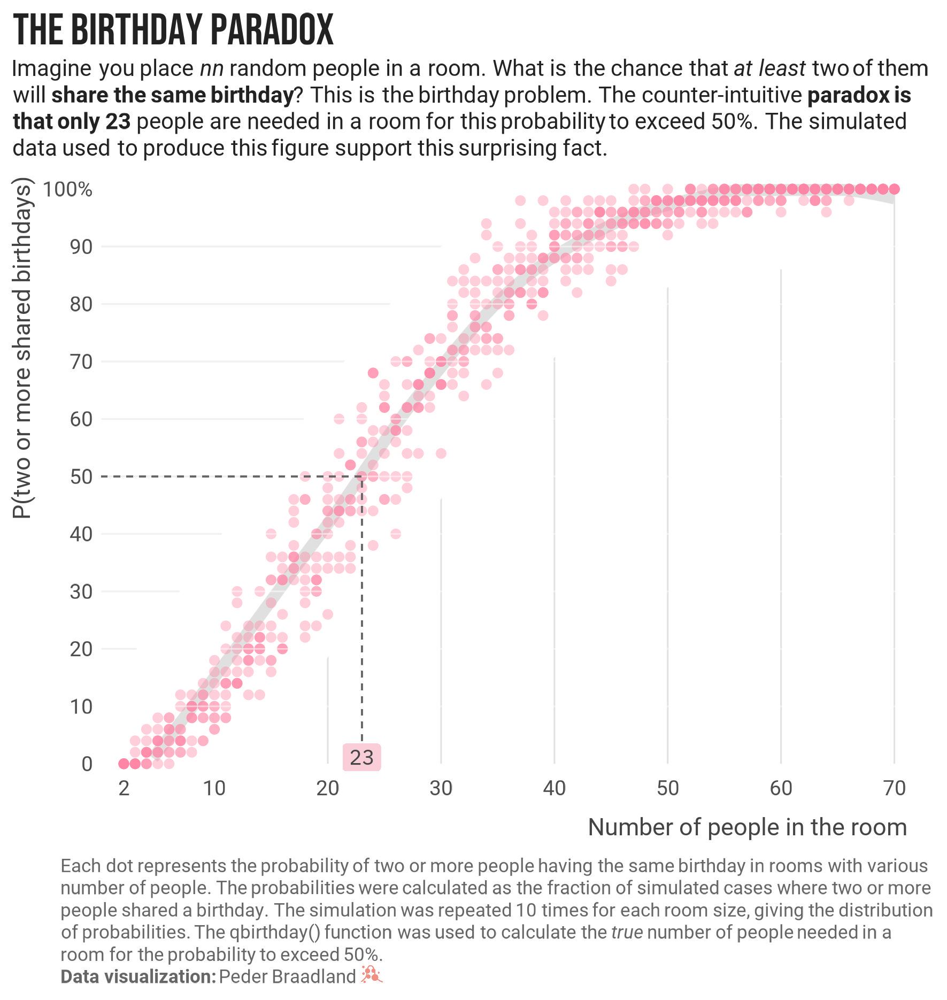{group="apr30daygallery"}

## Day 17 Relationships: Birds

```{r echo = TRUE, message = FALSE, warning = FALSE}
# Packages and reusables
# ----------------------------------------------------------------------------->
library(scales); library(ggpubr); library(ggtext); library(glue); library(showtext); library(tidyverse)
lwd <- unit(2.5, "pt")
theme_bird <- function() {
    theme_minimal(base_size = 9, base_family = "IBM Plex Sans") +
    theme(
        axis.ticks.y = element_blank(),
        panel.grid.minor = element_blank(),
        panel.grid.major.y = element_blank(),
        axis.title.y = element_blank(),
        axis.title.x = element_text(hjust = 0.5, color = "#666666", size = 7, margin = margin(t = 3)),
        axis.text.y = element_text(margin = margin(r = -12)),
        plot.background = element_rect(fill = "#faf8f5", color = NA),
        plot.title = element_textbox_simple(color = "#444444", size = 12, margin = margin(t = 10, b = 5)),
        plot.title.position = "plot",
        plot.subtitle.position = "plot",
        plot.subtitle = element_textbox_simple(color = "#444444", size = 8, margin = margin(t = 0, b = 10)),
        plot.caption = element_textbox_simple(color = "#999999", size = 6, margin = margin(t = 10, b = -2))
    )
}

# Load the data, copied from www.fws.gov/library/collections/threats-birds,
# and wrangle it.
# ----------------------------------------------------------------------------->
bird_raw <- read_delim("day17/na_bird_death_estimates.txt") %>%
    # Remove some categories with no estimates
    filter(!is.na(estimate)) %>%
    select(hazard, estimate) %>%
    # Simplify some category names
    mutate(hazard = case_when(
        hazard == "Collision - Vehicles" ~ "Vehicles",
        hazard == "Collisions - Electrical lines" ~ "Electrical lines",
        hazard == "Collisions - Communication towers" ~ "Communication towers",
        hazard == "Collisions - Land-based Wind Turbines" ~ "Wind turbines",
        TRUE ~ hazard
    )) %>%
    # Remove Oil Pits - what are those anyways?
    filter(hazard != "Oil Pits")
    
# I did this wrangling exercise to expand categories that exceed 500 million bird
# deaths, as I thought I could pass the data directly to the aes() call.
# However, I ended up actually just manually defining x and xend positions for the
# segments based on data from the following 'bird' data frame. Hence, defining
# this data frame is not strictly necessary, but perhaps helpful as a guide for
# making the segments. 
bird <- bird_raw %>%
    # Expand categories where estimate exceeds 500 million, to enable several rows 
    # for these categories
    rowwise() %>%
  mutate(
    n_rows = ceiling(estimate / 5e8),
    chunks = list(
      rep(5e8, n_rows - 1) %>%
        append(estimate - (n_rows - 1) * 5e8)
    )
  ) %>%
  unnest_longer(chunks) %>%
  rename(chunk_estimate = chunks) %>%
  select(hazard, chunk_estimate) %>%
    left_join(bird_raw %>% rename(total = estimate) %>% mutate(total = comma(total)))
    
# Plotting 
# ----------------------------------------------------------------------------->
# First we plot the snakey cat-plot. The issue here is that the length of the curved
# segments do not actually represent any data points. Since one may "feel" that their
# lengths matter, I've made the linear segments a *bit* shorter than 500 million.
p_cats <- 
bird %>%
    filter(hazard == "Cats") %>%
    mutate(
        pos = as.factor(c(nrow(.):1)),
        x = c(0, 2e7, 2e7, 2e7, 2e7),
        xend = c(4.8e8, 4.8e8, 4.8e8, 4.8e8, 4e8)
    ) %>%
    ggplot() +
    scale_x_continuous(expand = c(0.1, 0.1), breaks = seq(0, 5e8, 1e8), limits = c(0, 5e8))+
    scale_y_discrete(expand = c(0.1, 0.1), labels = c("", "", "", "", "Cats"))+
    theme_bird()+
    geom_segment(aes(x = x, xend = xend, y = pos), size = lwd, lineend = "butt", color = "#ff85a5")+
    geom_curve(aes(x = 4.8e8, xend = 4.8e8, y = 5, yend = 4), size = lwd, curvature = -1.4, color = "#ff85a5")+
    geom_curve(aes(x = 2e7, xend = 2e7, y = 4, yend = 3), size = lwd, curvature = 1.4, color = "#ff85a5")+
    geom_curve(aes(x = 4.8e8, xend = 4.8e8, y = 3, yend = 2), size = lwd, curvature = -1.4, color = "#ff85a5")+
    geom_curve(aes(x = 2e7, xend = 2e7, y = 2, yend = 1), size = lwd, curvature = 1.4, color = "#ff85a5") +
    geom_text(aes(x = 4.05e8, y = 1), label = bird %>% filter(hazard == "Cats") %>% pull(total), hjust = 0, family = "IBM Plex Sans", size = 2.5, color = "#ff85a5")+
    labs(
        title = "**Top Threats to Birds**",
        subtitle = "The numbers represent **estimates of annual bird mortality** in the U.S. While there certainly are both positive and negative sides to wind turbines, the focus on them being a major threat to birds may be overstated (although some bird species may be more affected than others). Keeping <strong style='color: #ff85a5;'>cats</strong> on a leash will have a far greatest impact on reducing bird mortality."
        )

# Then building glass (windows). This one is made similar to the cats plot. Since
# The second row goes from right to left, we need to take that into account when 
# defining the xend, going from 500 million to 500 million minus 9.9e07 (which is 
# the chunk estimate from the second, expanded row in the 'birds' data frame)
p_building_glass <- 
    bird %>%
    filter(hazard == "Collision - Building Glass") %>%
    mutate(
        pos = as.factor(c(2, 1)),
        x = c(0, 4.8e8),
        xend = c(4.8e8, 5e8-9.9e07)
    ) %>%
    ggplot() +
    scale_x_continuous(expand = c(0.1, 0.1), breaks = seq(0, 5e8, 1e8), limits = c(0, 5e8))+
    scale_y_discrete(expand = c(0.15, 0.15), labels = c("", "Windows"))+
    theme_bird()+
    geom_segment(aes(x = x, xend = xend, y = pos), size = lwd, lineend = "butt", color = "#9c9792")+
    geom_curve(aes(x = 4.8e8, xend = 4.8e8, y = 1, yend = 2), size = lwd, curvature = 1.4, color = "#9c9792") +
    geom_text(aes(x = 5e8-105000000, y = 1), label = bird %>% filter(hazard == "Collision - Building Glass") %>% pull(total), hjust = 1, family = "IBM Plex Sans", size = 2.5, color = "#736d67")

# Then the other categories (each with a total less than half a billion). Here it's
# much easier since we have no "snakes"/overflowing bars. 
p_rest <- 
bird %>%
    filter(hazard %ni% c("Collision - Building Glass", "Cats")) %>%
    ggplot(aes(x = 0, xend = chunk_estimate, y = reorder(hazard, chunk_estimate), yend = reorder(hazard, chunk_estimate)))+
    geom_segment(size = lwd, lineend = "butt", color = c("#9c9792", "#9c9792", "#9c9792", "#ff85a5", "#9c9792", "#9c9792"))+
    scale_x_continuous(expand = c(0.1, 0.1), breaks = seq(0, 5e8, 1e8), limits = c(0, 5e8), 
                       labels = c("0", "100", "200", "300", "400", "500 million"))+
    scale_y_discrete(expand = c(0.1, 0.1))+
    theme_bird()+
    labs(
        x = "Number of birds killed",
        caption = "**Source**: fws.gov/library/collections/threats-birds | **Data visualization:** Peder Braadland "
    ) +
    geom_text(aes(x = chunk_estimate, label = total), hjust = 0, position = position_nudge(x = 2e6), family = "IBM Plex Sans", size = 2.5, color = c("#736d67", "#736d67", "#736d67", "#ff85a5", "#736d67", "#736d67"))

# Saving the plot
# ----------------------------------------------------------------------------->
# showtext_auto()
# showtext_opts(dpi = 500)
# Save as pdf, to add vector graphic from iconify.org to the plot, and to "connect"
# the grid-lines which are not completely connected between the three arranged plots 
# in the composite.
# ggsave("day17/out/birds.pdf",
#        ggarrange(
#            p_cats + theme(axis.text.x = element_blank(), axis.title.x = element_blank(), plot.margin = unit(c(0, 3, 0, 3), "mm")),
#            p_building_glass + theme(axis.text.x = element_blank(), axis.title.x = element_blank(), plot.margin = unit(c(2, 3, 0, 3), "mm")),
#            p_rest  + theme(plot.margin = unit(c(0, 3, 3, 3), "mm")),
#            nrow = 3, align = "v", heights = c(3, 0.55, 3.5)), 
#        width = 140, height = 95, unit = "mm", dpi = 500, device = cairo_pdf)

# Alternative for illustration
# bird_raw %>%
#     ggplot(aes(y = reorder(hazard, estimate), x = estimate))+
#     geom_col()+
#     scale_x_log10()
```

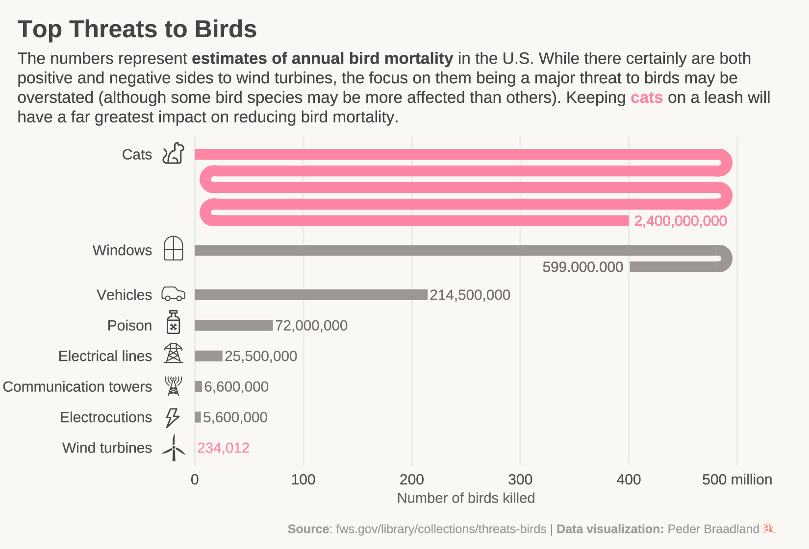{group="apr30daygallery"}

## Day 19 Timeseries::Smooth

```{r echo = TRUE, message = FALSE, warning = FALSE}
library(tidyverse)
library(ggrepel)
library(showtext)
library(ggtext)

pop <- read_delim(file = "day19/pollofpolls.txt") %>%
  mutate(across(-date, ~ (gsub("\\s*\\(.*\\)", "", .)))) %>%
  separate(col = date, sep = " '", into = c("month", "year")) %>%
  mutate(across(-c(month, year), ~ as.numeric(gsub(",", ".", .)))) %>%
  mutate(year = paste0(20, year), year = as.numeric(year)) %>%
  pivot_longer(cols = -c(month, year), names_to = "party", values_to = "poll_res")

pal <- c(
  H = "#009de0",
  AP = "#e81502",
  FrP = "#0c366c",
  SP = "#b7cc2b",
  SV = "#cc08c9",
  V = "#12c4a7",
  MDG = "#138031",
  KrF = "#feb937",
  R = "#7b0a02",
  Andre = "#888888"
)
pollofpolls_p <-
  pop %>%
  ggplot() +
  geom_smooth(aes(x = year, y = poll_res, color = party), span = 0.1, se = FALSE, linewidth = 0.4)

# Now that we have the plot, we can extract the smoothed endpoints of each line
# to which we can annotate with party labels...
smooth_ends <- ggplot_build(pollofpolls_p)$data[[1]]
party_lookup <- pop %>%
  group_by(party) %>%
  summarise(group = cur_group_id())
# Create the data for the geom_text_repel()
smooth_labeled <- smooth_ends %>%
  group_by(group) %>%
  slice_max(order_by = x, n = 1) %>%
  left_join(party_lookup, by = "group")

# Election years
election_yrs <- tibble(
  xmin = c(2009, 2013, 2017, 2021, 2025),
  xmax = xmin + 1,
  label = "Election year"
)

pollofpolls_p <-
  ggplot(pop, aes(x = year, y = poll_res, color = party, size = ifelse(party %in% c("H", "AP", "FrP", "SP"), "b", "a"))) +
  geom_rect(
    data = election_yrs,
    aes(xmin = xmin, xmax = xmax, ymin = 0, ymax = 38),
    inherit.aes = FALSE,
    fill = "#FFFFFF", alpha = 0.7
  ) +
  geom_label(
    data = election_yrs,
    aes(x = xmin, y = 38, label = label),
    inherit.aes = FALSE,
    color = "#999999",
    hjust = 0,
    label.size = 0,
    family = "Montserrat",
    size = 2, alpha = 0.7
  ) +
  geom_jitter(shape = 16, alpha = 0.25, width = 0.5, size = 0.8) +
  geom_smooth(method = "loess", span = 0.20, se = FALSE, fullrange = TRUE) +
  scale_size_manual(values = c(0.2, 0.6)) +
  scale_color_manual(values = pal) +
  scale_fill_manual(values = pal) +
  theme_minimal(base_size = 8, base_family = "IBM Plex Sans") +
  theme(
    legend.position = "none",
    panel.grid.major.x = element_blank(),
    panel.grid.minor.x = element_line(color = "#F9F9F9"),
    panel.grid.minor.y = element_blank(),
    axis.ticks = element_blank(),
    axis.title.y = element_blank(),
    axis.text.y = element_text(margin = margin(r = -15), vjust = -0.3, hjust = 0),
    axis.title.x = element_blank(),
    plot.margin = unit(c(2, 2, 2, 4), "mm"),
    plot.title = element_textbox_simple(face = "bold", size = 11),
    plot.subtitle = element_textbox_simple(size = 7, color = "#666666", margin = margin(8, 0, 6, 0)),
    plot.caption = element_textbox_simple(color = "#999999", margin = margin(5, 0, 3, 0)),
    plot.background = element_rect(fill = "#FAF9F6", color = NA)
  ) +
  scale_x_continuous(expand = expansion(mult = c(0.08, 0.08)), breaks = c(2025, 2021, 2017, 2013, 2009)) +
  scale_y_continuous(labels = c("0%", "10%", "20%", "30%"), breaks = c(0, 10, 20, 30), limits = c(0, 40)) +
  labs(
    title = "Long-Term Polling Trends for Norwegian Political Parties (Parliamentary Elections)",
    subtitle = "Smoothed lines (span = 0.20) summarize monthly polling data. Note that recent shifts in voter support may not be fully captured by the smoother, including a strong uptick in support for <strong style='color: #e81502;'>AP</strong>  and a downward trend for <strong style='color: #0c366c;'>FrP</strong>.",
    caption = "**Source:** PollOfPolls.no | **Data visualization:** Peder Braadland "
  ) +
  geom_text_repel(
    data = smooth_labeled,
    aes(x = x, y = y, label = party, color = party),
    direction = "y",
    force = 0.1,
    nudge_x = 1.5,
    hjust = 0,
    segment.size = 0.1,
    segment.color = "#999999",
    segment.linetype = "dashed",
    segment.curvature = 0.15,
    family = "Montserrat", size = 2.2
  )

# showtext_auto()
# showtext_opts(dpi = 500)
# ggsave("day19/out/pollofpolls.jpg", pollofpolls_p, width = 140, height = 90, unit = "mm", dpi = 500)
```

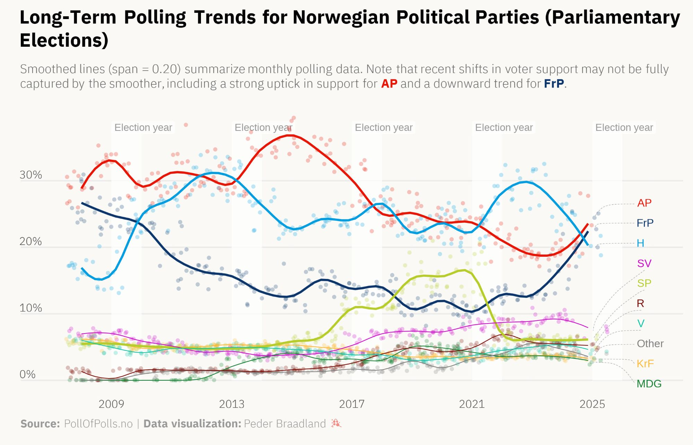{group="apr30daygallery"}

## Day 25 Uncertainty::Risk

```{r echo = TRUE, message = FALSE, warning = FALSE}
library(survival); library(survminer); library(tidyverse); library(ggtext); library(showtext)
fit <- survfit(Surv(futime, status) ~ trt, udca1 %>% mutate(futime = futime/365.25))
font_add_google("IBM Plex Sans", regular.wt = 400)
group_labels <- rep(names(fit$strata), fit$strata)
km_data <- data.frame(
  time = fit$time,
  surv = fit$surv,
  lower = fit$lower,
  upper = fit$upper,
  n.risk = fit$n.risk,
  n.event = fit$n.event,
  n.censor = fit$n.censor,
  group_labels = group_labels
)
censor_data <- km_data %>% filter(n.censor > 0)

km <- 
ggplot(km_data, aes(x = time, y = surv, color = group_labels)) +
    geom_ribbon(aes(ymin = lower, ymax = upper, fill = group_labels), 
              alpha = 0.2, linetype = 0, show.legend = FALSE)+
  geom_step(linewidth = 1.5) +
  geom_point(data = censor_data, aes(x = time, y = surv), shape = 16, color = "white", size = 0.8, alpha = 0.7) + 
  labs(x = "Time", y = "Survival probability") +
  theme_minimal(base_family = "IBM Plex Sans", base_size = 8)+
    scale_y_continuous(limits = c(0,1), expand = expansion(mult = c(0, 0.05)), breaks = seq(0.25, 1, 0.25), labels = c("25%", "50%", "75%", "100%"))+
    scale_x_continuous(expand = c(0,0), breaks = seq(0, 5, 1), labels = c("0", "1 yr", "2 yrs", "3 yrs", "4 yrs", "5 yrs"), limits = c(0, 5))+
    scale_color_manual(labels = c("Placebo", "UDCA"), values = c("#95bbbe", "#f27b5f"))+
    scale_fill_manual(labels = c("Placebo", "UDCA"), values = c("#95bbbe", "#f27b5f"))+
    theme(
        plot.subtitle = element_textbox_simple(margin = margin(t = 5, b = 10), color = "#444444", size = 7),
        plot.title = element_textbox_simple(margin = margin(t = 5, b = 5), color = "#444444", size = 11, face = "bold"),
        plot.title.position = "plot",
        legend.position = "none",
        plot.margin = unit(c(4,4,4,4), "mm"),
        axis.line.x = element_line(size = 0.25, color = "#444444"),
        axis.ticks.x = element_line(size = 0.25, color = "#444444"),
        axis.ticks.length = unit(2, "mm"),
        axis.title = element_blank(),
        plot.background = element_rect(fill = "#fdfbf7", color = NA),
        panel.grid.minor = element_blank(),
        panel.grid.major.x = element_blank(),
        axis.ticks.y = element_line(color = "#e0e0e0"),
        panel.grid.major.y = element_line(color = "#e0e0e0"),
        plot.caption = element_textbox_simple(color = "#777777", size = 6, margin = margin(t = 12, b = 0))
    )+
    labs(
        title = "UDCA and the *risk* of treatment failure in PBC",
        subtitle = "Kaplan Meier plot showing the **probability of treatment failure** for treatment groups from a trial testing the efficacy of <strong style='color: #f27b5f;'>ursodeoxycholic acid (UDCA)</strong> *vs* <strong style='color: #95bbbe;'>placebo</strong> in the cholestatic liver disease primary biliary cholangitis (PBC). For more detail see Lindor et al., Gastroenterology **1994**;106:1284-1290.",
        caption = "**Source:** survival::udca1 | **Data visualization:** Peder Braadland "
    ) +
    geom_label(family = "IBM Plex Sans", color = "#444444", size = 2.2, x = 2.6, y = 0.25, lineheight = 0.9, hjust = 1, label.size = NA, 
               fill = "#fdfbf7",
             label = "Each white dot indicates censoring, i.e.\nthat a patient was lost to follow-up without\nprior treatment failure.") +
    geom_curve(aes(x = 2.65, xend = 3.29, y = 0.25, yend = 0.42), arrow = arrow(length = unit(1.5, "mm"), type = "closed"), size = 0.2, color = "#888888", curvature = 0.4)+
    
    geom_label(family = "IBM Plex Sans", color = "#444444", size = 2.2, x = 2.8, y = 0.98, lineheight = 0.9, hjust = 0, label.size = NA, fill = "#fdfbf7", 
             label = "Each step indicates that an event (here:\ntreatment failure) occurred")+
    geom_curve(aes(x = 2.75, xend = 2.12, y = 0.98, yend = 0.85), arrow = arrow(length = unit(1.5, "mm"), type = "closed"), size = 0.2, color = "#888888", curvature = 0.4) +
    
    geom_label(family = "IBM Plex Sans", color = "#444444", size = 2.2, x = 1.5, y = 0.6, lineheight = 0.9, hjust = 1, label.size = NA, fill = "#fdfbf7",
             label = "The shaded areas indicate\n95% confidence intervals")+
    geom_curve(aes(x = 1.55, xend = 1.85, y = 0.6, yend = 0.7), arrow = arrow(length = unit(1.5, "mm"), type = "closed"), size = 0.2, color = "#888888", curvature = 0.4)

# Legend


showtext_auto()
showtext_opts(dpi = 500)
ggsave("day25/out/km.jpg", km, width = 120, height = 100, unit = "mm", dpi = 500)
```

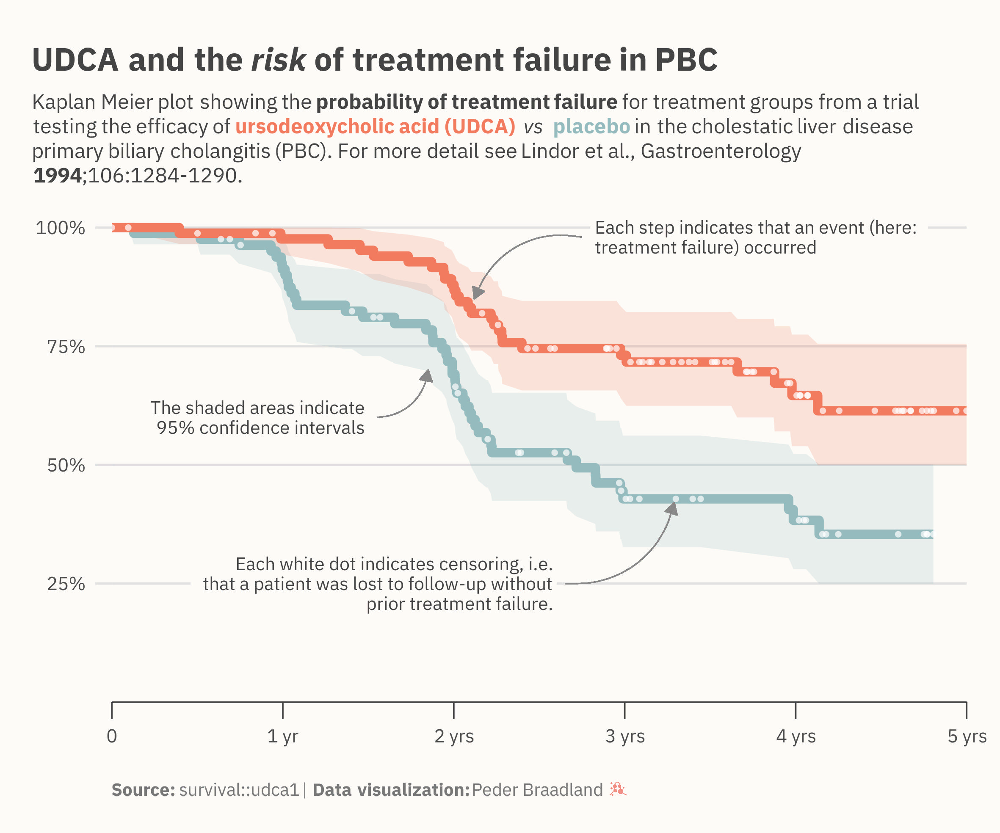{group="apr30daygallery"}


## Day 27 Uncertainty::Noise

```{r warning = FALSE, message = FALSE}
library(tidyverse); library(ggrepel); library(ggpubr); library(ggtext); library(showtext)
# 2021 relections first
# We first check how PollOfPolls calculate their averages
e_date_2021 <- as.Date("2021-09-15")
e_res_2021 <- c(
    R = 4.7,
    SV = 7.6,
    AP = 26.3,
    SP = 13.5,
    MDG = 3.9,
    KrF = 3.8,
    V = 4.6,
    H = 20.4,
    FrP = 11.6
)
e_date_2017 <- as.Date("2017-09-11")
e_res_2017 <- c(
    R = 2.4,
    SV = 6.0,
    AP = 27.4,
    SP = 10.3,
    MDG = 3.2,
    KrF = 4.2,
    V = 4.4,
    H = 25.0,
    FrP = 15.2
)
e_date_2013 <- as.Date("2013-09-11")
e_res_2013 <- c(
    R = 1.1,
    SV = 4.1,
    AP = 30.8,
    SP = 5.5,
    MDG = 2.8,
    KrF = 5.6,
    V = 5.2,
    H = 26.8,
    FrP = 16.3
)

e_res_df <- 
enframe(e_res_2021, name = "party", value = "election_res") %>% mutate(year = 2021) %>%
    bind_rows(enframe(e_res_2017, name = "party", value = "election_res") %>% mutate(year = 2017)) %>%
    bind_rows(enframe(e_res_2013, name = "party", value = "election_res") %>% mutate(year = 2013))


polls <- 
        read_delim(file = "day27/2021.txt") %>% mutate(year = 2021) %>%
        bind_rows(read_delim(file = "day27/2017.txt") %>% mutate(year = 2017)) %>%
        bind_rows(read_delim(file = "day27/2013.txt") %>% mutate(year = 2013)) %>%
        mutate(across(-c(date, pollster, year), ~ (gsub("\\s*\\(.*\\)", "", .)))) %>%
        mutate(across(-c(pollster, date, year), ~ as.numeric(gsub(",", ".", .)))) %>%
        mutate(date = dmy(date)) %>%
        # Pivot longer
        pivot_longer(cols = -c(pollster, date, year), names_to = "party", values_to = "vote_share") %>%
    filter(party != "Other")

# We can check how PollOfPolls calculate their averages (benchmarking against their 2021 data)
# polls %>%
#   filter(year == 2021) %>%
#   group_by(party) %>%
#   summarise(average = mean(vote_share))
# Which seems to return the same numbers as on their website. 


# Now remove any poll taken _after_ the elections or before 2 weeks prior to the election
polls_filtered <- 
    polls %>%
    filter(
    case_when(
      year == 2021 ~ date < e_date_2021 & date >= e_date_2021 - 14,
      year == 2017 ~ date < e_date_2017 & date >= e_date_2017 - 14,
      year == 2013 ~ date < e_date_2013 & date >= e_date_2013 - 14,
      TRUE ~ FALSE  # Exclude other polls
    )
  )

# We now calculate summary statistics
polls_sum_stat <- 
polls_filtered %>%
    group_by(year, party) %>%
    summarise(
        mean_poll_vote = mean(vote_share),
        sd_poll_vote = sd(vote_share)
    ) %>%
    mutate(lower = mean_poll_vote - sd_poll_vote,
           upper = mean_poll_vote + sd_poll_vote) %>%
    # Add the election results for the two years
    left_join(e_res_df)

# Now we plot the calibration plots, for three years

years <- c(2013, 2017, 2021)

# Function to generate plot per year
plot_per_year <- function(y) {
  polls_sum_stat %>%
    filter(year == y) %>%
    ggplot(aes(x = mean_poll_vote, y = election_res, fill = party, color = party, label = party)) +
    geom_abline(size = 0.20, color = "#999999") +
    geom_errorbar(aes(xmin = lower, xmax = upper), width = 0.5, linewidth = 0.3) +
    geom_point(size = 2, alpha = 1, color = "white", shape = 21, stroke = 0.2) +
    geom_text_repel(family = "IBM Plex Sans", size = 2, segment.color = "#444444", segment.size = 0.15) +
    labs(
      title = paste("Election", y),
      x = "Polling average",
      y = "Election result"
    ) +
    theme_minimal(base_family = "IBM Plex Sans", base_size = 7) +
    theme(
      panel.spacing = unit(4, "mm"),
      axis.ticks.length = unit(1.5, "mm"),
      panel.grid.minor = element_blank(),
      legend.position = "none",
      plot.background = element_rect(color = NA, fill = "#faf8f5"),
      plot.margin = unit(c(6,6,1,6), "mm"),
      axis.title = element_text(color = "#444444", margin = margin(r = 5)),
      axis.line = element_line(color = "#444444", size = 0.2),
      axis.ticks = element_line(color = "#444444", size = 0.2),
      plot.title = element_text(color = "#444444", size = 8)
    ) +
    scale_fill_manual(values = pal) +
    scale_color_manual(values = pal) +
    scale_x_continuous(limits = c(0, 35), expand = c(0, 0), breaks = seq(0, 30, 10), labels = c("0", "10", "20", "30%")) +
    scale_y_continuous(limits = c(0, 35), expand = c(0, 0), breaks = seq(0, 30, 10), labels = c("0", "10", "20", "30%")) +
    coord_cartesian(clip = "off")
}

# Apply the function to each year
plots <- lapply(years, plot_per_year)

# Create a title and subtitle plot
title_p <- 
    ggplot()+
    theme_void()+
    theme(
        plot.background = element_rect(fill = "#faf8f5", color = NA),
        plot.subtitle = element_textbox_simple(family = "IBM Plex Sans", size = 6, color = "#444444"),
        plot.title = element_textbox_simple(margin = margin(t = 12, b = 16), family = "IBM Plex Sans", size = 9, color = "#444444"),
        plot.margin = unit(c(4, 6, 0, 6), "mm"),
        plot.caption = element_textbox_simple(size = 6, color = "#999999", family = "IBM Plex Sans")
    ) +
    labs(
        title = "**Predicted *vs* actual** election results",
        subtitle = "Every four years, parliamentary elections are held in Norway. This plot visualizes how well the predictions (polls) from the final two weeks leading up to the elections in 2013, 2017 and 2021 corresponded with the actual vote shares from election day. Points falling along the diagonal line indicate concordance between predicted and actual vote shares.<br><br>The predictions were calculated as unweighted averages of polls. The horizontal error bars indicate the standard deviation. Note that polling and reporting of poll numbers reflect what happened a while back...",
            caption = "**Source:** PollOfPolls.no<br>**Data visualization:** Peder Braadland <br><br><br><br>"
        )
plots[[1]] <- 
plots[[1]] +
    geom_segment(aes(x = 9, y = 9, xend = 9, yend = 22), arrow = arrow(length = unit(1, "mm"), type = "closed"), size = 0.2, color = "#444444")+
    geom_label(aes(x = 9, y = 25), label = "Overperformance\nrelative to polls", family = "IBM Plex Sans", color = "#444444", fill = "white", size = 1.8, label.size = NA)+
    
    geom_segment(aes(x = 23, y = 23, xend = 23, yend = 9), arrow = arrow(length = unit(1, "mm"), type = "closed"), size = 0.2, color = "#444444")+
    geom_label(aes(x = 23, y = 6), label = "Underperformance\nrelative to polls", family = "IBM Plex Sans", color = "#444444", fill = "white", size = 1.8, label.size = NA)

composite <- ggarrange(title_p, plots[[1]], plots[[2]], plots[[3]], nrow = 2, ncol = 2)

showtext_auto()
showtext_opts(dpi = 500)
ggsave("day27/out/calib_poll.jpg", composite, width = 130, height = 120, unit = "mm", dpi = 500)
```

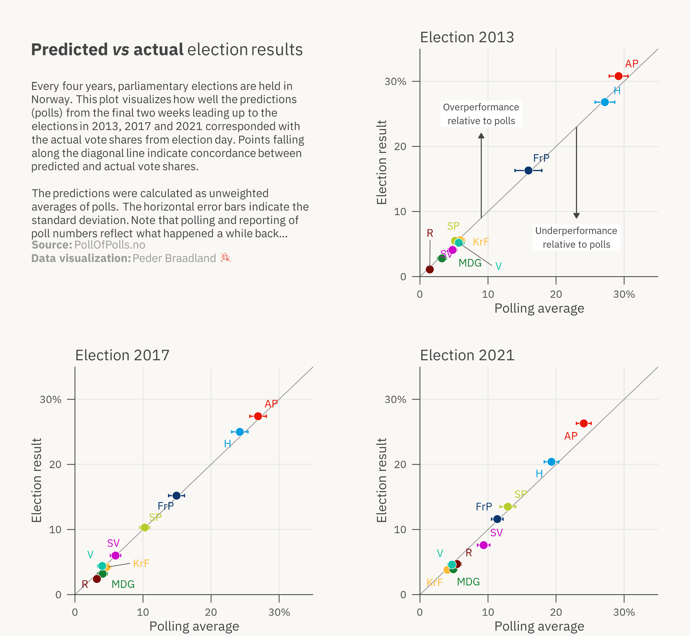

```{r warning = FALSE, message = FALSE, eval = FALSE, include = FALSE}
library(lubridate)
plot_list <- list()
for(i in unique(polls$party)) {
tmp_df <-     polls %>%
    filter(party == i) %>%
    # Now remove any poll taken _after_ the elections or before 1 month prior to the election
    filter(
        case_when(
            year == 2021 ~ date < e_date_2021 & date >= e_date_2021 - 30,
            year == 2017 ~ date < e_date_2017 & date >= e_date_2017 - 30,
            year == 2013 ~ date < e_date_2013 & date >= e_date_2013 - 30,
            TRUE ~ FALSE  # Exclude other polls
            )
        ) %>%
    mutate(true_share = 
               case_when(year == 2013 ~ e_res_2013[[i]],
                         year == 2017 ~ e_res_2017[[i]],
                         year == 2021 ~ e_res_2021[[i]])
    ) %>%
    mutate(deviation = true_share - vote_share) %>%
    # Need to create synthetic days going from negative 90 days to day 0
    mutate(
  election_date = case_when(
    year == 2013 ~ e_date_2013,
    year == 2017 ~ e_date_2017,
    year == 2021 ~ e_date_2021
  ),
  days_to_election = as.numeric(difftime(date, election_date, units = "days"))
)
    
plot_list[[i]] <- 
    tmp_df %>%
    ggplot(aes(x = days_to_election, y = deviation))+
    geom_hline(yintercept = 0)+
    #geom_smooth(data = tmp_df %>% filter(year == 2013), color = "#edd492", se = FALSE, span = 0.4, linewidth = 0.2)+
    geom_jitter(data = tmp_df %>% filter(year == 2013), color = "#edd492", alpha = 0.5)+
    #geom_smooth(data = tmp_df %>% filter(year == 2017), color = "#6a8782", se = FALSE, span = 0.4)+
    geom_jitter(data = tmp_df %>% filter(year == 2017), color = "#6a8782", alpha = 0.5)+
    #geom_smooth(data = tmp_df %>% filter(year == 2021), color = "#d18681", se = FALSE, span = 0.4)+
    geom_jitter(data = tmp_df %>% filter(year == 2021), color = "#d18681", alpha = 0.5)+
    theme_minimal(base_size = 6)+
    theme(
        panel.grid = element_blank(),
        axis.title.y = element_blank(),
        panel.border = element_rect(size = 0.15, color = "#666666", fill = NA),
        axis.ticks = element_line(size = 0.15, color = "#666666"),
        axis.ticks.length = unit(1.5, "mm")
    ) +
    labs(
        title = i
    ) +
    scale_y_continuous(limits = c(-4.5, 4.5), breaks = seq(-4, 4, 1))+
    scale_x_continuous(breaks = c(-30, -20, -10, 0), labels = c("30", "20", "10", "E.D."), limits = c(-30, 0))
}
comp <- ggarrange(plotlist = plot_list, nrow = 3, ncol = 3) 
ggsave("extra_poll_calib.jpg", comp, width = 140, height = 140, unit = "mm", dpi = 500)
```


```{r fig.width = 12, fig.height = 4, include = FALSE, eval = FALSE}
library(tidyverse); library(ggtext)

strava <- read_csv("day6/strava_activities.csv") %>%
    filter(`Activity Type` == "Run") %>%
  select(activity_id = `Activity ID`, filename = `Filename`, name = `Activity Name`, date = `Activity Date`, duration_s = `Elapsed Time...6`, distance_km = `Distance...7`, avg_hr = `Average Heart Rate`, relative_effort = `Relative Effort...9`, wt = `Athlete Weight`, avg_gap = `Average Grade Adjusted Pace`, max_hr = `Max Heart Rate...8`, elev_gain = `Elevation Gain`) %>%
  mutate(date = mdy_hms(date)) %>%
  arrange(date) %>%
  mutate(cum_distance = cumsum(distance_km)) %>%
  mutate(yr = year(date)) %>%
  # Remove really quick runs
  filter(duration_s > 500) %>%
  mutate(hour = lubridate::hour(date))
```


```{r fig.width = 12, fig.height = 4, include = FALSE, eval = FALSE}
# Most popular time for runs
# ----------------------------------------------------------------------------->
strava %>%
    mutate(hour_range = paste0(hour, "-", hour+1),
           # Need to factorize this or else we get a funky order of the hours
           hour_range = factor(hour_range, levels = paste0(0:23, "-", 1:24))) %>%
    group_by(yr, hour_range) %>%
    count() %>%
    ggplot(aes(x = hour_range, y = n))+
    geom_col()+
    theme_minimal(base_size = 2)+
    labs(x = "Starting time of run")
```


```{r fig.width = 12, fig.height = 4, include = FALSE, eval = FALSE}
# Github-like dashboard
# ----------------------------------------------------------------------------->

# We loop over a few years to create a plot composite
yrs_of_int <- 2020:2025
# We create a plot container
plot_container <- list()

# We can use cut to give say 10 distance ranges that will make out the fill color
# We can also use these same cuts as breakpoints in a histogram legend
strava_dashboard_df <- strava %>%
    filter(yr %in% yrs_of_int) %>%
    mutate(distance_breaks = cut(distance_km, breaks = 10),
           distance_breaks = as.factor(distance_breaks),
           distance_breaks = fct_rev(distance_breaks))
# We can create a palette by creating a sequence of alphas (lighter means shorter run)
alphas <- seq(1, 0.2, length.out = 10) 
palette <- scales::alpha("#6a8782", alphas)

# We make the legend, which is based on the years of interest (now 2020:2025)
leg <- 
    tibble(distance_breaks = "Rest day") %>%
    bind_rows(strava_dashboard_df %>%
                  group_by(distance_breaks) %>%
                  slice(1)) %>%
    mutate(distance_breaks = as.factor(distance_breaks)) %>%
    ggplot(aes(x = distance_breaks, y = "", fill = distance_breaks))+
    geom_tile(size = 1.5, color = "white") +
    theme_minimal(base_size = 6, base_family = "IBM Plex Sans")+
    theme(
        axis.title = element_blank(),
        axis.text.y = element_blank(),
        legend.position = "none",
        panel.grid = element_blank(),
        axis.text.x = element_text(angle = 40, hjust = 1, vjust = 1),
        plot.margin = unit(c(0, 70, 0, 70), "mm")
    ) +
    scale_fill_manual(values = c(palette, "#f9f9f9"))+
    scale_x_discrete(limits = rev)

for(i in yrs_of_int){
yr_of_int <- i

strava_calendar <- 
strava_dashboard_df %>%
    # Collect weekday from date
    mutate(
        week = lubridate::isoweek(date),
        weekday = lubridate::wday(date, label = TRUE)) %>%
    filter(yr == yr_of_int) %>%
    select(date, yr, week, weekday, distance_breaks) %>%
    mutate(trained = "yes") %>%
     mutate(date = as.Date(date))

# Now we "fill" in empty days
full_dates <- tibble(date = seq.Date(from = as.Date(paste0(yr_of_int, "-01-01")),
                                     to = as.Date(paste0(yr_of_int, "-12-31")),
                                     by = "day")) %>%
  mutate(
    yr = isoyear(date),
    day = yday(date),
    week = isoweek(date),
    month = month(date), 
    weekday = wday(date, label = TRUE, abbr = TRUE, week_start = 7)
  )

# Join and fill in missing dates with "no"
strava_calendar <- full_dates %>%
  left_join(strava_calendar %>% select(date, trained, distance_breaks), by = "date") %>%
    mutate(trained = replace_na(trained, replace = "no"))

# We now need to create a kind of grid layout to ensure that the upper-left-most
# tile has the first day of the year, and so on. We create a weekday_index and a
# week_index which is calculated using the weekday_index. The week_index is 0 for
# the week that contains January 1st.

plot_container[[as.character(i)]] <-
    strava_calendar %>%
  arrange(date) %>%
  mutate(
    weekday_index = wday(date, week_start = 1) - 1,  # 0 = Monday, 6 = Sunday
    week_index = as.integer((as.integer(date - min(date)) + weekday_index[1]) / 7)
  ) %>%
    ggplot(aes(x = week_index, y = weekday_index, fill = distance_breaks, label = day))+
    geom_tile(color = "white", linejoin = "mitre", size = 1)+
    theme_minimal(base_size = 7)+
    scale_fill_manual(values = palette, na.value = "#f9f9f9")+
    scale_y_continuous(
        breaks = 0:6,
        labels = c("Mon", "Tue", "Wed", "Thu", "Fri", "Sat", "Sun"),
        trans = "reverse" 
        ) +
    scale_x_continuous(expand = c(0,0), breaks = seq(0, 49, length.out = 12), labels = c("Jan", "Feb", "Mar", "Apr", "May", "Jun", "Jul", "Aug", "Sep", "Oct", "Nov", "Dec"))+
    theme(
        legend.position = "none",
        panel.grid = element_blank(),
        axis.ticks = element_blank(),
        axis.title = element_blank(),
        plot.title = element_textbox_simple(size = 7, color = "#444444", margin = margin(b = 0, t = 0), padding = margin(5, 5, 2, 2), fill = "#F9F9F9"),
        plot.title.position = "plot"
    )+
    labs(title = yr_of_int)+
    coord_fixed()
}

plot_container[["legend"]] <- leg

library(ggpubr)
ggsave("p.jpg", 
                 ggarrange(plotlist = plot_container, nrow = length(plot_container),  heights = c(5, 5, 5, 5, 5, 5, 2)), 
       width = 180, height = 205, unit = "mm", dpi = 500)
```

## Extras

### Remake of FT US policy uncertainty data

```{r warning = FALSE, message = FALSE}
# Remake of @jburnmurdoch.ft.com's viz
library(tidyverse); library(showtext)
df <- read_delim("US_Policy_Uncertainty_Data.txt")

p <- 
df %>%
    mutate(
    Year = as.integer(Year),
    date = ymd(paste(Year, Month, "01", sep = "-"))
  ) %>%
    filter(!is.na(Year)) %>%
    filter(Year > 2004) %>%
    bind_rows(tibble(Year = 2025, Month = 4, Three_Component_Index = NA, News_Based_Policy_Uncert_Index = 1000, date = as.Date("2025-04-01"))) %>%
    ggplot(aes(x = date, y = News_Based_Policy_Uncert_Index))+
    geom_hline(yintercept = seq(200, 600, 200), color = "#e6dace", size = 0.15)+
    geom_line(color = "#d14600", linewidth = 0.6) +
    geom_point(aes(x = max(date), y = 1000), color = "#d14600")+
    theme_minimal(base_family = "Roboto", base_size = 9)+
    theme(
        panel.grid.major = element_blank(),
        panel.grid.minor = element_blank(),
        axis.line.x = element_line(color="#5e5250", size = 0.4),
        axis.ticks.x =  element_line(color="#5e5250", size = 0.4),
        axis.text = element_text(color = "#5e5250"),
        axis.title = element_blank(),
        plot.title = element_text(vjust = -21, color = "#332f2c", size = 13),
        plot.subtitle = element_text(vjust = -40, color = "#5e5250", size = 7),
        plot.title.position = "plot",
        plot.background = element_rect(fill = "#fff1e6", color = NA),
        plot.caption = element_text(size = 5, color = "#5e5250", hjust = 0),
        plot.caption.position = "plot",
        plot.margin = unit(c(-7, 1, 1, 1), "mm")
    ) +
    scale_y_continuous(breaks = seq(0, 600, 200))+
    labs(title = "Uncertainty has exploded under Trump",
         subtitle = "US Economic Policy Uncertainty Index",
         caption = "Source: policyuncertainty.com/\nBased on @jburnmurdoch.ft.com's graphic\nPeder Braadland")+
    scale_x_date(expand = c(0.015, 0.015))+
    annotate(geom = "text", label = "Trump", x = as.Date("2024-10-01"), y = 1000, vjust = 0.5, size = 2, color = "#5e5250", hjust = 1, family = "Roboto")+
    annotate(geom = "text", label = "Covid-19\npandemic", x = as.Date("2019-11-01"), y = 460, vjust = 0.5, lineheight = 0.85, size = 2, color = "#5e5250", hjust = 1, family = "Roboto")

showtext_auto()
showtext_opts(dpi = 500)
ggsave("jburnmurdoch.jpg", p, width = 90, height = 65, unit = "mm", dpi = 500)
```

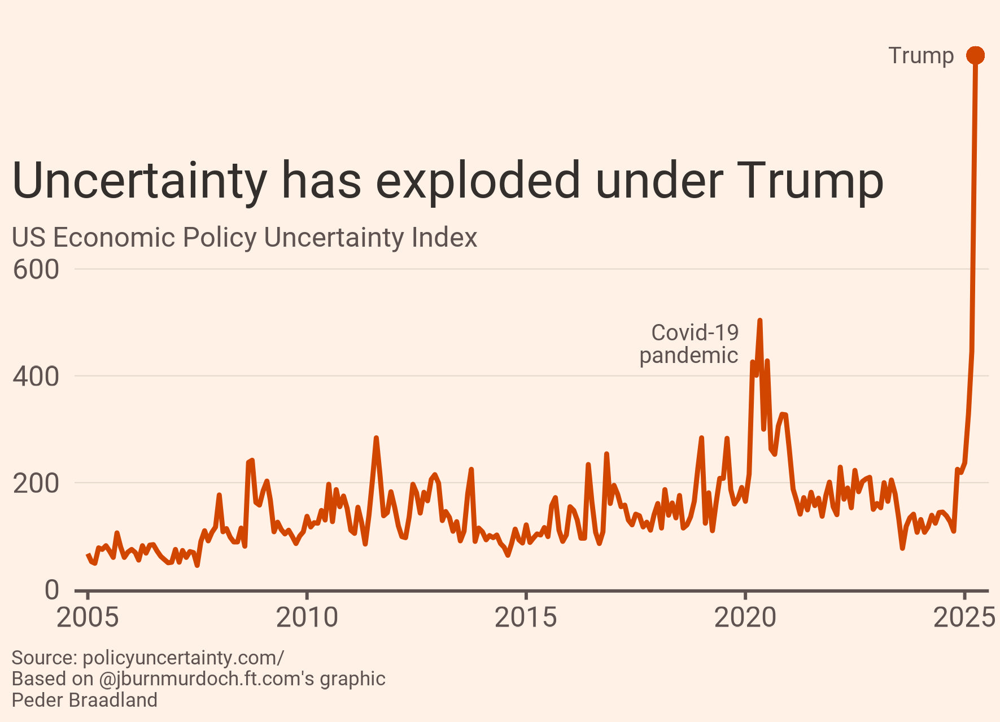{group="apr30daygallery"}

### ???

```{r warning = FALSE, message = FALSE}
library(tidyverse); library(ggrepel); library(ggpubr); library(showtext); library(ggtext); library(ggforce)
stemmer <- read_delim("stemmer.csv")
inntekt <- read_delim("inntekt.csv")
detalj <- read_delim("bydel_H.txt")

length(intersect(stemmer$Bydel, inntekt$Bydel))

p <-
stemmer %>%
    left_join(inntekt) %>%
    ggplot(aes(x = Gjennomsnitt, y = andel_H, label = Bydel))+
    geom_point(color = "#FFFFFF", stroke = 0.1, shape = 21, fill = "#222222")+
    geom_text_repel(family = "IBM Plex Sans", size = 1.75, segment.size = 0.15, color = "#222222")+
    theme_minimal(
        base_family = "IBM Plex Sans",
        base_size = 7
    ) +
    theme(
        plot.title = element_text(size = 14, face = "bold"),
        plot.caption = element_textbox_simple(margin = margin(t = 8)),
        panel.grid.minor = element_line(size = 0.10),
        panel.grid.major = element_line(size = 0.10)
    ) +
    labs(
        y = "Andel stemmer til H",
        x = "Gjennomsnittlig eiendomsskatt",
        caption = "**Kilde:** Frifagbevegelse.no<br>**Grafikk:** Peder Braadland",
        title = "Hmmmm...."
    )

p_detail <-
    detalj %>%
    mutate(side = ifelse(bydel %in% c("St.Hanshaugen", "Frogner", "Ullern", "Vestre Aker", "Nordre Aker"), "West", "East")) %>%
    ggplot(aes(x = snitt, y = andel_H, label = valgkrets))+
    geom_smooth(size = 0.5, color = "#888888", alpha = 0.05)+
    geom_point(color = "#FFFFFF", stroke = 0.1, shape = 21, aes(fill = side))+
    geom_text_repel(family = "IBM Plex Sans", size = 1.5, max.overlaps = 10, segment.size = 0.15, color = "#222222")+
    theme_minimal(
        base_family = "Segoe UI",
        base_size = 7
    ) +
    theme(
        plot.title = element_text(size = 12, face = "bold", color = "#222222", margin = margin(b = 5, t = 4)),
        plot.subtitle = element_textbox_simple(size = 6, color = "#222222"),
        plot.caption = element_textbox_simple(margin = margin(t = 8)),
        panel.grid.minor = element_line(size = 0.10, color = "#d0d0d0"),
        panel.grid.major = element_line(size = 0.10, color = "#d0d0d0"),
        plot.background = element_rect(fill = "#fcfbfa", color = NA),
        legend.position = "non"
    ) +
    labs(
        y = "Andelen som stemmer pa Hoyre",
        subtitle = "Punktene er farget utfra om bydelen ligger pa <strong style='color: #66c4ec;'>Vestkanten</strong> eller <strong style='color: #ff85a5;'>Ostkanten</strong>",
        x = "Gjennomsnittlig eiendomsskatt",
        caption = "**Kilde:** Frifagbevegelse.no<br>**Grafikk:** Peder Braadland",
        title = "Hvem tjener pa kutt i eiendomsskatten?"
    ) +
    scale_y_continuous(labels = c("10%", "20%", "30%", "40%", "50%", "60%"))+
    scale_x_continuous(breaks = c(0, 2000, 4000, 6000, 8000), labels = c("0", "2.000", "4.000", "6.000", "8.000 kr"))+
    scale_fill_manual(values = rev(c("#66c4ec", "#ff85a5")))

p_detail


showtext_auto()
showtext_opts(dpi = 500)
ggsave("stemmer.jpg",p_detail, width = 100, height = 90, unit = "mm", dpi = 500)
ggsave("stemmer.pdf",p_detail, width = 100, height = 90, unit = "mm", dpi = 500, device = cairo_pdf)
```


### Polling data

```{r}
library(sysfonts)
library(showtext)
library(tidyverse)
library(ggrepel)
library(ggtext)
library(tidyverse)
font_add_google("IBM Plex Sans", "plex")
polling_df <- 
read_delim(file = "polling_by_date.txt") %>%
    select(pollster, date, MDG) %>%
    mutate(MDG = gsub("\\s*\\(.*\\)", "", MDG)) %>%
    mutate(MDG = as.numeric(gsub(",", ".", MDG))) %>%
    mutate(date = dmy(date)) %>%
    bind_rows(
        tibble(
            pollster = 
                c("Verian/TV2", 
                  "Verian/TV2", 
                  "Respons/VG / Aftenp. / BT", 
                  "Norstat/NRK", 
                  "Verian/TV2", 
                  "Verian/TV2", 
                  "Verian/TV2", 
                  "Verian/TV2", 
                  "Responds/VG / Aftenp. / BT", 
                  "Opinion / ABC / AT"),
            date = c(as.Date("2025-08-22"), 
                     as.Date("2025-08-26"), 
                     as.Date("2025-08-26"), 
                     as.Date("2025-08-27"), 
                     as.Date("2025-08-28"),
                     as.Date("2025-08-30"),
                     as.Date("2025-09-01"), 
                     as.Date("2025-09-02"), 
                     as.Date("2025-09-02"), 
                     as.Date("2025-09-03")),
            MDG = c(4.8, 4.7, 5.0, 4.6, 5.6, 6.0, 5.8, 6.2, 7.1, 7.0),
        )
    )

todays_date <- Sys.Date()

mdg <- 
polling_df %>%
ggplot(aes(x = date, y = MDG, label = ifelse(date == todays_date, paste0("Latest poll: ", pollster), NA)))+
    geom_hline(yintercept = 4, linetype = "dashed", color = "#ff85a5")+
    geom_point(aes(color = pollster), shape = 16, alpha = 0.6, width = 0.5, size = 1.4)+
  geom_smooth(method = "loess", se = TRUE, fullrange = TRUE, color = "#222222", size = 0.5, alpha = 0.15)+
  theme_minimal(base_size = 10, base_family = "IBM Plex Sans") +
  theme(
    legend.position = "bottom",
    legend.title = element_blank(),
    legend.text = element_text(size = 6, color = "#444444"),
    legend.key.height = unit(0, "mm"),
    panel.grid.major.x = element_blank(),
    panel.grid.minor.x = element_line(color = "#F9F9F9"),
    panel.grid.minor.y = element_blank(),
    axis.ticks.y = element_blank(),
    axis.ticks.x = element_line(color = "#999999", size = 0.2),
    axis.title.y = element_blank(),
    axis.text.y = element_text(margin = margin(r = -17), vjust = -0.3, hjust = 0, color = "#444444"),
    axis.title.x = element_blank(),
    axis.ticks.length = unit(1.5, "mm"),
    plot.margin = unit(c(2, 2, 2, 4), "mm"),
    plot.title = element_textbox_simple(face = "bold", size = 13),
    plot.subtitle = element_textbox_simple(size = 8, color = "#666666", margin = margin(8, 0, 6, 0)),
    plot.caption = element_textbox_simple(color = "#999999", margin = margin(5, 0, 3, 0), size = 6),
    plot.background = element_rect(fill = "#FAF9F6", color = NA)
  ) +
  #scale_x_date(expand = expansion(mult = c(0.15, 0.05)))+
  #scale_y_continuous(labels = c("2%", "3%", "4%", "5%"), breaks = c(2, 3, 4, 5), limits = c(2, 5)) +
    labs(
        subtitle = paste0("Latest poll: ", polling_df %>% slice(which.max(date)) %>% pull(pollster), " (", polling_df %>% slice(which.max(date)) %>% pull(date), "). The smoothed curve is a flexible fit to the polling results. The shaded area around the line indicates plausible values based on the pollings (range of plausible results)."),
        title = "MDG above or below 4%?",
        caption = "Data: Pollofpolls.no.\nVisualization: Peder Braadland"
        )+
    annotate(geom = "text", label = "Sperregrensen", family = "IBM Plex Sans", color = "#ff85a5", size = 3, y = 3.97, x = as.Date("2025-06-15"), vjust = -1)+
    scale_color_brewer(type = "qual")+
    guides(color = guide_legend(ncol = 2, size = 3))+
    geom_text_repel(color = "#444444", size = 3, family = "IBM Plex Sans", min.segment.length = 0, box.padding = 1, segment.size = 0.2, segment.color = "#444444")

showtext_auto()
showtext_opts(dpi = 500)
ggsave("mdg.pdf", mdg, width = 90, height = 120, unit = "mm", dpi = 500, device = cairo_pdf)


```

```{r}
polls_raw <- read_delim("votes_aug_sep.csv") %>%
  mutate(date = dmy(date))  # adjust if format differs (dmy vs mdy)

# Define election day per year
election_days <- tibble(
  election_year = c(2017, 2021, 2024),
  election_day = as.Date(c("2017-09-11", "2021-09-13", "2025-09-08"))
)

# Join election day info
polls <- polls_raw %>%
  mutate(election_year = year(date)) %>%
  left_join(election_days, by = "election_year") %>%
  mutate(days_before_election = as.numeric(date - election_day)) %>%
    relocate(days_before_election, .after = "date") %>%
    relocate(election_day, .after = "days_before_election") %>%
    # Remove those with positive days before election
    filter(days_before_election < 0) %>%
    select(date, days_before_election, MDG) %>%
    mutate(MDG = gsub("\\s*\\(.*\\)", "", MDG)) %>%
    mutate(MDG = as.numeric(gsub(",", ".", MDG))) %>%
    mutate(year = year(date))


polls %>%
    ggplot(aes(x =days_before_election, y = MDG, color = as.factor(year)))+
    geom_jitter(shape = 16, alpha = 0.25, width = 0.5, size = 0.8) +
  geom_smooth(method = "loess", span = 0.5, se = TRUE, fullrange = TRUE) +
  scale_size_manual(values = c(0.2, 0.6)) +
  #scale_color_manual(values = pal) +
  #scale_fill_manual(values = pal) +
  theme_minimal(base_size = 8, base_family = "IBM Plex Sans") +
  theme(
    legend.position = "none",
    panel.grid.major.x = element_blank(),
    panel.grid.minor.x = element_line(color = "#F9F9F9"),
    panel.grid.minor.y = element_blank(),
    axis.ticks = element_blank(),
    axis.title.y = element_blank(),
    axis.text.y = element_text(margin = margin(r = -15), vjust = -0.3, hjust = 0),
    axis.title.x = element_blank(),
    plot.margin = unit(c(2, 2, 2, 4), "mm"),
    plot.title = element_textbox_simple(face = "bold", size = 11),
    plot.subtitle = element_textbox_simple(size = 7, color = "#666666", margin = margin(8, 0, 6, 0)),
    plot.caption = element_textbox_simple(color = "#999999", margin = margin(5, 0, 3, 0)),
    plot.background = element_rect(fill = "#FAF9F6", color = NA)
  ) +
  scale_x_continuous(expand = expansion(mult = c(0.08, 0.08)), breaks = c(2025, 2021, 2017, 2013, 2009)) +
  scale_y_continuous(labels = c("0%", "1%", "2%", "3%", "4%", "5%", "6%", "7%"), breaks = seq(0, 7, 1), limits = c(0, 7.5))
```

