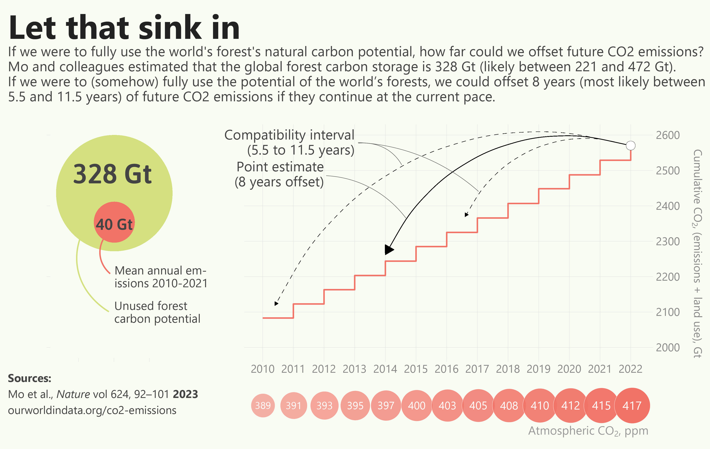
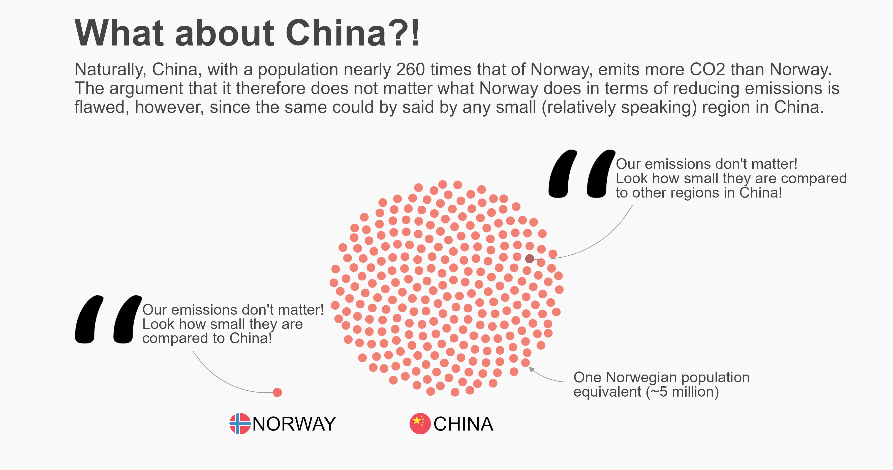
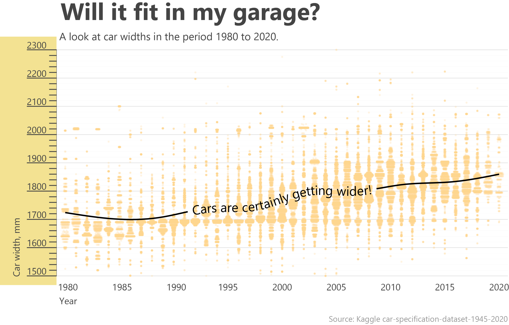
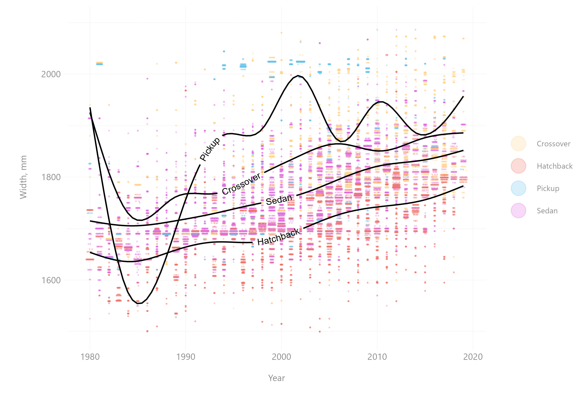
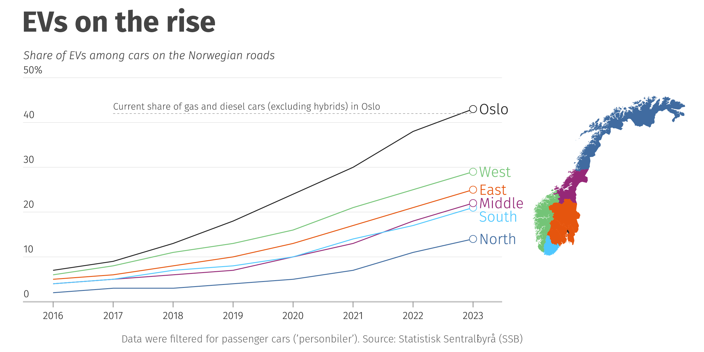
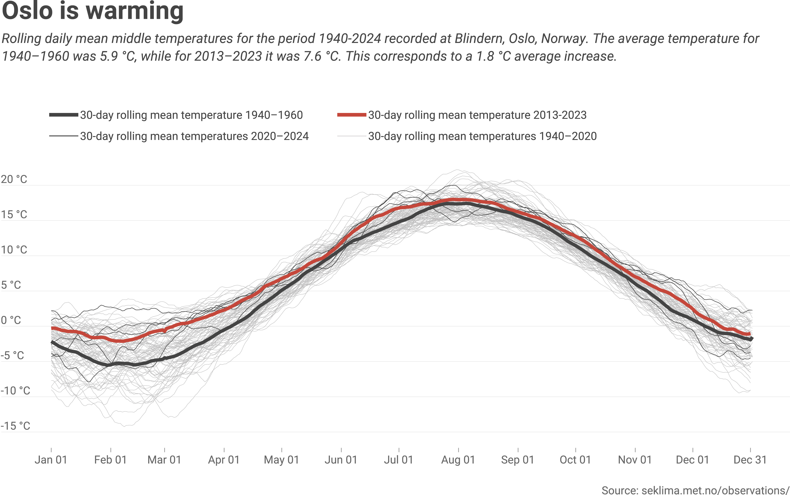
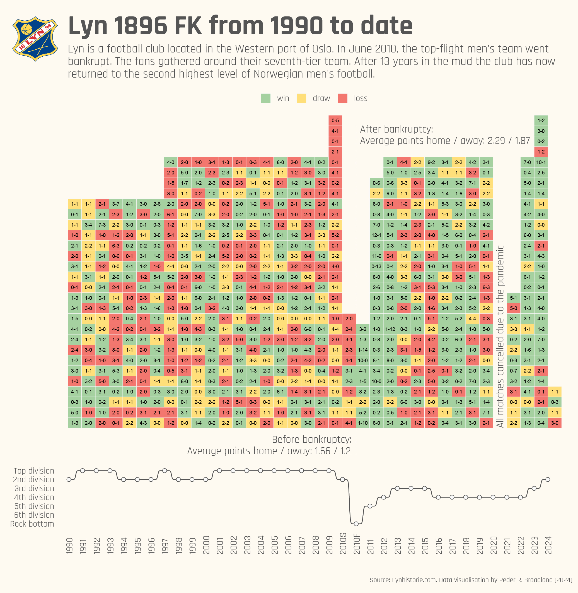
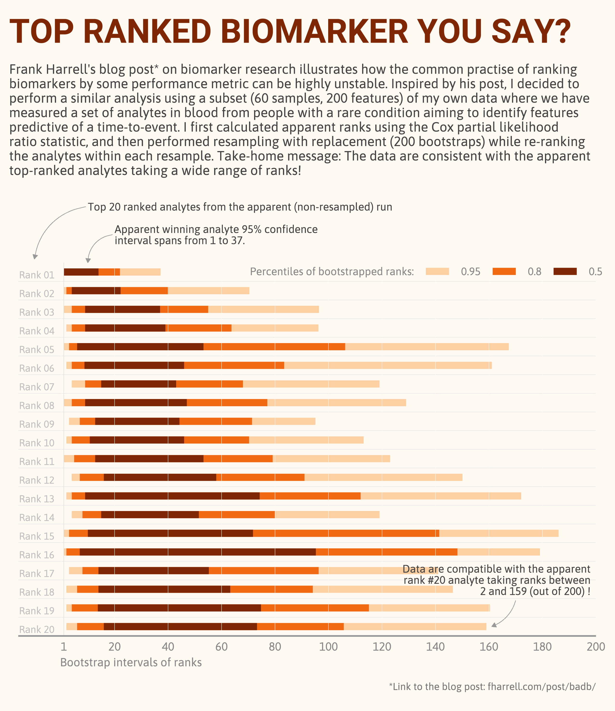
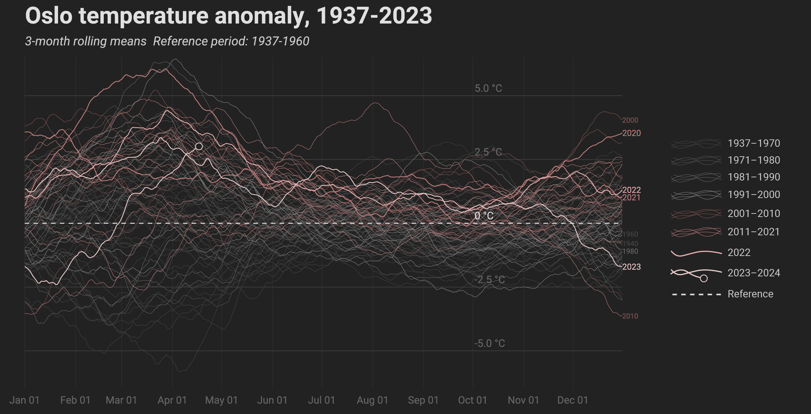

Here I will post my first `rstats` visualisations as part of the #30DayChartChallenge where anyone can contribute with their own visualisations on whatever data they like.

I post all my data visualisations on my [BlueSky ](https://bsky.app/profile/braadland.bsky.social)).

## April 1st - part to whole

My first attempt at the 30daychartchallenge. I wanted to look at meat consumption, as this is an important topic to me, both due to animal rights and welfare and the effects of livestock on emissions and loss of nature.

There are certainly many stories to dive into in these data - perhaps I'll dive more into it in the future...

Data source: Food and Agriculture Organization of the United Nations (2023) - [ourworldindata](https://ourworldindata.org/grapher/per-capita-meat-consumption-by-type-kilograms-per-year)

I've made slight adjustments in Illustrator (e.g. curved arrows as these simply look better that way) to generate the final plot found at the bottom.

```{r echo = TRUE, message = FALSE, warning = FALSE}
# Packages and reusables
# --------------------------------------------------->
library(readr)
library(tidyverse)
library(DescTools)
library(ggrepel)
library(ggpubr)
library(ggplotify)
library(geomtextpath)
library(showtext)

font_add_google(name = "Roboto", regular.wt = 300)
font <- "Roboto"


my_gg_theme <- function() {
  theme(
    # Control legend appearance
    legend.key = element_blank(),
    legend.background = element_blank(),
    legend.title = element_blank(),
    legend.text = element_text(family = font, size = 6, color = "#888888"),
    # Title and subtitle
    plot.title = element_text(family = font, size = 21, color = "#444444", face = "bold"),
    plot.subtitle = element_text(family = font, size = 8, color = "#444444"),
    plot.caption = element_text(family = font, size = 6, color = "#666666"),
    # Control text appearance and spacing
    axis.title.x = element_text(size = 7, color = "#888888", family = font, margin = margin(b = 10, t = 10)),
    axis.title.y = element_text(size = 7, color = "#888888", family = font, margin = margin(l = 10, r = 10)),
    axis.text.y = element_text(size = 7, color = "#888888", family = font),
    axis.text.x = element_text(size = 7, color = "#888888", family = font),
    # Grid, ticks and plot lines
    line = element_line(color = "#F9F9F9", size = 0.1),
    axis.ticks.x = element_line(color = "#eeeeee", size = 0.1),
    panel.grid.major.x = element_line(color = "#eeeeee", size = 0.1),
    axis.ticks.y = element_line(color = "#eeeeee", size = 0.1),
    panel.grid.major.y = element_line(color = "#eeeeee", size = 0.1),
    panel.grid.minor.y = element_line(color = "#f0f0f0", size = 0.1),
    panel.background = element_rect(fill = "#fefaf2", color = NA),
    plot.background = element_rect(fill = "#fefaf2", color = NA)
  )
}
comma_delim <- locale(decimal_mark = ",")
cols <- c(
  beef = "#ffd38b",
  poultry = "#f17367",
  sheep_goat = "#e06bdf",
  pig = "#66c4ec",
  other = "#CCCCCC"
)

arrow <- arrow(type = "closed", length = unit(1, "mm"))

# Load data
# -------------------------->
mt_sel <- 
    read_delim("meat_consumption.txt", delim = "\t") %>%
    mutate_at(vars(other, sheep_goat, beef, pig, poultry), as.numeric) %>%
    # Create a df with selected regions and start at 1965
    filter(region %in% c("Africa", "Europe", "South America", "North America", "Asia", "World")) %>%
    mutate(region = case_when(
        region == "South America" ~ "S.America",
        region == "North America" ~ "N.America",
        TRUE ~ region
  )) %>%
  filter(yr >= 1965)

# Impute missing data using Last Observation Carried Forward
# -------------------------->
mt_sel_imp <- LOCF(mt_sel)

# Calculate sum of all meat types
# -------------------------->
mt_imp <-
  mt_sel_imp %>%
  mutate(all_meat = other + sheep_goat + beef + pig + poultry) %>%
  select(region, yr, all_meat) %>%
  pivot_wider(names_from = region, values_from = all_meat)

# Create, grouped by 10 years, pie charts for the world
# -------------------------->
# Define years for the pies
years <- c(seq(1970, 2019, 10), 2021)

# Pull coordinates of pies
pos <-
  mt_imp %>%
  filter(yr %in% years) %>%
  pull(World)

# Generate pies, one for each decade
for (year in years) {
  p <- mt_sel_imp %>%
    filter(region == "World", yr == year) %>%
    select(-c(region, code)) %>%
    pivot_longer(cols = -yr) %>%
    rename(meat_type = name) %>%
    mutate(meat_type = factor(meat_type, levels = c("poultry", "beef", "pig", "sheep_goat", "other"))) %>%
    ggplot(aes(x = 1, y = value, fill = meat_type)) +
    geom_col(position = "fill") +
    coord_polar(theta = "y") +
    scale_fill_manual(values = cols) +
    theme_void() +
    theme(
      legend.position = "none",
      plot.background = element_blank()
    )
  assign(paste0("p_", year), p)
}

# Generate legend from one of the pies
# --------------------------------------------------->
leg <- get_legend(p_1970 +
  theme(
    legend.position = "top",
    legend.title = element_blank(),
    legend.key.size = unit(3, "mm"),
    legend.background = element_rect(fill = NA, color = NA),
    legend.text = element_text(family = font, size = 7, color = "#555555")
  ))

# Text annotations
# --------------------------------------------------->
NA_meat <- paste0(
  "North Americans consumed on average\n",
  round(mt_imp %>%
    filter(yr == 2021) %>%
    pull(N.America), 1),
  " kg meat per year in 2021"
)
SA_meat <- paste0(
  "South Americans consumed ",
  round((mt_imp %>% filter(yr == 2021) %>%
    pull(S.America)) / (mt_imp %>% filter(yr == 1965) %>%
    pull(S.America)) * 100, 0),
  "%\nmore meat in 2021 than in 1965"
)
EU_meat <- paste0("Europe's meat consumption\npeaked in 1990")
pie_info <- paste0("Poultry was the most consumed meat per capita worldwide\nin 2021 and explained the largest proportion of the increase\nin global meat consumption during the past 50 or so years")

# Main plot (year x consumption)
# --------------------------------------------------->
p1 <-
  mt_imp %>%
  ggplot(aes(x = yr, y = World)) +
  # Line for the World average
  geom_line(size = 0.5, color = "#222222") +
  geom_point(
    data = mt_imp %>% filter(yr %in% c(seq(1970, 2019, 10), 2021)),
    aes(x = yr, y = World),
    shape = 21, size = 14, color = "#222222", fill = "white", stroke = 0.6
  ) +
  # Region-wise (selected regions)
  geom_line(
    data = mt_imp %>%
      select(-World) %>%
      pivot_longer(cols = -yr),
    aes(x = yr, y = value, color = name),
    size = 0.1
  ) +
  geom_textline(
    data = mt_imp %>%
      pivot_longer(cols = -yr) %>%
      mutate(lab = ifelse(yr == max(yr), name, NA)),
    aes(x = yr, y = value, color = name, label = lab),
    hjust = 0, size = 3, family = font, position = position_nudge(x = 3)
  ) +

  # Annotate with pies, use coordinates from 'pos'
  annotation_custom(grob = ggplotGrob(p_1970), xmin = 1967, xmax = 1973, ymin = pos[[1]] - 20, ymax = pos[[1]] + 20) +
  annotation_custom(grob = ggplotGrob(p_1980), xmin = 1977, xmax = 1983, ymin = pos[[2]] - 20, ymax = pos[[2]] + 20) +
  annotation_custom(grob = ggplotGrob(p_1990), xmin = 1987, xmax = 1993, ymin = pos[[3]] - 20, ymax = pos[[3]] + 20) +
  annotation_custom(grob = ggplotGrob(p_2000), xmin = 1997, xmax = 2003, ymin = pos[[4]] - 20, ymax = pos[[4]] + 20) +
  annotation_custom(grob = ggplotGrob(p_2010), xmin = 2007, xmax = 2013, ymin = pos[[5]] - 20, ymax = pos[[5]] + 20) +
  annotation_custom(grob = ggplotGrob(p_2021), xmin = 2018, xmax = 2024, ymin = pos[[6]] - 20, ymax = pos[[6]] + 20) +
  my_gg_theme() +
  scale_color_manual(values = c(rep("#999999", 5), "#222222")) +
  coord_cartesian(clip = "off") +
  theme(
    legend.position = "none",
    plot.margin = unit(c(2, 20, 2, 2), "mm"),
    axis.title.x = element_blank()
  ) +
  scale_x_continuous(breaks = seq(1965, 2020, 5)) +
  scale_fill_manual(values = cols) +
  labs(
    y = "Meat consumption per year per capita, kg",
    title = "Food for thought",
    subtitle = "Meat consumption per capita rose steadily from 1965 to 2021, largely driven by increased consumption of poultry which now\nhas overtaken pigmeat as the most consumed meat worldwide. There are large regional variations in meat consumption per\ncapita and meat type preferences."
  ) +
  # Annotate with the legend
  annotation_custom(grob = as.grob(leg), xmin = 1995, xmax = 2010, ymin = 4, ymax = 12) +
  # Custom text and point highlights
  # NORTH AMERICA
  geom_point(
    aes(x = 2021, y = mt_imp %>% filter(yr == 2021) %>%
      pull(N.America)),
    shape = 21, size = 2, stroke = 0.15, fill = "white", color = "#555555"
  ) +
  annotate(geom = "text", label = NA_meat, family = font, size = 2, x = 2019.5, y = 106, hjust = 1, lineheight = 0.9, color = "#555555") +
  # SOUTH AMERICA
  geom_point(
    aes(x = 2021, y = mt_imp %>%
      filter(yr == 2021) %>%
      pull(S.America)),
    shape = 21, size = 2, stroke = 0.15, fill = "white", color = "#555555"
  ) +
  annotate(geom = "text", label = SA_meat, family = font, size = 2, x = 2019.5, y = 88, hjust = 1, lineheight = 0.9, color = "#555555") +
  # EUROPE
  geom_point(
    aes(x = 1990, y = mt_imp %>%
      filter(yr == 1990) %>%
      pull(Europe)),
    shape = 21, size = 2, stroke = 0.15, fill = "white", color = "#555555"
  ) +
  annotate(geom = "text", label = EU_meat, family = font, size = 2, x = 1988, y = 68, hjust = 0.5, lineheight = 0.9, color = "#555555") +
  # Pie charts
  annotate(geom = "text", label = pie_info, family = font, size = 2, x = 2025, y = 57, hjust = 1, lineheight = 0.9, color = "#555555")

# Second plot shows per capita area graph for all varieties of meat
# --------------------------------------------------->
p2 <-
  mt_sel_imp %>%
  select(-code) %>%
  pivot_longer(cols = -c(region, yr)) %>%
  rename(meat_type = name) %>%
  mutate(meat_type = factor(meat_type, levels = rev(c("poultry", "beef", "pig", "sheep_goat", "other")))) %>%
  mutate(region = factor(region, levels = c("World", "Africa", "Asia", "Europe", "S.America", "N.America"))) %>%
  ggplot(aes(x = yr, y = value, fill = meat_type, group = meat_type)) +
  geom_area(alpha = 0.8) +
  facet_wrap(~region, ncol = 2, scales = "free_y") +
  my_gg_theme() +
  theme(
    legend.position = "none",
    plot.margin = unit(c(2, 11, 2, 12), "mm"),
    strip.background = element_blank(),
    strip.text = element_text(family = font, size = 6, color = "#444444", hjust = 0),
    axis.text.y = element_blank(),
    axis.title.y = element_blank(),
    axis.title.x = element_blank(),
    panel.grid.major.y = element_blank(),
    panel.grid.minor.y = element_blank(),
    panel.grid.major.x = element_blank(),
    axis.ticks.y = element_blank()
    )+
    scale_x_continuous(
        breaks = c(seq(1965, 2019, 10), 2021),
        expand = c(0.02, 0.02)
        ) +
    scale_fill_manual(values = cols) +
    labs(caption = "Data source: Food and Agriculture Organization of the United Nations (2023)")

# Generate composite plot and save as pdf
# --------------------------------------------------->
comp <- ggarrange(p1, p2, nrow = 2, align = "v", heights = c(2.4, 2))
#ggsave("meat_consumption.pdf", comp, width = 180, height = 180, unit = "mm", dpi = 500, device = cairo_pdf)
```

{group="apr30daygallery"}

<hr>

</hr>

<br></br>

## April 4th - Waffle

Armed conflicts dataset

Source: https://ourworldindata.org/war-and-peace

```{r echo = TRUE, message = FALSE, warning = FALSE, eval = FALSE}
# Reusables
# ---------------------------->
library(ggpubr)
library(ggplotify)
library(ggrepel)
library(rworldmap)
library(ggflags)
library(countrycode)
library(showtext)
library(tidyverse)
font_add_google(name = "Asap Condensed")
font_add_google(name = "Asap")
font2 <- "Asap Condensed Medium"
font <- "Asap"

comma_delim <- locale(decimal_mark = ",")

my_gg_theme <- function() {
  theme(
    # Control legend appearance
    legend.key = element_blank(),
    legend.background = element_blank(),
    legend.title = element_blank(),
    legend.text = element_text(family = font, size = 6, color = "#888888"),
    # Title and subtitle
    plot.title = element_text(family = font, size = 21, color = "#444444", face = "bold"),
    plot.subtitle = element_text(family = font, size = 8, color = "#444444"),
    plot.caption = element_text(family = font, size = 6, color = "#666666"),
    # Control text appearance and spacing
    axis.title.x = element_text(size = 7, color = "#888888", family = font, margin = margin(b = 10, t = 10)),
    axis.title.y = element_text(size = 7, color = "#888888", family = font, margin = margin(l = 10, r = 10)),
    axis.text.y = element_text(size = 7, color = "#888888", family = font),
    axis.text.x = element_text(size = 7, color = "#888888", family = font),
    # Grid, ticks and plot lines
    line = element_line(color = "#F9F9F9", size = 0.1),
    axis.ticks.x = element_line(color = "#eeeeee", size = 0.1),
    panel.grid.major.x = element_line(color = "#eeeeee", size = 0.1),
    axis.ticks.y = element_line(color = "#eeeeee", size = 0.1),
    panel.grid.major.y = element_line(color = "#eeeeee", size = 0.1),
    panel.grid.minor.y = element_line(color = "#f0f0f0", size = 0.1),
    panel.background = element_rect(fill = "#fcf2f2", color = NA),
    plot.background = element_rect(fill = "#fcf2f2", color = NA)
  )
}

cols <-
  c(
    Africa = "#f17367", # red
    peptides = "#999999", # gray
    S.America = "#e06bdf", # purple
    N.America = "#9db98b", # dark green
    Oceania = "#71dcca", # Turkis
    Asia = "#66c4ec", # Blue
    Europe = "#ffd38b" # Light orange
  )

# Data wrangling and plotting
# ---------------------------->
# Load and wrangle data
conflict <- read_delim("conflict.txt", delim = "\t", locale = comma_delim) |>
  # Join in subregions and populations using the rworldmap package
  left_join(
    countryExData |> select(Country, GEO_subregion, Population2005),
    by = "Country"
  ) |>
  # Simplify regions
  mutate(region = case_when(
    str_detect(GEO_subregion, "Europe") ~ "Europe",
    str_detect(GEO_subregion, "Africa") ~ "Africa",
    str_detect(GEO_subregion, "Asia") ~ "Asia",
    GEO_subregion == "South America" ~ "S.America",
    GEO_subregion == "North America" ~ "N.America",
    GEO_subregion == "Australia + New Zealand" ~ "Oceania",
    GEO_subregion == "Meso America" ~ "S.America"
  )) |>
  # Remove countries not assigned to a region
  filter(!is.na(region)) |>
  # Filter countries with a population above 15 million
  filter(Population2005 > 15000)


# ggflags require country codes (iso) in lowercase
# --------------------------------------------------->
conflict$countrycode <- countrycode::countrycode(conflict$Country, "country.name", "iso2c")
conflict$iso2_lower <- tolower(conflict$countrycode)

# Create a factor which we can use to arrange by number of conflicts and thereafter region
# --------------------------------------------------->
conflict_fct <-
  conflict %>%
  group_by(Country, region) %>%
  summarise(count_conflict = sum(conflict)) %>%
  arrange(-1 * count_conflict, rev(region)) %>%
  pull(Country)
conflict_fct <- as.factor(conflict_fct)

# Generate the main (waffle) plot
# --------------------------------------------------->
p1 <-
  conflict %>%
  mutate(Country = factor(Country, levels = conflict_fct)) %>%
  mutate(conflict = ifelse(Country == "Ukraine" & yr == 2014, 2, conflict)) %>%
  mutate(conflict = as.factor(conflict)) %>%
  ggplot(aes(x = yr, y = Country, fill = conflict)) +
  geom_tile(color = "#F9F9F9", stroke = 0.1) +
  scale_fill_manual(values = c("#f0f0f0", "#ff85a5", "#b3646c")) +
  my_gg_theme() +
  theme(
    panel.background = element_rect(fill = "#F9F9F9"),
    axis.text.y = element_blank(),
    axis.title.y = element_blank(),
    axis.title.x = element_blank(),
    axis.ticks.x = element_line(color = "#999999", size = 0.1),
    axis.text.x = element_text(angle = 30, hjust = 1, vjust = 1),
    plot.margin = unit(c(2, 2, 2, 0), "mm"),
    legend.position = "none"
  ) +
  scale_x_continuous(expand = c(0, 0), breaks = seq(1990, 2022, 2)) +
  labs(caption = "Only countries with >15 million inhabitants are included.\nSource: Uppsala Conflict Data Program (2023); Natural Earth (2022)") +
  annotate(geom = "text", label = "Armed conflict took place", family = font, size = 3, color = "#444444", x = 2005, y = 40, lineheight = 0.8, hjust = 0) +
  annotate(geom = "text", label = "No armed conflict causing at\nleast one death", family = font, size = 3, color = "#444444", x = 1995, y = 48, lineheight = 0.8, hjust = 0) +
  annotate(geom = "text", label = "Russian annexation\nof Crimea", family = font, size = 3, color = "#444444", x = 2011, y = 35, lineheight = 0.8, hjust = 1)

# Vertical annotation bar with flags and regions
# --------------------------------------------------->
p2 <-
  p1$data %>%
  ggplot(aes(x = 1, y = Country, fill = region)) +
  geom_tile(color = "white", stroke = 0.1) +
  scale_fill_manual(values = cols) +
  theme_void() +
  theme(
    axis.text.y = element_text(family = font, size = 6.5, color = "#444444", hjust = 1, margin = margin(l = 1, r = 6.5)),
    legend.position = "none",
    plot.margin = unit(c(2, 0, 2, 11), "mm"),
    panel.background = element_rect(fill = "#fcf2f2", color = NA),
    plot.background = element_rect(fill = "#fcf2f2", color = NA)
  ) +
  scale_x_discrete(expand = c(0.1, 0.06)) +
  guides(fill = guide_legend(nrow = 3, byrow = TRUE)) +
  geom_flag(aes(country = iso2_lower), size = 2.3, position = position_nudge(x = -1.3))

# Collect legend from the vertical annotation bar
# --------------------------------------------------->
leg <- get_legend(p2 + theme(
  legend.position = "top",
  legend.title = element_blank(),
  legend.key.size = unit(3, "mm"),
  legend.background = element_rect(fill = "#fcf2f2", color = NA),
  legend.text = element_text(family = font, size = 7, color = "#555555")
))
leg <- ggplot() +
  annotation_custom(grob = as.grob(leg), xmin = -Inf, xmax = Inf, ymin = -Inf, ymax = Inf) +
  theme_void() +
  theme(plot.background = element_rect(fill = "#fcf2f2", color = NA))

# Bar/line/dot plot above with sum per year
# --------------------------------------------------->
p3 <-
  conflict %>%
  group_by(yr) %>%
  summarise(sum_conflict = sum(conflict)) %>%
  mutate(lab = case_when(
    sum_conflict == max(sum_conflict) ~ sum_conflict,
    sum_conflict == min(sum_conflict) ~ sum_conflict
  )) %>%
  ggplot(aes(x = yr, y = sum_conflict, label = lab)) +
  geom_col(fill = "#F0F0F0", width = 0.01) +
  geom_line(size = 0.1, color = "#444444") +
  geom_point(shape = 21, size = 1.5, stroke = 0.1, color = "#444444", fill = "white") +
  geom_text_repel(family = font, size = 2, color = "#999999") +
  theme_void() +
  scale_x_discrete(expand = c(0, 0)) +
  theme(
    plot.margin = unit(c(0, 3.5, 0, 2), "mm"),
    panel.background = element_rect(fill = "#fcf2f2", color = NA),
    plot.background = element_rect(fill = "#fcf2f2", color = NA)
  ) +
  coord_cartesian(clip = "off")

# Header and subtitle
# --------------------------------------------------->
p4 <- ggplot() +
  theme_void() +
  theme(
    plot.title = element_text(family = font2, size = 21, color = "#444444", face = "bold"),
    plot.subtitle = element_text(family = font, size = 8, color = "#444444"),
    panel.background = element_rect(fill = "#fcf2f2", color = NA),
    plot.background = element_rect(fill = "#fcf2f2", color = NA),
    plot.margin = unit(c(2, 2, 2, 7), "mm")
  ) +
  labs(
    title = "Armed conflicts over time",
    subtitle = "There have been large regional differences in the occurrence of armed conflicts over time,\nbut countries that had an armed conflict 30 years ago were more likely to have one in 2022"
  )

# Generate composite plot and save as pdf
# --------------------------------------------------->
bottom <- ggarrange(p2, p1, nrow = 1, widths = c(1.2, 3), align = "h")
mid <- ggarrange(leg, p3, nrow = 1, widths = c(1.2, 3), align = "h")
comp <- ggarrange(p4, mid, bottom, nrow = 3, heights = c(3.5, 2, 25))
#ggsave("conflict.pdf", comp, width = 130, height = 180, unit = "mm", dpi = 500, device = cairo_pdf)
```

{group="apr30daygallery"}

<hr>

</hr>

<br></br>

## April 5th - Diverging

On questionnaire data (Norwegian adults) on whether or not one believes climate change is in large caused by human actions (i.e. anthropogenic).

Source: https://www.energiogklima.no/nyhet/klimaskepsis

```{r echo = TRUE, message = FALSE, warning = FALSE, eval = FALSE}
library(tidyverse)
library(ggtext)
library(extrafont)

font_add_google(name = "Asap Condensed")
font_add_google(name = "Asap")
font <- "Asap"
font2 <- "Asap Condensed"


# Climate belief by sex
# Numbers reflect the percentage who believe climate change IS caused by humans
climate_skep_sex <- read_delim("climate_skep_sex.txt", delim = "\t", locale = comma_delim) %>%
  pivot_longer(cols = -yr) %>%
  rename(sex = name, perc = value)

climate_skep_age <- read_delim("climate_skep_age.txt", delim = "\t", locale = comma_delim) %>%
  pivot_longer(cols = -yr) %>%
  rename(age_grp = name, perc = value) %>%
  mutate(perc = perc / 100)

vlines_df <- data.frame(xintercept = seq(-100, 100, 20))

flag <-
  data.frame(country = "no") %>%
  ggplot() +
  geom_flag(aes(x = 1, y = 1, country = country), size = 5, color = "#222222") +
  theme_void()

climate_skep_sex_p <-
  climate_skep_sex %>%
  mutate(perc = 100 - perc) %>%
  mutate(yr = as.factor(yr)) %>%
  mutate(yr = factor(yr, levels = rev(levels(yr)))) %>%
  mutate(perc = ifelse(sex == "Male", -1 * perc, perc))

p <-
  climate_skep_sex_p %>%
  ggplot() +
  geom_col(aes(x = -50, y = yr), width = 0.75, fill = "#e0e0e0") +
  geom_col(aes(x = 50, y = yr), width = 0.75, fill = "#e0e0e0") +
  geom_col(aes(x = perc, y = yr, fill = sex), width = 0.75) +
  theme_void() +
  theme(
    legend.position = "none",
    axis.text.y = element_text(family = font, size = 5, color = "#999999", hjust = 1, margin = margin(r = -10)),
    axis.text.x = element_text(family = font, size = 5, color = "#999999", margin = margin(t = 1)),
    axis.title.x = element_markdown(family = font, size = 5.5, color = "#555555", margin = margin(t = 1)),
    plot.title = element_markdown(family = font2, size = 12, color = "#444444"),
    plot.subtitle = element_text(family = font, size = 5.5, color = "#444444"),
    plot.background = element_rect(fill = "#FFFFFF", color = NA),
    panel.background = element_rect(fill = "#FFFFFF", color = NA),
    axis.ticks.length = unit(1, "mm"),
    axis.ticks.x = element_line(size = 0.2, color = "#e0e0e0"),
    plot.caption = element_text(family = font, size = 4, color = "#9C9C9C")
  ) +
  scale_fill_manual(values = c("#619b90", "#ce7382")) +
  scale_x_continuous(labels = function(x) abs(x), breaks = seq(-100, 100, 20)) +
  geom_vline(data = vlines_df, aes(xintercept = xintercept), color = "#FFFFFF", size = 0.1, alpha = 0.5) +
  labs(
    title = "**A gender in denial**",
    subtitle = "Questioned whether climate change is to a large extent caused by human actions, only\n70% of Norwegian adults answer 'yes'. Men are more likely to be in denial than women,\nand the overall trend is quite stable, but the % of men in denial is slightly decreasing.\n",
    x = expression("Percentage who do **not** believe climate change is caused by humans"),
    caption = "Source: Norsk Medborgerpanel (energiogklima.no/nyhet/klimaskepsis) "
  ) +
  coord_cartesian(clip = "off") +
  annotation_custom(grob = ggplotGrob(flag), xmin = 90, xmax = 90, ymin = 14.5, ymax = 14.5) +
  geom_text(data = climate_skep_sex_p %>% filter(sex == "Male"), aes(x = perc, y = yr, label = paste0(abs(perc), "%")), size = 1.8, color = "#FFFFFF", family = font, position = position_nudge(x = 5)) +
  geom_text(data = climate_skep_sex_p %>% filter(sex == "Female"), aes(x = perc, y = yr, label = paste0(abs(perc), "%")), size = 1.8, color = "#FFFFFF", family = font, position = position_nudge(x = -5)) +
  geom_segment(aes(x = mean((climate_skep_sex_p %>% filter(sex == "Male"))$perc), xend = -1, y = 9.6, yend = 9.6), size = 0.35, color = "#ce7382") +
  annotate(geom = "text", label = "Males", family = font2, size = 2, x = -2, y = 9.7, vjust = 0, hjust = 1, color = "#ce7382") +
  geom_segment(aes(x = 1, xend = mean((climate_skep_sex_p %>% filter(sex == "Female"))$perc), y = 9.6, yend = 9.6), size = 0.35, color = "#619b90") +
  annotate(geom = "text", label = "Females", family = font2, size = 2, x = 2, y = 9.7, vjust = 0, hjust = 0, color = "#619b90") +
  annotate(geom = "text", label = "Mean % in denial last 10 years", family = font, size = 1.5, x = 35, y = 10.5, vjust = 0, hjust = 0, color = "#999999")

#ggsave("denial.pdf", p, width = 80, height = 55, unit = "mm", dpi = 500, device = cairo_pdf)
```

{group="apr30daygallery"}

<hr>

</hr>

<br></br>

## April 8th - Circular

The world's forests, both in areas where humans are living and more untouched areas, has a large potential to store (sequester) CO2. However, since we cut down forests we are not using their full potential. In this plot, I investigate, using data from a [paper in *Nature* from last year](https://www.nature.com/articles/s41586-023-06723-z) and data from [OurWorldInData](https://ourworldindata.org/co2-emissions) how far "back" in time we could go if we were to fully restore the world's forest's carbon potential. If my calculations are correct, we could offset future emissions by quite a bit (around 5.5 to 11.5 years to be exact) if current emissions remain at the current pace.

This was a big challenge, both in terms of calculations, creating circles which were proportional in terms of area, and aligning etc. I therefore had to do some work in Illustrator to get the result I wanted.

```{r echo = TRUE, message = FALSE, warning = FALSE, eval = FALSE}
# Reusables
# ------------------------------->
library(tidyverse)
library(ggpubr)
library(ggtext)
library(ggforce)
library(pracma)
library(showtext)

font_add_google(name = "Asap")
font <- "Segoe UI"
font2 <- "Asap"


my_gg_theme <- function() {
  theme(
    # Control legend appearance
    legend.key = element_blank(),
    legend.background = element_blank(),
    legend.title = element_blank(),
    legend.text = element_text(family = font, size = 6, color = "#888888"),
    # Title and subtitle
    plot.title = element_markdown(family = font, size = 17, color = "#444444", face = "bold"),
    plot.subtitle = element_text(family = font, size = 8, color = "#444444"),
    plot.caption = element_text(family = font, size = 6, color = "#666666"),
    # Control text appearance and spacing
    axis.title.x = element_blank(),
    axis.title.y = element_text(size = 8, color = "#888888", family = font, hjust = 0),
    axis.text.y = element_text(size = 8, color = "#888888", family = font),
    axis.text.x = element_text(size = 8, color = "#888888", family = font),
    # Grid, ticks and plot lines
    line = element_line(color = "#F9F9F9", size = 0.1),
    axis.ticks.x = element_line(color = "#e0e0e0", size = 0.1),
    panel.grid.major.x = element_line(color = "#e0e0e0", size = 0.1),
    axis.ticks.y = element_line(color = "#e0e0e0", size = 0.1),
    panel.grid.major.y = element_line(color = "#e0e0e0", size = 0.1),
    panel.grid.minor.y = element_blank(),
    panel.grid.minor.x = element_blank(),
    panel.background = element_rect(fill = "#f8fcf2", color = NA),
    plot.background = element_rect(fill = "#f8fcf2", color = NA)
  )
}

arrow_s <- arrow(type = "closed", length = unit(1, "mm"))
arrow_l <- arrow(type = "closed", length = unit(2.5, "mm"))

# Data loading, calculations and composite plotting
# ------------------------------->

# Load annual CO2 emissions data (https://ourworldindata.org/co2-emissions, fossil fuels and land use change)
ann_co2 <- read_csv("co2-fossil-plus-land-use.csv")
names(ann_co2) <- c("entity", "code", "yr", "ann_co2_including_land_use_change", "ann_co2_land_use_change_only", "ann_co2_only")

# Load atmospheric CO2 data
atm_co2 <- read_csv("atm_co2.csv") %>%
  # filter(Year > 2009) %>%
  select(yr = Year, co2_ppm = "Long-run CO₂ concentration")

# Filter the annual CO2 emissions worldwide and from year 2000 to 2021 (last year in the dataset), including CO2 from land use change
ann_co2 <-
  ann_co2 %>%
  select(entity, code, yr, ann_co2 = ann_co2_including_land_use_change) %>%
  mutate(ann_co2_bln_tons = ann_co2 / 10^9) %>%
  filter(entity == "World") %>%
  # Calculate cumulative CO2 produced in this time frame
  mutate(cum_sum = cumsum(ann_co2_bln_tons)) %>%
  # Join in atmospheric CO2
  left_join(atm_co2)

# Now onto the forest's unused potential to capture CO2
forest_est <- 328 # https://www.nature.com/articles/s41586-023-06723-z
# But there is some model uncertainty around this estimate ("model compatibility interval")
lower_est <- 221
upper_est <- 472

cum_co2_2021 <- ann_co2 %>%
  filter(yr == max(yr)) %>%
  pull(cum_sum) # Cumulative anthropogenic CO2 emissions
cum_co2_est <- cum_co2_2021 - forest_est
cum_co2_lower <- cum_co2_2021 - lower_est
cum_co2_upper <- cum_co2_2021 - upper_est

# We use the pracma package to interpolate (to find the years we can "return" to if we were to restore the forest potential, with uncertainty)

interpol_vals <- pracma::interp1(ann_co2$cum_sum, ann_co2$yr, c(cum_co2_lower, cum_co2_est, cum_co2_upper))
# These are the estimated time points we can go "back" in time should we use all the forest potential
# We round them to the nearest year
best_case <- round(interpol_vals[[3]], 1)
best_guess <- round(interpol_vals[[2]], 1)
worst_case <- round(interpol_vals[[1]], 1)
mean_ann_emissions <- mean((ann_co2 %>% filter(yr > 2009))$ann_co2_bln_tons)

# We generate 5 plots for the composite
# ----------------------->

# Header
p_header <-
  ggplot() +
  labs(
    title = "Let that sink in",
    subtitle = "If we were to fully use the world's forest's natural carbon potential, how far could we offset future CO2 emissions?\nMo and colleagues estimates that the global forest carbon storage is 328 Gt (likely between 221 and 472 Gt).\nIf we were to (somehow) fully use the potential of the world’s forests, we could offset 8 years (most likely between\n5.5 and 11.5 years) of future CO2 emissions if they continue at the current pace."
  ) +
  theme_void() +
  theme(
    legend.position = "none",
    plot.title = element_text(family = font, face = "bold", size = 24, color = "#222222"),
    plot.subtitle = element_text(family = font, size = 10, color = "#444444"),
    panel.background = element_rect(fill = "#f8fcf2", color = NA),
    plot.background = element_rect(fill = "#f8fcf2", color = NA),
    plot.margin = unit(c(2, 2, 2, 2), "mm")
  )

# Stairs plot
p_stairs <-
  ann_co2 %>%
  filter(yr > 2009) %>%
  ggplot(aes(x = yr)) +
  geom_step(aes(y = cum_sum), color = "#f17367", size = 0.5) +
  scale_y_continuous(position = "right", limits = c(2000, 2600), breaks = seq(2000, 2600, 100)) +
  scale_x_continuous(breaks = seq(2010, 2022, 1)) +
  my_gg_theme() +
  theme(
    legend.position = "none",
    axis.title.y.right = element_text(margin = margin(l = 10), hjust = 1)
  ) +
  # Add the potential steps down we can "move" with best, best guess, and worst effect of forest carbon capture scenarios
  # Buest guess (point estimate)
  geom_curve(aes(x = 2022, xend = best_guess, y = cum_co2_2021, yend = cum_co2_est + 20), arrow = arrow_l, curvature = 0.4, size = 0.2) +
  # Best case scenario
  geom_curve(aes(x = 2022, xend = best_case, y = cum_co2_2021, yend = cum_co2_upper + 20), arrow = arrow_s, curvature = 0.4, size = 0.1, linetype = "dashed") +
  # Worst case scenario
  geom_curve(aes(x = 2022, xend = worst_case, y = cum_co2_2021, yend = cum_co2_lower + 20), arrow = arrow_s, curvature = 0.4, size = 0.1, linetype = "dashed") +
  # Add point which is 2022
  geom_point(aes(x = 2022, y = max(cum_sum)), shape = 21, fill = "white", color = "#444444", stroke = 0.1, size = 3) +
  # Other stuff
  coord_cartesian(clip = "off") +
  labs(
    x = "",
    y = expression("Cumulative CO"[2] * ", (emissions + land use), Gt")
  ) +
  annotate(geom = "text", family = font, size = 3.5, color = "#444444", label = "Point estimate\n(8 years offset)", x = 2012, y = 2490, hjust = 1, lineheight = 0.9) +
  annotate(geom = "text", family = font, size = 3.5, color = "#444444", label = "Compatibility interval\n(5.5 to 11.5 years)", x = 2013, y = 2580, hjust = 1, lineheight = 0.9)

# Atmospheric CO2
p_atm_co2 <-
  ann_co2 %>%
  filter(yr > 2009) %>%
  ggplot(aes(x = yr)) +
  geom_point(aes(x = yr, y = 10, size = co2_ppm, fill = co2_ppm), shape = 21, stroke = 0.1, color = "white") +
  scale_fill_gradient(low = "#f1736790", high = "#f17367") +
  scale_size(range = c(8, 12)) +
  geom_text(aes(x = yr, y = 10, label = round(co2_ppm, 0)),
    family = font, color = "#FFFFFF",
    segment.color = NA, size = c(seq(2.5, 3, (3 - 2.5) / 12))
  ) +
  scale_x_continuous(breaks = seq(2010, 2021, 1)) +
  theme_void() +
  theme(
    legend.position = "none",
    plot.caption = element_markdown(family = font, size = 7, color = "#666666", hjust = 1),
    panel.background = element_rect(fill = "#f8fcf2", color = NA),
    plot.background = element_rect(fill = "#f8fcf2", color = NA),
    plot.margin = unit(c(0, 15, 2, 2), "mm")
  ) +
  annotate(geom = "text", label = expression("Atmospheric CO"[2] * ", ppm"), x = 2020, y = 9.6, hjust = 1, family = font, size = 3, color = "#999999") +
  coord_cartesian(clip = "off")

# Circles

# We calculate circles, where diameter corresponds to the y-axis of the stairs plot, and sizes are relative to the areas
radius_forest <- forest_est / 2
area_forest <- pi * radius_forest^2
area_ann_em <- area_forest * (mean_ann_emissions / forest_est)
radius_ann_em <- sqrt(area_ann_em / pi)

p_circles <-
  ann_co2 %>%
  ggplot(aes(x = 1, y = cum_sum)) +
  geom_circle(aes(x0 = 1, y0 = 2600 - radius_forest, r = radius_forest), size = 0.1, fill = "#d4e080", color = NA) +
  annotate(geom = "text", x = 1, y = 2600 - radius_forest / 2, label = paste0(forest_est, " Gt"), family = font2, size = 7, color = "#444444") +
  geom_circle(aes(x0 = 1, y0 = 2600 - 1.5 * radius_forest, r = radius_ann_em), size = 0.1, fill = "#f17367", color = NA) +
  annotate(geom = "text", x = 1, y = 2430 - radius_forest / 2, label = paste0(round(mean_ann_emissions, 0), " Gt"), family = font2, size = 4, color = "#444444") +
  coord_fixed(ylim = c(2000, 2600), clip = "off") +
  my_gg_theme() +
  theme(
    legend.position = "none",
    axis.text.x = element_blank(),
    axis.text.y = element_blank(),
    axis.title.y = element_blank(),
    panel.grid.major.x = element_blank(),
    panel.grid.major.y = element_blank(),
    plot.margin = unit(c(0, 5, 0, 2), "mm"),
    panel.background = element_rect(fill = "#f8fcf2", color = NA),
    plot.background = element_rect(fill = "#f8fcf2", color = NA)
  ) +
  annotate(geom = "text", label = "Mean annual em-\nissions 2010-2021", x = 1.25, y = 2200, hjust = 0, family = font, color = "#444444", size = 3, lineheight = 0.9) +
  annotate(geom = "text", label = "Unused forest\ncarbon potential", x = 1, y = 2100, hjust = 0, family = font, color = "#444444", size = 3, lineheight = 0.9)

# Info box
p_sources <-
  ggplot() +
  theme_void() +
  theme(
    plot.margin = unit(c(2, 2, 2, 2), "mm"),
    plot.subtitle = element_text(family = font, size = 8, color = "#444444", lineheight = 1.2),
    panel.background = element_rect(fill = "#f8fcf2", color = NA),
    plot.background = element_rect(fill = "#f8fcf2", color = NA)
  ) +
  labs(subtitle = "Sources:\nMo et al., Nature vol 624, 92–101 2023\nourworldindata.org/co2-emissions")


comp <- ggarrange(p_header,
  ggarrange(p_circles, p_stairs, nrow = 1, widths = c(2, 4), align = "h"),
  ggarrange(p_sources, p_atm_co2, nrow = 1, widths = c(2, 4), align = "h"),
  nrow = 3, heights = c(2.2, 5, 1.7)
) +
  bgcolor("#f8fcf2") +
  border(color = NA)

#ggsave("forest_carbon.pdf", comp, width = 180, height = 120, unit = "mm", dpi = 500, device = cairo_pdf)
```

{group="apr30daygallery"}

<hr>

</hr>

<br></br>

## April 9th - Major/minor

I decided to use this opportunity to point out a **deeply flawed** argument I all too often encounter on social media platforms: That it does not really matter how much CO2 we emit in Norawy, since the amount of CO2 emitted by large countries like China anyways dwarf us, and any attempts by Norway to reduce global emissions will therefore be futile.

```{r echo = TRUE, message = FALSE, warning = FALSE, eval = FALSE}
# Reusables
# -------------------------->
library(tidyverse)
library(ggpubr)
library(ggforce)
library(png)
#library(ggflags)
library(showtext)
font_add_google(name = "Asap")
font_add_google(name = "Asap Condensed")
font <- "Asap Light"
font2 <- "Asap Condensed"

quote <- readPNG("quote.png")
# Define the 'sunflower' function which enables plotting points uniformly within a circular shape
# https://stackoverflow.com/questions/28567166/uniformly-distribute-x-points-inside-a-circle
sunflower <- function(n, alpha = 2, geometry = c("planar", "geodesic")) {
  b <- round(alpha * sqrt(n)) # number of boundary points
  phi <- (sqrt(5) + 1) / 2 # golden ratio
  r <- radius(1:n, n, b)
  theta <- 1:n * ifelse(geometry[1] == "geodesic", 360 * phi, 2 * pi / phi^2)

  tibble(
    x = r * cos(theta),
    y = r * sin(theta)
  )
}

radius <- function(k, n, b) {
  ifelse(
    k > n - b,
    1,
    sqrt(k - 1 / 2) / sqrt(n - (b + 1) / 2)
  )
}
arrow <- arrow(type = "closed", length = unit(1, "mm"))

# Plotting
# -------------------------->

ch_pop <- 1.412e09
no_pop <- 5.457e06
ann_no <- "Our emissions don't matter!\nLook how small they are\ncompared to China!"
ann_ch <- "Our emissions don't matter!\nLook how small they are compared\nto other regions in China!"

# Breaking down China's population into Norway equivalents, we get
no_equiv <- round(ch_pop / no_pop, 0)

# Plot
p <-
  sunflower(no_equiv, 2, "planar") %>%
  mutate(x = x * (20 / 3), y = y) %>%
  ggplot() +
  geom_point(aes(x = x, y = y),
    size = 2, alpha = 0.9, shape = 16, color = "#f17367"
  ) +
  scale_x_continuous(limits = c(-20, 20)) +
  scale_y_continuous(limits = c(-1.5, 1.5)) +
  annotate(
    geom = "text", label = "NORWAY",
    x = -9, hjust = 0.5, y = -1.3, family = font
  ) +
  annotate(
    geom = "text", label = "CHINA",
    x = 1, hjust = 0.5, y = -1.3, family = font
  ) +
  # Annotations

  # Population equivalence
  annotate(
    geom = "text", label = "One Norwegian population\nequivalent (~5 million)",
    x = 7.5, y = -0.8, family = font, hjust = 0, vjust = 1, size = 3, color = "#444444", lineheight = 0.8
  ) +
  geom_curve(aes(x = 7.4, xend = 4.9, y = -0.9, yend = -0.76),
    size = 0.1, curvature = -0.2, color = "#999999", arrow = arrow
  ) +

  # Norwegian quote
  annotation_custom(rasterGrob(quote), xmin = -22, xmax = -18, ymin = -0.6, ymax = 0) +
  annotate(
    geom = "text", label = ann_no,
    x = -18, y = -0.15, family = font, hjust = 0, vjust = 1, size = 3, lineheight = 0.8, color = "#444444"
  ) +
  geom_curve(aes(x = -10, xend = -15, y = -1, yend = -0.6),
    size = 0.1, curvature = -0.3, color = "#999999"
  ) +
  geom_point(aes(x = -10, y = -1),
    size = 2, alpha = 0.9, shape = 16, color = "#f17367"
  ) +

  # Chinese quote
  annotation_custom(rasterGrob(quote), xmin = 6, xmax = 10, ymin = 0.8, ymax = 1.4) +
  annotate(
    geom = "text", label = ann_ch,
    x = 10, y = 1.25, family = font, hjust = 0, vjust = 1, size = 3, lineheight = 0.8, color = "#444444"
  ) +
  geom_curve(aes(x = 11, xend = 5.12, y = 0.8, yend = 0.28),
    size = 0.1, curvature = -0.3, color = "#999999"
  ) +
  geom_point(aes(x = 4.91342498, y = 0.285574868),
    size = 2, alpha = 0.9, shape = 16, color = "#b3646c"
  ) +

  # Flags
  geom_flag(aes(country = "no"),
    size = 5, x = -12.2, y = -1.3
  ) +
  geom_flag(aes(country = "cn"),
    size = 5, x = -1.55, y = -1.3
  ) +
  labs(
    title = "What about China?!",
    subtitle = "Naturally, China, with a population nearly 260 times that of Norway, emits more CO2 than Norway.\nThe argument that it therefore does not matter what Norway does in terms of reducing emissions is\nflawed, however, since the same could by said by any small (relatively speaking) region in China."
  ) +
  coord_cartesian(clip = "off") +
  theme_void() +
  theme(
    plot.margin = unit(c(2, 15, 2, 15), "mm"),
    plot.title = element_text(family = font2, size = 21, color = "#444444", face = "bold"),
    plot.subtitle = element_text(family = font, size = 10, color = "#444444"),
    plot.background = element_rect(fill = "#F9F9F9", color = NA),
    panel.background = element_rect(fill = "#F9F9F9", color = NA)
  )

#ggsave("no_cn.jpg", p, width = 180, height = 95, unit = "mm", dpi = 500)
```

{group="apr30daygallery"}

<hr>

</hr>

<br></br>

## April 10th - Physical

Indeed, cars are getting bigger. Here's a plot looking at car widths - certainly relevant if you have an old, narrow garage or parking spot!

```{r echo = TRUE, message = FALSE, warning = FALSE, eval = FALSE}
# Reusables
# -------------------------->
library(tidyverse)
library(ggbeeswarm)
library(ggprism)
library(geomtextpath)
library(showtext)
font <- "Segoe UI"

my_gg_theme <- function() {
  theme(
    # Control legend appearance
    legend.key = element_blank(),
    legend.background = element_blank(),
    legend.title = element_blank(),
    legend.text = element_text(family = font, size = 6, color = "#888888"),
    # Title and subtitle
    plot.title = element_text(family = font, size = 21, color = "#444444", face = "bold"),
    plot.subtitle = element_text(family = font, size = 8, color = "#444444"),
    plot.caption = element_text(family = font, size = 6, color = "#666666"),
    # Control text appearance and spacing
    axis.title.x = element_text(size = 7, color = "#888888", family = font, margin = margin(b = 10, t = 10)),
    axis.title.y = element_text(size = 7, color = "#888888", family = font, margin = margin(l = 10, r = 10)),
    axis.text.y = element_text(size = 7, color = "#888888", family = font),
    axis.text.x = element_text(size = 7, color = "#888888", family = font),
    # Grid, ticks and plot lines
    line = element_line(color = "#F9F9F9", size = 0.1),
    axis.ticks.x = element_line(color = "#eeeeee", size = 0.1),
    panel.grid.major.x = element_line(color = "#eeeeee", size = 0.1),
    axis.ticks.y = element_line(color = "#eeeeee", size = 0.1),
    panel.grid.major.y = element_line(color = "#eeeeee", size = 0.1),
    panel.grid.minor.y = element_line(color = "#f0f0f0", size = 0.1),
    panel.background = element_rect(fill = "#FFFFFF", color = NA),
    plot.background = element_rect(fill = "#FFFFFF", color = NA)
  )
}
arrow <- arrow(type = "closed", length = unit(1.3, "mm"))

# Load data
# -------------------------->
# Source: https://www.kaggle.com/datasets/jahaidulislam/car-specification-dataset-1945-2020?resource=download
cars <- read_csv("Car Dataset 1945-2020.csv") %>%
  rename(yr = Year_from) %>%
  filter(yr > 1979) %>%
  filter(!is.na(yr) & !is.na(width_mm))

# Plot
# -------------------------->
p <-
  cars %>%
  ggplot(aes(x = yr, y = width_mm)) +
  geom_quasirandom(aes(color = type),
    size = 0.1, alpha = 0.15, color = "#ffd38b"
  ) +
  geom_textsmooth(aes(y = width_mm, group = 1),
    label = "Cars are certainly getting wider!", family = font, size = 3.5
  ) +
  scale_y_continuous(
    guide = "prism_minor",
    limits = c(1500, 2300),
    breaks = seq(1500, 2300, 100),
    expand = c(0, 0),
    minor_breaks = seq(1500, 2300, 20)
  ) +
  scale_x_continuous(
    breaks = seq(1980, 2020, 5),
    expand = c(0.01, 0.01)
  ) +
  theme(
    prism.ticks.length.y = unit(2, "mm"),
    axis.ticks.length = unit(5, "mm"),
    axis.ticks.y = element_line(size = 0.3, color = "#444444"),
    axis.line.y = element_line(size = 0.1, color = "#444444"),
    axis.text.y = element_text(family = font, size = 7, color = "#444444"),
    axis.title.y = element_text(family = font, size = 7, color = "#444444", hjust = 0),
    axis.ticks.x = element_blank(),
    axis.line.x = element_blank(),
    axis.text.x = element_text(family = font, size = 7, color = "#444444", margin = margin(t = -8, b = 2)),
    axis.title.x = element_text(family = font, size = 7, color = "#444444", hjust = 0, margin = margin(t = 2, b = 2)),
    plot.title = element_text(hjust = 0, family = font, face = "bold", size = 18, color = "#444444"),
    plot.subtitle = element_text(hjust = 0, family = font, size = 8, color = "#444444"),
    plot.caption = element_text(hjust = 1, family = font, size = 6, color = "#999999"),
    panel.grid.major.y = element_line(color = "#e0e0e0", size = 0.2),
    panel.grid.minor.y = element_line(color = "#f9f9f9", size = 0.1),
    panel.grid.major.x = element_blank(),
    panel.grid.minor.x = element_blank(),
    plot.background = element_rect(fill = "white", color = NA),
    panel.background = element_rect(fill = "white", color = NA)
  ) +
  coord_cartesian(clip = "off") +
  labs(
    y = "Car width, mm",
    x = "Year",
    caption = "Source: Kaggle car-specification-dataset-1945-2020",
    title = "Will it fit in my garage?",
    subtitle = "A look at car widths in the period 1980 to 2020."
  )

# Now some modifications in Illustrator
#ggsave("carwidth_ruler.pdf", p, width = 140, height = 90, unit = "mm", dpi = 500, device = cairo_pdf)

# Extra plot, looking at whether the increase in size is driven by more manufacturing of particular vehicle types, such as pickups
# -------------------------->
# ggsave("width_by_vehicle_type.jpg",
#   cars %>%
#     ggplot(aes(x = yr, y = width_mm)) +
#     geom_quasirandom(data = cars %>% filter(yr > 1979 & Body_type %in% c("Sedan", "Crossover", "Hatchback", "Pickup")), aes(color = Body_type), size = 0.02, alpha = 0.25) +
#     geom_textsmooth(data = cars %>% filter(yr > 1979 & Body_type == "Sedan"), aes(y = width_mm, group = 1), label = "Sedan", size = 2.5) +
#     geom_textsmooth(data = cars %>% filter(yr > 1979 & Body_type == "Hatchback"), aes(y = width_mm, group = 1), label = "Hatchback", size = 2.5) +
#     geom_textsmooth(data = cars %>% filter(yr > 1979 & Body_type == "Crossover"), aes(y = width_mm, group = 1), label = "Crossover", size = 2.5) +
#     geom_textsmooth(data = cars %>% filter(yr > 1979 & Body_type == "Pickup"), aes(y = width_mm, group = 1), label = "Pickup", size = 2.5) +
#     scale_y_continuous(limits = c(1500, 2100)) +
#     labs(y = "Width, mm", x = "Year") +
#     my_gg_theme() +
#     guides(colour = guide_legend(override.aes = list(size = 5))) +
#     scale_color_manual(values = c("#ffd38b", "#f17367", "#66c4ec", "#e06bdf")),
#   width = 160, height = 110, unit = "mm", dpi = 500
# )
```

{group="apr30daygallery"}

Bonus plot, stratified by some common vehicle types:

{group="apr30daygallery"}

<hr>

</hr>

<br></br>

## April 12th - Reuters Graphics

Cars on the streets in Norway

Although the vast majority of newly registered cars in Norway are fully electric, the fraction of EVs on the streets is still fairly low but catching up. Totally expected, to be honest, given that all new cars sold in Norway must be electric by 2025. We can look at the distribution of gas/diesel, hybrids and EVs.

```{r echo = TRUE, message = FALSE, warning = FALSE, eval = FALSE}
# Reusables
# -------------------------->
## Packages
library(tidyverse)
library(ggrepel)
library(showtext)
library(csmaps)
library(ggmap)
library(ggpubr)
## Fonts
font_add_google(name = "Fira Sans", regular.wt = 300)
# sysfonts::font_families()
font <- "Fira Sans"

## Other
comma_delim <- locale(decimal_mark = ",")
## Theme function
theme_reuters <- function() {
  theme(
    plot.title = element_text(family = font, size = 14, lineheight = 0.5, color = "#444444", face = "bold", margin = margin(l = 10.5)),
    plot.subtitle = element_text(family = font, size = 5.5, lineheight = 1.2, color = "#444444", face = "italic", margin = margin(l = 11.5)),
    plot.caption = element_text(family = font, size = 5.5, color = "#666666"),
    axis.title.x = element_blank(),
    axis.title.y = element_blank(),
    axis.text.y = element_text(size = 5, color = "#343433", family = font, margin = margin(r = -21.5), vjust = 0, hjust = 0),
    axis.text.x = element_text(size = 5, color = "#343433", family = font),
    axis.ticks.x = element_line(color = "#999999", size = 0.2),
    panel.grid.major.x = element_blank(),
    panel.grid.minor.x = element_blank(),
    axis.ticks.y = element_blank(),
    panel.grid.major.y = element_blank(),
    panel.grid.minor.y = element_blank(),
    panel.background = element_blank(),
    plot.background = element_blank()
  )
}

# Load data
# -------------------------->

# Number of cars ('personbiler') on the streets, by region and engine type of vehicle. Downloaded from SSB.no
fuel <-
  read_delim("fuel.txt", delim = "\t", locale = comma_delim) %>%
  pivot_longer(cols = -c(yr, region)) %>%
  rename(type = name, n_sales = value)

# We remove hydrogen (very few), and group hybrids and gas/diesel together
fuel <-
  fuel %>%
  filter(type != "hydrogen") %>%
  mutate(type = ifelse(str_detect(type, "hybrid"), "hybrid", type)) %>%
  mutate(type = ifelse(type %in% c("diesel", "gas"), "gas_diesel", type)) %>%
  group_by(yr, region, type) %>%
  mutate(n_sales = sum(n_sales)) %>%
  distinct()

# We now want to, grouped by region and year, calculate the fraction of each engine type on the streets
fuel_frac <-
  fuel %>%
  group_by(region, yr) %>%
  mutate(sum_sales_by_region_and_yr = sum(n_sales)) %>%
  mutate(fraction = n_sales / sum_sales_by_region_and_yr) %>%
  mutate(fraction = round(fraction * 100, 0))

hlines <- tibble(
  y = seq(9, 49, 10),
  yend = seq(9, 49, 10),
  x = 2015.5,
  xend = Inf
)


# Plot the line graph
# ----------------------------->
annotations <-
  fuel_frac %>%
  filter(yr == 2023 & type == "EV") %>%
  mutate(
    fraction =
      case_when(
        region == "South" ~ 18,
        TRUE ~ fraction
      )
  )

cols <- c(
  Oslo = "#222222",
  South = "#4ec7ff",
  West = "#74c476",
  East = "#e6550d",
  Middle = "#952978",
  North = "#3f6ba0"
)

p <-
  fuel_frac %>%
  filter(type == "EV") %>%
  ggplot(
    aes(x = yr, y = fraction, color = region)
  ) +
  geom_segment(
    data = hlines,
    aes(x = x, xend = xend, y = y, yend = yend),
    size = 0.1, color = "#e0e0e0"
  ) +
  geom_line(size = 0.2) +
  geom_point(
    data =
      fuel_frac %>%
        filter(yr == max(fuel_frac$yr) & type == "EV"),
    aes(x = yr, y = fraction),
    shape = 21, stroke = 0.2, fill = "white"
  ) +
  theme_reuters() +
  theme(
    legend.position = "none",
    plot.margin = unit(c(2, 2, 2, 4), "mm")
  ) +
  scale_y_continuous(
    limits = c(-1, 50),
    expand = c(0, 0),
    breaks = seq(0, 50, 10),
    labels = c("0", "10", "20", "30", "40", "50%")
  ) +
  coord_cartesian(clip = "off") +
  scale_x_continuous(breaks = c(2016:2023)) +
  geom_segment(
    aes(x = 2015.5, xend = Inf, y = -1, yend = -1),
    size = 0.3, color = "#c6c6c6"
  ) +
  geom_text(
    data = annotations,
    aes(label = region, x = yr, y = fraction),
    hjust = 0, size = 2.5, family = font, position = position_nudge(x = 0.1)
  ) +
  geom_segment(
    aes(
      x = 2017, xend = 2023,
      y = fuel_frac %>%
        filter(type == "gas_diesel" & region == "Oslo" & yr == 2023) %>%
        pull(fraction),
      yend = fuel_frac %>%
        filter(type == "gas_diesel" & region == "Oslo" & yr == 2023) %>%
        pull(fraction)
    ),
    size = 0.1, linetype = "dotted", color = "#9F9F9F"
  ) +
  annotate(
    geom = "text",
    label = "Current share of gas and diesel cars (excluding hybrids) in Oslo",
    x = 2017,
    y = fuel_frac %>%
      filter(type == "gas_diesel" & region == "Oslo" & yr == 2023) %>%
      pull(fraction) + 1.6,
    family = font, size = 1.6, color = "#555555", hjust = 0
  ) +
  labs(
    title = "EVs on the rise\n",
    subtitle = "Share of EVs among cars on the Norwegian roads\n",
    caption = "Data were filtered for passenger cars (<U+2019>personbiler<U+2019>). Source: Statistisk Sentralbyr<U+00E5> (SSB)"
  ) +
  scale_color_manual(values = cols)


# Load map data, wrangle and plot
# ----------------------------->
# Load map data
map_df <- nor_county_map_b2020_insert_oslo_dt
# Map each county to region
county_names <-
  csdata::nor_locations_names(border = 2020) %>%
  filter(str_detect(location_code, "^county")) %>%
  # Some wrangling to indicate region based on location data (tricky with special characters)
  mutate(region = case_when(
    location_name %in% c("Viken", "Buskerud", "Vestfold og Telemark") | location_name_file_nb_ascii == "Ostfold_fylke" | location_name_short == "INN" ~ "East",
    location_name %in% c("Rogaland", "Vestland") | location_name_short == "MRO" ~ "West",
    location_name == "Agder" ~ "South",
    location_name_file_nb_ascii == "Trondelag_Troondelage_fylke" ~ "Middle",
    location_name == "Oslo-Oslove" ~ "Oslo",
    TRUE ~ "North"
  )) %>%
  select(location_code, region)

# Plot the map
map_nor <-
  map_df %>%
  left_join(county_names) %>%
  ggplot(aes(x = long, y = lat, group = group, fill = region)) +
  geom_polygon() +
  scale_fill_manual(values = cols) +
  theme_void() +
  theme(
    legend.position = "none",
    plot.margin = unit(c(15, 2, 15, 2), "mm")
  )

# Save
# ggsave("EVs.pdf",
#   ggarrange(p, map_nor, nrow = 1, widths = c(7, 2.6)),
#   width = 120, height = 60, unit = "mm", dpi = 500
# )
```

{group="apr30daygallery"}

<hr>

</hr>

<br></br>

## April 14th - Heatmap

Snow data for Oslo, Blindern was downloaded from https://seklima.met.no/observations/ for the period 01.01.1960 to 31.12.2023. I averaged the daily data to weekly data, and aligned the data so that every year started with week 1 and ended with week 52.

```{r echo = TRUE, message = FALSE, warning = FALSE, eval = FALSE}
# Reusables
# ----------------------------->
library(tidyverse)
library(lubridate)
library(ggpubr)
library(showtext)
arrow <- arrow(type = "closed", length = unit(1, "mm"))
font <- "Asap"

my_gg_theme <- function() {
  theme(
    # Control legend appearance
    legend.position = c(0.5, 0.85),
    legend.key = element_rect(color = "#F9F9F9", size = 0.1),
    legend.key.size = unit(3, "mm"),
    legend.background = element_blank(),
    legend.title = element_blank(),
    legend.text = element_text(family = font, size = 6, color = "#F9F9F9"),
    # Title and subtitle
    plot.title = element_text(family = font, size = 21, color = "#F9F9F9", face = "bold", lineheight = 0.3),
    plot.subtitle = element_text(family = font, size = 8, color = "#F9F9F9"),
    plot.caption = element_text(family = font, size = 6, color = "#CCCCCC"),
    # Control text appearance and spacing
    axis.title.x = element_blank(),
    axis.title.y = element_blank(),
    axis.text.y = element_text(size = 5, color = "#F9F9F9", family = font, hjust = 0),
    axis.text.x = element_text(size = 6, color = "#F9F9F9", family = font, hjust = 0.5),
    # Grid, ticks and plot lines
    axis.line = element_blank(),
    axis.ticks.x = element_blank(),
    panel.grid.major.x = element_blank(),
    panel.grid.minor.x = element_blank(),
    axis.ticks.y = element_blank(),
    panel.grid.major.y = element_blank(),
    panel.grid.minor.y = element_blank(),
    panel.background = element_rect(fill = "#444444", color = NA),
    plot.background = element_rect(fill = "#444444", color = NA)
  )
}

# Data loading, wrangling and plotting
# ----------------------------->
snow_oslo <- read_delim("snow_oslo.txt") %>%
  mutate(date = dmy(date))

# Some dates are missing, usually in the summer. I guess someone didnt want to record
date_range <- seq(min(snow_oslo$date), max(snow_oslo$date), by = "1 day")
# Create a data frame with all dates
all_dates <- data.frame(date = date_range)
# Join with original data to fill in missing dates
snow_oslo_compl <-
  all_dates %>%
  left_join(snow_oslo, by = "date") %>%
  mutate(
    year = year(date),
    wk = isoweek(date)
  ) %>%
  # Average per week
  group_by(year, wk) %>%
  mutate(avg_snow_depth = mean(snow_depth, na.rm = TRUE)) %>%
  ungroup() %>%
  distinct(year, wk, avg_snow_depth) %>%
  # Since some years start with week 53, we align the data
  group_by(year) %>%
  filter(wk >= 1 & wk <= 52) %>%
  ungroup() %>%
  # Ensure that each year starts with week 1
  group_by(year) %>%
  mutate(wk = row_number()) %>%
  ungroup() %>%
  # For missing values impute to 0 (missing values are anyways in the summer months)
  # Perhaps someone got lazy - why record snow depth in July anyways?
  mutate(avg_snow_depth = ifelse(is.na(avg_snow_depth), 0, avg_snow_depth))

# Define custom breaks and labels for weeks to months
# Not exactly sure how to align the week numbers with month names since months fall on separate weeks from year to year
week_labels <- c("Jan", "Feb", "Mar", "Apr", "May", "Jun", "Jul", "Aug", "Sep", "Oct", "Nov", "Dec")
week_to_month <- c(3, 8, 12, 16, 20, 24, 29, 33, 37, 41, 46, 50)

# Test trend over time by fitting a linear model per year
model <- lm(avg_snow_depth ~ year, data = snow_oslo_compl)
estimate_per_yr <- model$coefficients[[2]]
lower <- confint(model)[[2, 1]]
upper <- confint(model)[[2, 2]]

# Categorize snow depth to ease interpretability
p_df <-
  snow_oslo_compl %>%
  mutate(snow_depth_cat = case_when(
    avg_snow_depth == 0 ~ "no snow",
    avg_snow_depth > 0 & avg_snow_depth <= 5 ~ "1-5 cm",
    avg_snow_depth > 5 & avg_snow_depth <= 10 ~ "6-10 cm",
    avg_snow_depth > 10 & avg_snow_depth <= 15 ~ "11-15 cm",
    avg_snow_depth > 15 & avg_snow_depth <= 20 ~ "16-20 cm",
    avg_snow_depth > 20 & avg_snow_depth <= 25 ~ "21-25 cm",
    avg_snow_depth > 25 & avg_snow_depth <= 30 ~ "26-30 cm",
    avg_snow_depth > 30 & avg_snow_depth <= 40 ~ "31-40 cm",
    avg_snow_depth > 40 ~ ">40 cm"
  )) %>%
  mutate(snow_depth_cat = factor(snow_depth_cat, levels = c("no snow", "1-5 cm", "6-10 cm", "11-15 cm", "16-20 cm", "21-25 cm", "26-30 cm", "31-40 cm", ">40 cm")))

# Generate the heatmap
p <-
  p_df %>%
  ggplot(aes(x = wk, y = year, fill = snow_depth_cat)) +
  geom_tile(color = "#444444", size = 0.1) +
  scale_fill_manual(values = c("#444444", "#4ca6ff", "#66bfff", "#80d4ff", "#99e6ff", "#b2f2ff", "#ccfbff", "#e6ffff", "#FFFFFF")) +
  my_gg_theme() +
  coord_cartesian(clip = "off") +
  scale_x_continuous(breaks = week_to_month, labels = week_labels, expand = c(0, 0)) +
  scale_y_continuous(breaks = c(seq(1960, 2020, 2), 2023), expand = c(0, 0)) +
  labs(caption = "Station: Oslo-Blindern. Source: seklima.met.no/observations/")

# Add bar plot with average weekly snow depth for all years
ann_over <-
  p_df %>%
  group_by(wk) %>%
  summarise(avg_wk = mean(avg_snow_depth)) %>%
  mutate(snow_depth_cat = case_when(
    avg_wk == 0 ~ "no snow",
    avg_wk > 0 & avg_wk <= 5 ~ "1-5 cm",
    avg_wk > 5 & avg_wk <= 10 ~ "6-10 cm",
    avg_wk > 10 & avg_wk <= 15 ~ "11-15 cm",
    avg_wk > 15 & avg_wk <= 20 ~ "16-20 cm",
    avg_wk > 20 & avg_wk <= 25 ~ "21-25 cm",
    avg_wk > 25 & avg_wk <= 30 ~ "26-30 cm",
    avg_wk > 30 & avg_wk <= 40 ~ "31-40 cm",
    avg_wk > 40 ~ ">40 cm"
  )) %>%
  mutate(snow_depth_cat = factor(snow_depth_cat, levels = c("no snow", "1-5 cm", "6-10 cm", "11-15 cm", "16-20 cm", "21-25 cm", "26-30 cm", "31-40 cm", ">40 cm"))) %>%
  ggplot(aes(x = wk, y = avg_wk, fill = snow_depth_cat)) +
  geom_col() +
  my_gg_theme() +
  theme(axis.text.y = element_blank(), axis.text.x = element_blank(), axis.title.x = element_blank(), legend.position = "none") +
  scale_x_continuous(breaks = week_to_month, labels = week_labels, expand = c(0, 0)) +
  scale_fill_manual(values = c("#4ca6ff", "#66bfff", "#80d4ff", "#99e6ff", "#b2f2ff", "#ccfbff", "#e6ffff", "#FFFFFF")) +
  labs(
    title = "Snow Depth in Oslo\n",
    subtitle = paste0(
      "In the period 1960 to 2023, snow depth decreased on average by ",
      abs(round(estimate_per_yr, 2) * 10), " mm per year\n[95% confidence interval ",
      abs(round(upper, 2) * 10),
      " to ",
      abs(round(lower, 2) * 10),
      " mm], p < 0.001."
    )
  ) +
  annotate(geom = "text", label = "Mean snow depth per week", family = font, size = 3, x = 17, y = 20, color = "#e6ffff", hjust = 0) +
  geom_curve(aes(x = 16.8, xend = 14, y = 20, yend = 14), color = "#e6ffff", curvature = 0.2, arrow = arrow)

# Save plot for Illustrator
# ggsave("snow_oslo.pdf",
#   ggarrange(ann_over, p, nrow = 2, heights = c(2, 8), align = "v"),
#   width = 140, height = 160, unit = "mm", dpi = 500, device = cairo_pdf
# )
```

{group="apr30daygallery"}

<hr>

</hr>

<br></br>

## April 16th - Weather

I decided to have a look at historical temperature data from Oslo (Blindern). This was a first for me, and I'm unsure about how to best analyse such data, especially the 30 day rolling averages, so take it with a grain of salt.

```{r echo = TRUE, message = FALSE, warning = FALSE, eval = FALSE}
# Loading, wrangling, analysis and plotting
# --------------------->
library(DescTools)
library(tidyverse)
library(showtext)
library(zoo)
font_add_google(name = "Roboto", family = "Roboto")
font <- "Roboto"

comma_delim <- locale(decimal_mark = ",")

theme_temp <- function() {
  theme(
    plot.title = element_text(family = font, size = 16, lineheight = 0.3, color = "#444444", face = "bold", margin = margin(l = 24)),
    plot.subtitle = element_text(family = font, size = 8.5, lineheight = 1.1, color = "#444444", face = "italic", margin = margin(l = 24)),
    plot.caption = element_text(family = font, size = 7, color = "#666666"),
    axis.title.x = element_blank(),
    axis.title.y = element_blank(),
    axis.text.y = element_text(size = 7, color = "#666666", family = font, margin = margin(r = -45), vjust = -0.3, hjust = 0),
    axis.text.x = element_text(size = 7, color = "#666666", family = font),
    axis.ticks.x = element_line(color = "#999999", size = 0.2),
    panel.grid.major.x = element_blank(),
    panel.grid.minor.x = element_blank(),
    axis.ticks.y = element_blank(),
    panel.grid.major.y = element_blank(),
    panel.grid.minor.y = element_blank(),
    panel.background = element_blank(),
    plot.background = element_blank()
  )
}

# Data import, wrangling and plotting
# --------------------->

# Downloaded daily middle temperature data from https://seklima.met.no/observations/
temp <- read_delim("oslo_temp.txt", delim = "\t", locale = comma_delim) %>%
  mutate(
    date = dmy(date),
    year = year(date),
    month = month(date),
    day = day(date)
  )

# Some missing data
date_range <- seq(min(temp$date), max(temp$date), by = "1 day")
# Create a data frame with all dates
all_dates <- data.frame(date = date_range)
temp <- all_dates %>%
  left_join(temp) %>%
  # Add day, month and year again
  mutate(
    year = year(date),
    month = month(date),
    day = day(date)
  ) %>%
  # Now remove leap year days
  filter(!(month(date) == 2 & day(date) == 29)) %>%
  # LOCF (last observation carried forward) for missing values
  fill(mid_temp, .direction = "down") %>%
  # Make days go up to 365
  group_by(year) %>%
  mutate(day = as.numeric(date - floor_date(date, "year")) + 1)

# Rolling 30 day averages
zoo_data <- zoo(temp$mid_temp, order.by = temp$date)
moving_avg <- rollapply(zoo_data, width = 30, FUN = mean, align = "right", fill = NA)
temp$moving_avg_30d <- as.vector(moving_avg[temp$date])

# Calculate average for the 1940-1959 period
avg_1940_1959 <- temp %>%
  filter(year >= 1940 & year <= 1959) %>%
  group_by(day) %>%
  summarise(avg_temp = mean(moving_avg_30d, na.rm = TRUE))

# Calculate average for the 2014-2023 period
avg_2013_2023 <- temp %>%
  filter(year >= 2014 & year <= 2023) %>%
  group_by(day) %>%
  summarise(avg_temp = mean(moving_avg_30d, na.rm = TRUE)) %>%
  filter(day != 366)

# Calculate the differences in mean temperatures 1940-1959 (20 years) and 2014-2023 (10 years)
mean_temp_1940_1959 <-
  mean(
    (temp %>%
      filter(year >= 1940 & year <= 1959))$mid_temp
  )
mean_temp_2014_2023 <-
  mean(
    (temp %>%
      filter(year >= 2014 & year <= 2023))$mid_temp
  )

# Colors and horizontal grid lines
cols <- c(rep("#c0bfbf", 80), rep("#444444", 5))
hlines <- tibble(
  y = seq(-15, 20, 5),
  yend = seq(-15, 20, 5),
  x = -25,
  xend = Inf
)

# Plot
p <-
  temp %>%
  mutate(lty = case_when(
    year < 2020 ~ 0,
    year >= 2020 ~ 1
  )) %>%
  mutate(year = as.factor(year)) %>%
  ggplot(aes(x = day, y = moving_avg_30d, color = year, size = lty)) +
  geom_segment(
    data = hlines,
    aes(x = x, xend = xend, y = y, yend = yend),
    size = 0.1, color = "#e0e0e0"
  ) +
  geom_line(aes(group = year)) +
  geom_line(data = avg_1940_1959, aes(y = avg_temp, x = day, group = 1), color = "#444444", size = 1) +
  geom_line(data = avg_2013_2023, aes(y = avg_temp, x = day, group = 1), color = "#c5473b", size = 1) +
  scale_color_manual(values = cols) +
  theme_temp() +
  theme(legend.position = "none") +
  scale_x_continuous(breaks = c(1, 32, 60, 91, 121, 152, 182, 213, 244, 274, 305, 335, 365), labels = c("Jan 01", "Feb 01", "Mar 01", "Apr 01", "May 01", "Jun 01", "Jul 01", "Aug 01", "Sep 01", "Oct 01", "Nov 01", "Dec 01", "Dec 31")) +
  scale_y_continuous(breaks = seq(-15, 20, 5), labels = c(
    "-15 \u00B0C",
    "-10 \u00B0C",
    "-5 \u00B0C",
    "0 \u00B0C",
    "5 \u00B0C",
    "10 \u00B0C",
    "15 \u00B0C",
    "20 \u00B0C"
  )) +
  scale_size(range = c(0.1, 0.15)) +
  labs(
    title = "Oslo is warming\n",
    subtitle =
      paste0(
        "Rolling daily mean middle temperatures for the period 1940-2024 recorded at Blindern, Oslo, Norway. The average temperature for\n1940-1960 was ",
        round(mean_temp_1940_1959, 1),
        " \u00B0C, while for 2013-2023 it was ",
        round(mean_temp_2014_2023, 1),
        " \u00B0C. This corresponds to a ",
        abs(round(mean_temp_1940_1959 - mean_temp_2014_2023, 1)),
        " \u00B0C average increase.\n\n"
      ),
    caption = "\nSource: seklima.met.no/observations/"
  ) +

  # Annotations
  geom_segment(aes(x = 0, xend = 15, y = 30, yend = 30), color = "#444444", size = 1) +
  annotate(geom = "text", label = "30-day rolling mean temperature 1940-1960", family = font, size = 2.5, x = 16, y = 30, vjust = 0.5, hjust = 0, color = "#444444") +
  geom_segment(aes(x = 150, xend = 165, y = 30, yend = 30), color = "#c5473b", size = 1) +
  annotate(geom = "text", label = "30-day rolling mean temperature 2013-2023", family = font, size = 2.5, x = 166, y = 30, vjust = 0.5, hjust = 0, color = "#444444") +
  geom_segment(aes(x = 0, xend = 15, y = 27, yend = 27), color = "#444444", size = 0.2) +
  annotate(geom = "text", label = "30-day rolling mean temperatures 2020-2024", family = font, size = 2.5, x = 16, y = 27, vjust = 0.5, hjust = 0, color = "#444444") +
  geom_segment(aes(x = 150, xend = 165, y = 27, yend = 27), color = "#d4d2d2", size = 0.15) +
  annotate(geom = "text", label = "30-day rolling mean temperatures 1940-2020", family = font, size = 2.5, x = 166, y = 27, vjust = 0.5, hjust = 0, color = "#444444")

ggsave("temp_oslo.pdf", p, width = 180, height = 115, unit = "mm", dpi = 500, device = cairo_pdf)
```

{group="apr30daygallery"}

<hr>

</hr>

<br></br>

## April 20th - Correlation

```{r echo = TRUE, message = FALSE, warning = FALSE, eval = FALSE}
# Reusables
# ---------------------->
library(RColorBrewer)
library(showtext)
library(extrafont)
library(tidyverse)
library(ggpubr)
library(ggrepel)
#extrafont::font_import()
#font_add_google(name = "Rajdhani")
font <- "Rajdhani"
comma_delim <- locale(decimal_mark = ",")

# Axis text colors
ycols <- rev(brewer.pal(11, "RdYlBu")[c(1, 2, 3, 5, 6, 7, 8, 9, 10, 11)])
brbg <- brewer.pal(11, "BrBG")
xcols <- c(brbg[[1]], brbg[[2]], brbg[[2]], brbg[3:10])

theme_scatter <- function() {
  theme(
    plot.title = element_text(family = font, size = 16, lineheight = 0.3, color = "#e0e0e0", face = "bold"),
    plot.subtitle = element_text(family = font, size = 8.5, lineheight = 1.1, color = "#C0C0C0"),
    plot.caption = element_text(family = font, size = 7, color = "#888888"),
    axis.title.x = element_text(size = 9, color = "#888888", family = font),
    axis.title.y = element_text(size = 9, color = "#888888", family = font),
    axis.text.y = element_text(size = 7.5, color = ycols, family = font),
    axis.text.x = element_text(size = 7.5, color = xcols, family = font),
    axis.ticks.x = element_blank(),
    panel.grid.major.x = element_line(color = "#333333", size = 0.1),
    panel.grid.major.y = element_line(color = "#333333", size = 0.1),
    axis.ticks.y = element_blank(),
    panel.grid.minor.x = element_blank(),
    panel.grid.minor.y = element_blank(),
    panel.background = element_rect(color = NA, fill = "#222222"),
    plot.background = element_rect(color = NA, fill = "#222222"),
    plot.margin = unit(c(4, 4, 4, 4), "mm")
  )
}

cols <- c(
  rep("#444444", 20), # 1901 to 1920
  rep("#555555", 20), # 1921 to 1940
  rep("#666666", 20), # 1941 to 1960
  rep("#888888", 20), # 1961 to 1980
  rep("#865353", 20), # 1981 to 2000
  rep("#c17e7e", 10), # 2001 to 2010
  rep("#e8b1b1", 10), # 2011 to 2020
  rep("#eccdcd", 2), # 2021-2022
  rep("#e0e0e0")
) # 2023

# Load and plot
# ---------------------->

rain_temp_nor <- read_delim("rain_nor.txt", delim = "\t", locale = comma_delim)
# Rain is given in percent of normal
# Temperature is given in absolute difference in degrees celsius
# cor.test(rain_temp_nor$temp_dev_norm_1991_2020, rain_temp_nor$rain_dev_norm_1991_2020) # Pearson correlation = 0.63

p <-
  rain_temp_nor %>%
  mutate(lab_size = case_when(
    year <= 1980 ~ 2,
    year >= 1980 & year < 2011 ~ 2.5,
    year >= 2011 ~ 3
  )) %>%
  mutate(year = as.factor(year)) %>%
  ggplot(aes(x = rain_dev_norm_1991_2020, y = temp_dev_norm_1991_2020, fill = year, color = year, label = year, size = lab_size)) +
  geom_segment(aes(x = -Inf, xend = Inf, y = 0, yend = 0), size = 0.1, color = "#444444", linetype = "dashed") +
  geom_segment(aes(x = 100, xend = 100, y = -Inf, yend = Inf), size = 0.1, color = "#444444", linetype = "dashed") +
  geom_point(size = 2.5, shape = 21, color = "#222222", stroke = 0.1) +
  geom_text_repel(family = font, segment.size = 0.1, segment.linetype = "dashed") +
  scale_fill_manual(values = cols) +
  scale_color_manual(values = cols) +
  theme(legend.position = "none") +
  theme_scatter() +
  labs(
    title = "Yearly Precipitation vs. Temperature in Norway",
    subtitle = "Warmer years associate with more rain and snow, and both the temperature and precipitation have increased over\ntime. Since warm air is known to hold more water vapour, at least part of the positive association between temperature\nand precipitation is likely causal. A warning of a wetter and warmer future?\n",
    caption = "Source: seklima.met.no/observations/. Visualisation made with #rstats",
    x = "Precipitation, deviation from normal (1991-2020)",
    y = "Temperature, deviation from normal (1991-2020)"
  ) +
  scale_x_continuous(breaks = seq(70, 120, 5), labels = c("70%", "75%", "80%", "85%", "90%", "95%", "100%", "105%", "110%", "115%", "120%")) +
  scale_y_continuous(breaks = seq(-3, 1.5, 0.5), labels = c("-3.0 \u00B0C", "-2.5 \u00B0C", "-2.0 \u00B0C", "-1.5 \u00B0C", "-1.0 \u00B0C", "-0.5 \u00B0C", "0.0 \u00B0C", "0.5 \u00B0C", "1.0 \u00B0C", "1.5 \u00B0C")) +
  coord_cartesian(clip = "off") +
  scale_size(range = c(2.5, 3.5)) +
  # Annotations
  annotate(geom = "text", label = "Cold and dry", x = 68, y = -3, hjust = 0, size = 3, family = font, color = "#777777") +
  annotate(geom = "text", label = "Warm and dry", x = 68, y = 1.7, hjust = 0, size = 3, family = font, color = "#777777") +
  annotate(geom = "text", label = "Warm and wet", x = 123, y = 1.7, hjust = 1, size = 3, family = font, color = "#777777") +
  annotate(geom = "text", label = "Cold and wet", x = 123, y = -3, hjust = 1, size = 3, family = font, color = "#777777") +
  annotate(geom = "text", label = "Dryer than expected", x = 87, y = 1.4, hjust = 1, size = 3, family = font, color = "#e8b1b1") +
  geom_curve(aes(x = 87.5, xend = 92.5, y = 1.4, yend = 1.25), size = 0.05, color = "#777777", curvature = -0.12) +
  annotate(geom = "text", label = "2010 was colder and dryer than expected", x = 89, y = -2.75, hjust = 0, size = 3, family = font, color = "#e8b1b1") +
  geom_curve(aes(x = 88.5, xend = 85, y = -2.75, yend = -2.35), size = 0.05, color = "#777777", curvature = -0.2)

ggsave("nor_temp_rain.pdf", p, width = 180, height = 150, unit = "mm", dpi = 300, device = cairo_pdf)

```

{group="apr30daygallery"}

<hr>

</hr>

<br></br>

## April 23rd - Tiles

I decided to look at my favorite football club Lyn's seasons since 1990. A quite interesting journey! The data were collected from [LynHistorie](www.LynHistorie.com).

```{r echo = TRUE, message = FALSE, warning = FALSE, eval = FALSE}
# Reusables
# ----------------------->
library(ggbump)
library(tidyverse)
library(ggpubr)
library(showtext)
library(png)
library(grid)
library(extrafont)
extrafont::fonts()
font <- "Rajdhani"

# Wrangling and plotting
# ----------------------->

# Load the Lyn logo
lyn_logo <- png::readPNG("lyn_logo.png")

# Load data on divisions by season
lyn <- read_delim("lyn.txt", delim = "\t") %>%
  filter(yr != 2010) %>%
  mutate(yr = as.character(yr)) %>%
  bind_rows(data.frame(yr = c("2010S", "2010F"), level = c(2, 7))) %>%
  mutate(yr = factor(yr, levels = c(1990:2009, "2010S", "2010F", 2011:2024))) %>%
  arrange(yr) %>%
  mutate(x_yr = as.numeric(c(1:n())))

# Labels for the y-axis
ylabs <- c("Top division", "2nd division", "3rd division", "4th division", "5th division", "6th division", "Rock bottom")

# Plot the bump-plot
p_bump <-
  lyn %>%
  ggplot(aes(x = x_yr, y = level)) +
  geom_bump(smooth = 15, size = 0.3, color = "#555555") +
  geom_point(shape = 21, color = "#555555", stroke = 0.3, fill = "#F9F9F9") +
  scale_y_reverse(breaks = c(1:7), labels = ylabs) +
  scale_x_continuous(limits = c(1, 36), breaks = c(1:36), labels = c(1990:2009, "2010S", "2010F", 2011:2024)) +
  theme(
    legend.position = "none",
    panel.grid.major = element_blank(),
    panel.grid.minor = element_blank(),
    axis.text.y = element_text(family = font, size = 7.5, color = "#555555", hjust = 1),
    axis.text.x = element_text(family = font, size = 8, angle = 90, hjust = 0, vjust = 0, color = "#555555"),
    axis.title.x = element_blank(),
    axis.title.y = element_blank(),
    plot.title = element_text(family = font, size = 12, color = "#555555"),
    plot.subtitle = element_text(family = font, size = 5.5, color = "#555555"),
    plot.caption = element_text(family = font, size = 6, color = "#999999"),
    plot.background = element_rect(fill = "#fefaf2", color = NA),
    panel.background = element_rect(fill = "#fefaf2", color = NA),
    axis.ticks = element_blank()
  ) +
  labs(
    caption = "\nSource: Lynhistorie.com. Datavisualisation by Peder R. Braadland (2024)"
  ) +
  coord_cartesian(clip = "off")

# Load the individual matches (quite messy)
kamper <-
  read_delim("lynkamper.txt", delim = "\t") %>%
  separate(col = rad, into = c("date", "home_team", "delete", "away_team", "result"), sep = " ") %>%
  select(-delete) %>%
  mutate(date = dmy(date)) %>%
  separate(col = result, into = c("home_goals", "away_goals"), sep = "-") %>%
  mutate(lyn_victory = case_when(
    home_team == "Lyn" & home_goals > away_goals ~ "win",
    away_team == "Lyn" & away_goals > home_goals ~ "win",
    home_goals == away_goals ~ "draw",
    TRUE ~ "loss"
  )) %>%
  mutate(season = year(date)) %>%
  mutate(season = case_when(
    season == 2010 & date < "2010-08-11" ~ "2010S",
    season == 2010 & date >= "2010-08-11" ~ "2010F",
    TRUE ~ as.character(season)
  )) %>%
  mutate(season = factor(season, levels = c(1990:2009, "2010S", "2010F", 2011:2024))) %>%
  group_by(season) %>%
  mutate(match_no = rev(c(1:n()))) %>%
  mutate(match_result = paste0(home_goals, "-", away_goals)) %>%
  mutate(lyn_victory = factor(lyn_victory, levels = c("win", "draw", "loss")))

# Calculate average points home vs away (win = 3 points, draw = 1 point, loss = 0 points)
pts <-
  kamper %>%
  mutate(
    home_away = ifelse(home_team == "Lyn", "home", "away"),
    pre_post_bankrupt = ifelse(season %in% c(1990:2009, "2010S"), "pre-bankrupt", "post_bankrupt")
  ) %>%
  group_by(pre_post_bankrupt, home_away) %>%
  summarise(
    count = n(),
    win_count = sum(lyn_victory == "win"),
    loss_count = sum(lyn_victory == "loss"),
    draw_count = sum(lyn_victory == "draw")
  ) %>%
  mutate(avg_points = round((win_count * 3 + draw_count * 1) / count, 2))

# Plot the tile plot
p_res <-
  kamper %>%
  ggplot(aes(y = match_no, x = season, fill = lyn_victory, label = match_result)) +
  geom_tile(color = "#F9F9F9", stroke = 0.1) +
  scale_fill_manual(values = c("#a5d0a0", "#ffdf7a", "#f3766e")) +
  theme(
    axis.text.x = element_blank(),
    axis.text.y = element_blank(),
    axis.title.x = element_blank(),
    axis.title.y = element_blank(),
    plot.title = element_text(family = font, color = "#555555", size = 24, face = "bold"),
    plot.subtitle = element_text(family = font, color = "#555555", size = 10),
    plot.background = element_rect(fill = "#fefaf2", color = NA),
    panel.background = element_rect(fill = "#fefaf2", color = NA),
    panel.grid.major = element_blank(),
    panel.grid.minor = element_blank(),
    axis.ticks = element_blank(),
    legend.direction = "horizontal",
    legend.title = element_blank(),
    legend.background = element_rect(fill = NA, color = NA),
    legend.key.size = unit(3, "mm"),
    legend.text = element_text(family = font, size = 7.5, color = "#555555"),
    legend.position = c(0.5, 1)
  ) +
  geom_text(size = 1.5) +
  scale_x_discrete(breaks = levels(kamper$season), drop = F, expand = c(0, 0)) +
  labs(
    title = "Lyn 1896 FK from 1990 to date",
    subtitle = "Lyn is a football club located in the Western part of Oslo. In June 2010, the top-flight men's team went\nbankrupt. The fans gathered around their team in the seventh-tier team. After 13 years in the mud the club has now\nreturned to the second highest level of Norwegian men's football.\n"
  ) +
  annotation_custom(rasterGrob(lyn_logo), xmin = -9, xmax = 4, ymin = 34, ymax = 40) +
  coord_cartesian(clip = "off") +
  annotate(geom = "text", label = "All matches cancelled due to the pandemic", hjust = 0, family = font, size = 3.2, color = "#555555", angle = 90, x = 32, y = 0.5) +
  geom_segment(aes(x = 21.5, xend = 21.5, y = -2, yend = 29.5), color = "#999999", linetype = "dashed", size = 0.1) +
  annotate(geom = "text", label = paste0("After bankruptcy:\nAverage points home / away: ", pts$avg_points[[2]], " / ", pts$avg_points[[1]], "."), x = 21.8, y = 29.5, family = font, size = 3.2, color = "#555555", hjust = 0, vjust = 1, lineheight = 0.9) +
  annotate(geom = "text", label = paste0("Before bankruptcy:\nAverage points home / away: ", pts$avg_points[[4]], " / ", pts$avg_points[[3]], "."), x = 21.2, y = -2, family = font, size = 3.2, color = "#555555", hjust = 1, vjust = 0, lineheight = 0.9)

# Save the plot
ggsave("lyn.pdf",
  ggarrange(p_res + theme(plot.margin = unit(c(5, 5, 0, 24), "mm")),
    p_bump,
    nrow = 2, heights = c(4, 1)
  ),
  width = 180, height = 180, unit = "mm", dpi = 300, device = cairo_pdf
)
```

{group="apr30daygallery"}

<hr>

</hr>

<br></br>

## April 27th - Good/Bad

I'm a big admirer of Professor Frank Harrell, a biostatistican at Vanderbildt University who, aside from being a pioneering biostatistician, has invested a lot of time and thought into teaching and publishing his insights online in various forums and his own blog [Statistical Thinking](https://www.fharrell.com/). One blog post I've found extremely interesting and useful is ['How to do bad biomarker research'](https://www.fharrell.com/post/badb/#bootstrap-ranking-example), where he shows how the common practise of "ranking" biomarkers based on some metric/statistic (to e.g. identify "top" diagnostic biomarkers or define a set of features with the highest prognostic value) is extremely unstable when sample size is low and the number of features is high (which is, after all, more common than not).

In the following plot, I've used his framework to display this instability using a subsampled set of data from our lab where we've measured a set of analytes ("candidate biomarkers") in blood from people with a certain condition. For the sake of this exercise, I've used time to event data to explore the analytes' prognostic potential using the Cox likelihood ratio `𝛘2` statistic. I rank the analytes in the original data, and then explore their ranks when bootstrapping the procedure 200 times. This is all illustrated in the plot, and firmly supports Harrell's worries, even in a dataset I know has multiple markers with a strong association with the time to event outcome.

```{r echo = TRUE, message = FALSE, warning = FALSE, eval = FALSE}
# Reusables
# --------------------->

# Required packages
library(tidyverse)
library(survival)
library(ggdist)
library(showtext)
library(ggtext)
library(RColorBrewer)

# Fonts
font_add_google(name = "Asap", family = "Asap")
font_add_google(name = "Roboto", family = "Roboto")
arrow <- arrow(type = "closed", length = unit(1, "mm"))
font <- "Asap"
font2 <- "Roboto"

showtext_opts(dpi = 320)

# Theme
my_gg_theme <- function() {
  theme(
    # Control legend appearance
    legend.position = c(0.73, 0.85),
    legend.direction = "horizontal",
    legend.key = element_blank(),
    legend.background = element_rect(fill = NA, color = NA),
    legend.title = element_text(family = font, size = 6.5, color = "#888888"),
    legend.text = element_text(family = font, size = 6.5, color = "#888888"),
    # Title and subtitle
    plot.title = element_text(family = font2, size = 20, color = "#7F2704", face = "bold", margin = margin(l = 25)),
    plot.subtitle = element_text(family = font, size = 8, color = "#444444", margin = margin(l = 25)),
    plot.caption = element_text(family = font, size = 6, color = "#777777"),
    # Control text appearance and spacing
    axis.title.x = element_text(size = 7, color = "#888888", family = font, margin = margin(b = 3, t = 3), hjust = 0.19),
    axis.title.y = element_blank(),
    axis.text.y = element_text(size = 6, color = "#C0C0C0", family = font, margin = margin(r = -55), vjust = 0.9),
    axis.text.x = element_text(size = 7, color = "#888888", family = font, margin = margin(t = 0, b = 0)),
    # Grid, ticks and plot lines
    line = element_blank(),
    axis.ticks.x = element_blank(),
    panel.grid.major.x = element_blank(),
    panel.grid.minor.x = element_blank(),
    axis.ticks.y = element_blank(),
    panel.grid.major.y = element_blank(),
    panel.grid.minor.y = element_blank(),
    panel.background = element_rect(fill = "#fefaf2", color = NA),
    plot.background = element_rect(fill = "#fefaf2", color = NA)
  )
}


# Wrangling, analysis and plotting
# --------------------->

# We used an untargeted omics technology to measure a set of analytes in retrospectively sampled blood of people with a rare condition. We can, for each analyte, measure their prognostic potential by fitting Cox proportional hazards models evaluating their association with survival.

# Load data
load("blog_subset.RData")

set.seed(042024)

# Subsample the dataset to a typical omics (p>>N) study
n_subsample <- 60
df_subsample <- sample_n(df, n_subsample, replace = FALSE)
# table(df_subsample$endpoint) # 32 events

# # Loop over each analyte, calculate the CoxPH chisquared R2 (apparent prognostic potential)
# chisq_res_app <- tibble(marker = character(), rsq = numeric())
# markers <- names(df_subsample %>% select(starts_with("bld")))
#
# # Loop over each marker
# for(i in 1:length(markers)) {
#   marker <- markers[i]
#   formula <- as.formula(paste("Surv(time, endpoint) ~ log2(", marker, ")"))
#   fit <- coxph(formula, data = df_subsample)
#   rsq <- summary(fit)$rsq[[1]]
#   tmp_df <- tibble(marker = marker, rsq = rsq)
#   chisq_res_app <- bind_rows(chisq_res_app, tmp_df)
# }
# save(chisq_res_app, file = "chisq_res_app.RData")
# Load the apparent run
load(file = "chisq_res_app.RData")

# Arrange by descending R-squared value and add apparent_rank column
chisq_res_app <- chisq_res_app %>%
  arrange(desc(rsq)) %>%
  mutate(apparent_rank = row_number())
# This is our apparent run
# Let's bootstrap with replacement, maintaining 132 samples within each bootstrap

# Set the number of bootstrap iterations
B <- 200

# # Create an empty dataframe to store bootstrapped results
# boot_res <- tibble(marker = character(), rsq = numeric(), bootstrapped_rank = integer())
#
# # Loop over each bootstrap iteration
# for (b in 1:B) {
#   # Resample with replacement, maintaining n_subsample samples within each bootstrap
#   boot_sample <- sample_n(df_subsample, n_subsample, replace = TRUE)
#
#   chisq_res_b <- tibble(marker = character(), rsq = numeric())
#
#   for (i in 1:length(markers)) {
#     marker <- markers[i]
#     formula <- as.formula(paste("Surv(time, endpoint) ~ log2(", marker, ")"))
#     fit <- coxph(formula, data = boot_sample)
#     rsq <- summary(fit)$rsq[[1]]
#     tmp_df <- tibble(marker = marker, rsq = rsq)
#     chisq_res_b <- bind_rows(chisq_res_b, tmp_df)
#   }
# chisq_res_b <- mutate(chisq_res_b, bootstrapped_rank = rank(-1 * rsq))
# # Append the bootstrapped results to the overall boot_res dataframe
# boot_res <- bind_rows(boot_res, chisq_res_b)
# }
# save(boot_res, file = "boot_res.RData")

# Load saved file (the bootstrap takes some time to run...)
load(file = "boot_res.RData")

# Show only markers with apparent rank top 20
top20 <- (chisq_res_app[1:20, ])$marker
top20_df <-
  tibble(
    marker = top20,
    rank = 1:20
  ) %>%
  mutate(rank = sprintf("%02d", rank)) %>%
  mutate(rank = paste0("Rank ", rank))

# Play around with horizontal and vertical gridlines
hlines <- tibble(
  y = seq(0.5, 19.5, 1),
  yend = seq(0.5, 19.5, 1),
  x = -16,
  xend = Inf
)


vlines <- tibble(
  y = 0.5,
  yend = 20.5,
  x = seq(0, 200, 20),
  xend = seq(0, 200, 20)
)

# Calculate 2.5 and 97.5 percentiles of the apparent winning analyte and rank #20
perc <-
  boot_res %>%
  filter(marker %in% top20) %>%
  left_join(top20_df) %>%
  mutate(rank = factor(rank, levels = rev(top20_df$rank))) %>%
  group_by(rank) %>%
  summarise(
    `2.5th percentile` = quantile(bootstrapped_rank, probs = 0.025, na.rm = TRUE),
    `97.5th percentile` = quantile(bootstrapped_rank, probs = 0.975, na.rm = TRUE)
  )

perc_win <- perc %>%
  filter(rank == "Rank 01")

perc_20 <- perc %>%
  filter(rank == "Rank 20")

# Colors for the percentiles
cols <- brewer.pal(9, "Oranges")
cols <- cols[c(3, 6, 9)]

# Plot!
p <-
  boot_res %>%
  filter(marker %in% top20) %>%
  left_join(top20_df) %>%
  mutate(rank = factor(rank, levels = rev(top20_df$rank))) %>%
  ggplot(aes(x = bootstrapped_rank, y = rank)) +
  ggdist::stat_dist_interval(size = 2) +
  scale_color_manual(values = cols) +
  labs(
    title = "TOP RANKED BIOMARKER YOU SAY?",
    subtitle = paste0(
      "\nFrank Harrell's blog post* on biomarker research illustrates how the common practise of ranking\nbiomarkers by some performance metric can be highly unstable. Inspired by his post, I decided to\nperform a similar analysis using a subset (", n_subsample, " samples, 200 features) of my own data where we have\nmeasured a set of analytes in blood from people with a rare condition aiming to identify features\npredictive of a time-to-event. I first calculated apparent ranks using the Cox partial likelihood\nratio statistic, and then performed resampling with replacement (", B, " bootstraps) while re-ranking\nthe analytes within each resample. Take-home message: The data are consistent with the apparent\ntop-ranked analytes taking a wide range of ranks!\n\n"
    ),
    caption = "*Link to the blog post: fharrell.com/post/badb/",
    x = "Bootstrap intervals of ranks",
    color = "Percentiles of bootstrapped ranks:"
  ) +
  my_gg_theme() +
  theme(plot.margin = unit(c(4, 4, 4, 4), "mm")) +
  scale_x_continuous(limits = c(-35, 200), breaks = c(1, 20, 40, 60, 80, 100, 120, 140, 160, 180, 200), expand = c(0, 0)) +
  geom_segment(data = hlines, aes(x = x, xend = xend, y = y, yend = yend), size = 0.1, color = "#e0e0e0") +
  geom_segment(data = vlines, aes(x = x, xend = xend, y = y, yend = yend), size = 0.1, color = "#fefaf2") +
  geom_segment(aes(x = 1, xend = 1, y = 0.5, yend = 20.5), size = 0.1, color = "#e0e0e0") +
  geom_segment(aes(x = -16, xend = 200, y = 0.5, yend = 0.5), size = 0.4, color = "#999999") +
  coord_cartesian(clip = "off") +

  # Annotations
  annotate(
    geom = "text", label = paste0("Apparent winning analyte 95% confidence\ninterval spans from ", round(perc_win[[2]], 0), " to ", round(perc_win[[3]], 0), "."),
    x = 20, hjust = 0, y = 22, family = font, size = 2.3, color = "#444444", lineheight = 0.85
  ) +
  geom_curve(aes(x = 19.2, xend = 10, y = 22, yend = 20.5), size = 0.1, curvature = 0.4, arrow = arrow, color = "#999999") +
  annotate(
    geom = "text", label = paste0("Top 20 ranked analytes from the apparent (non-resampled) run"),
    x = 10, hjust = 0, y = 23.5, family = font, size = 2.3, color = "#444444", lineheight = 0.85
  ) +
  geom_curve(aes(x = 9.2, xend = -10, y = 23.5, yend = 20.7), size = 0.1, curvature = 0.35, arrow = arrow, color = "#999999") +
  annotate(geom = "text", label = paste0("Data are compatible with the apparent\nrank #20 analyte taking ranks between\n", round(perc_20[[2]], 0), " and ", round(perc_20[[3]], 0), " (out of 200) !"), x = 198, hjust = 1, y = 3.5, family = font, size = 2.3, color = "#444444", lineheight = 0.85) +
  geom_curve(aes(x = 170, xend = perc_20[[3]] + 2, y = 2.4, yend = 1), size = 0.1, curvature = -0.25, arrow = arrow, color = "#999999")

# Save the plot
#ggsave("feature_ranks.pdf", p, width = 130, height = 150, unit = "mm", dpi = 500, device = cairo_pdf)


```

{group="apr30daygallery"}

<hr>

</hr>

<br></br>

## April 28th - Trend

I decided to revisit the Day 16 - Weather data on historical Oslo temperatures. Instead of plotting the raw temperatures, I here plot the temperature anomaly relative to a selected time period, which appears common in meteorology and climatology. With data scaled this way, certain **trends** may be easier to spot, such as whether the temperature increase over time has been uniform or not over the year's months.

I decided to plot the data in two ways - both on normal coordinates and as a circular plot. The circular plot is quite interesting in that it captures the cyclical nature of the years: Although the lines represent distinct years, they appear as if they are one long line (which indeed they are - cut points generally do not exist in nature but are merely human constructs).

While both plots have their strengths and weaknesses, I think the conventional one is my favorite here since (1) it is far easier to code, (2) annotations for the years are easier to place, and (3) it seems to better reflect trends over time than the circular plot, where lines closer to the center (lower y-values) may appear less important than lines moving outwards (high y-values). Perhaps the circular plot is most handy when trends are clearer as well as when the data are smoothed more through e.g. 1-year rolling averages, such as in the [climate spiral](https://science.nasa.gov/resource/video-climate-spiral-1880-2022/).

```{r echo = TRUE, message = FALSE, warning = FALSE, eval = FALSE}
# Plots of circular and linear temperature anomalies
# ------------------------------------------------->
library(DescTools)
library(tidyverse)
library(showtext)
library(zoo)
library(RColorBrewer)

font_add_google(name = "Roboto", family = "Roboto")
font <- "Roboto"

comma_delim <- locale(decimal_mark = ",")

# Load and wrangle data
# -------->

# Downloaded daily middle temperature data from https://seklima.met.no/observations/
temp <- read_delim("temp_oslo.txt", delim = "\t", locale = comma_delim) %>%
  mutate(
    date = dmy(date),
    year = year(date),
    month = month(date),
    day = day(date)
  ) %>%
  filter(!(month(date) == 2 & day(date) == 29))

# Some missing data
date_range <- seq(min(temp$date), max(temp$date), by = "1 day")
# Create a data frame with all dates
all_dates <- data.frame(date = date_range)
temp <- all_dates %>%
  left_join(temp) %>%
  # Add day, month and year again
  mutate(
    year = year(date),
    month = month(date),
    day = day(date)
  ) %>%
  # LOCF (last observation carried forward) for missing values
  fill(mid_temp, .direction = "down") %>%
  # Make days go up to 365
  group_by(year) %>%
  mutate(day = as.numeric(date - floor_date(date, "year")) + 1)

# We define the baseline period
baseline_start <- as.Date("1937-02-01")
baseline_end <- as.Date("1959-12-31")

# Calculate the daily mean temperature for each day within the baseline period
baseline_data <- temp %>%
  filter(date >= baseline_start & date <= baseline_end) %>%
  group_by(day) %>%
  summarise(mean_temperature = mean(mid_temp, na.rm = TRUE))

# Left join the baseline data
temp_anom <-
  temp %>%
  left_join(baseline_data) %>%
  mutate(anomaly = mid_temp - mean_temperature)

# Compute 30 day rolling avg
zoo_data <- zoo(temp_anom$anomaly, order.by = temp_anom$date)
moving_avg <- rollapply(zoo_data, width = 90, FUN = mean, align = "right", fill = NA)
temp_anom$rolling_avg_anomaly <- as.vector(moving_avg[temp_anom$date])

cols <- c(
  rep("#444444", 33), # 1937 to 1970
  rep("#555555", 10), # 1971 to 1980
  rep("#666666", 10), # 1981 to 1990
  rep("#888888", 10), # 1991 to 2000
  rep("#865353", 10), # 2001 to 2010
  rep("#c17e7e", 12), # 2011 to 2021
  "#e8b1b1", # 2022
  "#eccdcd", # 2023
  "#eccdcd" # 2024
)

hlines <- tibble(
  y = seq(-5, 5, 2.5),
  yend = seq(-5, 5, 2.5),
  x = -Inf,
  xend = Inf
)

hlines2 <- tibble(
  y = 0,
  yend = 0,
  x = -Inf,
  xend = Inf
)

# Circular version (coord_polar)
# ----------------------------->

theme_temp_circ <- function() {
  theme(
    plot.title = element_text(family = font, size = 16, lineheight = 0.3, color = "#e0e0e0", face = "bold"),
    plot.subtitle = element_text(family = font, size = 8.5, lineheight = 1.1, color = "#CCCCCC", face = "italic"),
    plot.caption = element_text(family = font, size = 7, color = "#666666"),
    axis.title.x = element_blank(),
    axis.title.y = element_blank(),
    axis.text.y = element_blank(),
    axis.text.x = element_text(size = 7, color = "#666666", family = font),
    axis.ticks.x = element_blank(),
    panel.grid.major.x = element_line(color = "#333333", size = 0.1),
    panel.grid.minor.x = element_blank(),
    axis.ticks.y = element_blank(),
    panel.grid.major.y = element_blank(),
    panel.grid.minor.y = element_blank(),
    panel.background = element_rect(color = NA, fill = "#222222"),
    plot.background = element_rect(color = NA, fill = "#222222")
  )
}

p <-
  temp_anom %>%
  mutate(lty = case_when(
    year < 2021 ~ 0,
    year >= 2021 ~ 1
  )) %>%
  mutate(year = as.factor(year)) %>%
  ggplot(aes(x = day, y = rolling_avg_anomaly, color = year, size = lty)) +
  # Winter and summer months (optional)
  # geom_rect(aes(xmin = 365-31, xmax = 365, ymin = -Inf, ymax = 5), fill = "#333333", color = NA)+
  # geom_rect(aes(xmin = 1, xmax = 31+28, ymin = -Inf, ymax = 5), fill = "#333333", color = NA)+
  # geom_rect(aes(xmin = 152, xmax = 244, ymin = -Inf, ymax = 5), fill = "#333333", color = NA)+

  geom_segment(
    data = hlines,
    aes(x = x, xend = xend, y = y, yend = yend),
    size = 0.1, color = "#555555"
  ) +
  geom_line(aes(group = year)) +
  # Add dot for the last day of the data
  geom_point(data = temp_anom %>% filter(year == 2024 & day == max(day)), aes(x = day, y = rolling_avg_anomaly), size = 2, color = "#eccdcd", fill = "#222222", shape = 21) +
  scale_size(range = c(0.1, 0.25)) +
  theme(legend.position = "none") +
  scale_color_manual(values = cols) +
  scale_x_continuous(expand = c(0, 0)) +
  scale_y_continuous(limits = c(-11, 6.5), expand = c(0, 0)) +
  coord_polar(theta = "x", start = pi * 1.5, clip = "off") +
  scale_x_continuous(breaks = c(1, 32, 60, 91, 121, 152, 182, 213, 244, 274, 305, 335), labels = c("Jan 01", "Feb 01", "Mar 01", "Apr 01", "May 01", "Jun 01", "Jul 01", "Aug 01", "Sep 01", "Oct 01", "Nov 01", "Dec 01"), expand = c(0, 0), limits = c(1, 365)) +
  theme_temp_circ() +
  annotate(geom = "text", x = 273, y = 5.5, label = "5.0 \u00B0C", family = font, color = "#666666", size = 2.5, hjust = 0) +
  annotate(geom = "text", x = 273, y = 3, label = "2.5 \u00B0C", family = font, color = "#666666", size = 2.5, hjust = 0) +
  annotate(geom = "text", x = 272, y = 0.5, label = "0 \u00B0C", family = font, color = "#e0e0e0", size = 2.5, hjust = 0) +
  annotate(geom = "text", x = 273, y = -2, label = "-2.5 \u00B0C", family = font, color = "#666666", size = 2.5, hjust = 0) +
  annotate(geom = "text", x = 271, y = -4.5, label = "-5.0 \u00B0C", family = font, color = "#666666", size = 2.5, hjust = 0) +
  labs(
    title = "Oslo Temperature Anomaly, 1937-2023",
    subtitle = "3-month rolling means. Reference period: 1937-1960"
  ) +
  geom_segment(
    data = hlines2,
    aes(x = x, xend = xend, y = y, yend = yend),
    size = 0.3, color = "#e0e0e0", linetype = "dashed"
  )

ggsave("temp_oslo_circ.pdf", p, width = 140, height = 140, unit = "mm", dpi = 500, device = cairo_pdf)


# Straight version
# ----------------------------->

theme_temp_lin <- function() {
  theme(
    plot.title = element_text(family = font, size = 16, lineheight = 0.3, color = "#e0e0e0", face = "bold"),
    plot.subtitle = element_text(family = font, size = 8.5, lineheight = 1.1, color = "#CCCCCC", face = "italic"),
    plot.caption = element_text(family = font, size = 7, color = "#666666"),
    axis.title.x = element_blank(),
    axis.title.y = element_blank(),
    axis.text.y = element_blank(),
    axis.text.x = element_text(size = 7, color = "#666666", family = font),
    axis.ticks.x = element_blank(),
    panel.grid.major.x = element_line(color = "#333333", size = 0.1),
    panel.grid.minor.x = element_blank(),
    axis.ticks.y = element_blank(),
    panel.grid.major.y = element_blank(),
    panel.grid.minor.y = element_blank(),
    panel.background = element_rect(color = NA, fill = "#222222"),
    plot.background = element_rect(color = NA, fill = "#222222"),
    plot.margin = unit(c(2, 10, 2, 5), "mm")
  )
}

p <-
  temp_anom %>%
  mutate(lty = case_when(
    year < 2020 ~ 0,
    year >= 2020 ~ 1
  )) %>%
  mutate(year = as.factor(year)) %>%
  ggplot(aes(x = day, y = rolling_avg_anomaly, color = year, size = lty)) +
  geom_segment(
    data = hlines,
    aes(x = x, xend = xend, y = y, yend = yend),
    size = 0.1, color = "#555555"
  ) +
  geom_line(aes(group = year)) +
  # Add dot for the last day of the data
  geom_point(data = temp_anom %>% filter(year == max(year) & day == max(day)), aes(x = day, y = rolling_avg_anomaly), size = 2, color = "#eccdcd", fill = "#222222", shape = 21) +
  scale_size(range = c(0.1, 0.25)) +
  theme(legend.position = "none") +
  scale_color_manual(values = cols) +
  scale_x_continuous(expand = c(0.1, 0.1)) +
  scale_y_continuous(limits = c(-6.5, 6.5), expand = c(0, 0)) +
  coord_cartesian(clip = "off") +
  scale_x_continuous(breaks = c(1, 32, 60, 91, 121, 152, 182, 213, 244, 274, 305, 335), labels = c("Jan 01", "Feb 01", "Mar 01", "Apr 01", "May 01", "Jun 01", "Jul 01", "Aug 01", "Sep 01", "Oct 01", "Nov 01", "Dec 01"), expand = c(0, 0), limits = c(1, 365)) +
  theme_temp_lin() +
  annotate(geom = "text", x = 275, y = 5.3, label = "5.0 \u00B0C", family = font, color = "#666666", size = 2.5, hjust = 0) +
  annotate(geom = "text", x = 275, y = 2.8, label = "2.5 \u00B0C", family = font, color = "#666666", size = 2.5, hjust = 0) +
  annotate(geom = "text", x = 275, y = 0.3, label = "0 \u00B0C", family = font, color = "#e0e0e0", size = 2.5, hjust = 0) +
  annotate(geom = "text", x = 275, y = -2.2, label = "-2.5 \u00B0C", family = font, color = "#666666", size = 2.5, hjust = 0) +
  annotate(geom = "text", x = 275, y = -4.7, label = "-5.0 \u00B0C", family = font, color = "#666666", size = 2.5, hjust = 0) +
  labs(
    title = "Oslo temperature anomaly, 1937-2023",
    subtitle = "3-month rolling means. Reference period: 1937-1960"
  ) +
  geom_segment(
    data = hlines2,
    aes(x = x, xend = xend, y = y, yend = yend),
    size = 0.3, color = "#e0e0e0", linetype = "dashed"
  ) +
  # 2020
  annotate(
    geom = "text", label = "2020", x = 365,
    y = temp_anom %>%
      filter(year == 2020 & day == 365) %>%
      pull(rolling_avg_anomaly),
    color = "#c17e7e", hjust = 0, family = font, size = 2
  ) +
  # 2021
  annotate(
    geom = "text", label = "2021", x = 365,
    y = temp_anom %>%
      filter(year == 2021 & day == 365) %>%
      pull(rolling_avg_anomaly),
    color = "#c17e7e", hjust = 0, family = font, size = 2
  ) +
  # 2022
  annotate(
    geom = "text", label = "2022", x = 365,
    y = temp_anom %>%
      filter(year == 2022 & day == 365) %>%
      pull(rolling_avg_anomaly),
    color = "#e8b1b1", hjust = 0, family = font, size = 2
  ) +
  # 2023
  annotate(
    geom = "text", label = "2023", x = 365,
    y = temp_anom %>%
      filter(year == 2023 & day == 365) %>%
      pull(rolling_avg_anomaly),
    color = "#eccdcd", hjust = 0, family = font, size = 2
  ) +

  # 1940
  annotate(
    geom = "text", label = "1940", x = 365,
    y = temp_anom %>%
      filter(year == 1940 & day == 365) %>%
      pull(rolling_avg_anomaly),
    color = "#444444", hjust = 0, family = font, size = 1.7
  ) +
  # 1960
  annotate(
    geom = "text", label = "1960", x = 365,
    y = temp_anom %>%
      filter(year == 1960 & day == 365) %>%
      pull(rolling_avg_anomaly),
    color = "#444444", hjust = 0, family = font, size = 1.7
  ) +
  # 1980
  annotate(
    geom = "text", label = "1980", x = 365,
    y = temp_anom %>%
      filter(year == 1980 & day == 365) %>%
      pull(rolling_avg_anomaly),
    color = "#666666", hjust = 0, family = font, size = 1.7
  ) +
  # 2000
  annotate(
    geom = "text", label = "2000", x = 365,
    y = temp_anom %>%
      filter(year == 2000 & day == 365) %>%
      pull(rolling_avg_anomaly),
    color = "#865353", hjust = 0, family = font, size = 1.7
  ) +
  # 2010
  annotate(
    geom = "text", label = "2010", x = 365,
    y = temp_anom %>%
      filter(year == 2010 & day == 365) %>%
      pull(rolling_avg_anomaly),
    color = "#865353", hjust = 0, family = font, size = 1.7
  )

ggsave("temp_oslo_lin.pdf", p, width = 160, height = 100, unit = "mm", dpi = 500, device = cairo_pdf)

```

{group="apr30daygallery"} <br>

{group="apr30daygallery"}
