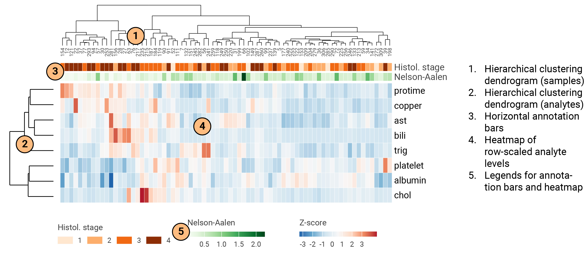

My colleagues *love* heatmaps (at least most of them). Especially when they have these interesting trees in them. (And worth to note that the resulting clusters are not necessarily meaningful.) And when they google *hierarchical clustering heatmaps in r* they find many different packages. And although they do get the job done, there's often a wish to customize the heatmaps a bit beyond changing colors and annotations. Unfortunately, this is not for the faint of heart.

I've been in the same situation myself. I tried to look 'under the hood' of various heatmap packages, but time constraints led me to give up and simply use the available packages. *This is completely fine*. Now I finally had some time to try to create my own hierarchical clustering heatmap from "scratch". (I of course lean on all the work done by probably thousands of people (more adept at coding than me) creating hundreds of packages and all their dependencies.)

In general I think it's a great idea to not use packages uncritically - there are often multiple arguments that each require some background knowledge to understand, and using the default settings may mislead you into believing that the plots show what you *intend* it to do.

For this reason I've here made a reproducible example of how you can make a heatmap from scratch. As we will see later, it resembles that of the frequently used `pheatmap` package. I've used the `pbc` dataset which contains baseline characteristics, including several biochemical markers which we will use to cluster the data, from people suffering from the biliary diseaes primary biliary cholangitis.

I hope this example can help my colleagues, and possibly other readers, understand what these clustering heatmaps *are*. Another benefit of doing it this way is that you will have *full* control of the whole process from data to plotting, and can adjust visual components of the plot as you like. I will go through each of the elements in the figure below.



#### Required packages

```{r echo = TRUE, message = FALSE, warning = FALSE, fig.width = 9, fig.height = 5}
library(tidyverse) # For wrangling
library(ggdendro) # Required to make the dendrogram in ggplot
library(survival) # Contains the pbc dataset
library(mice) # Contains the function to calculate the Nelson-Aalen estimator
library(patchwork) # Required to assemble the plot composite
library(RColorBrewer) # Contains several color palettes
library(ggpubr) # An alternative to patchwork

font <- "Roboto"
```

### Take a glimpse at the data

We see several continuous variables that we can include in the clustering heatmap. Of course your choice of variables to include should be pre-specified, based on domain knowledge, and depends on what story you want to tell.

```{r echo = TRUE, message = FALSE, warning = FALSE, fig.width = 9, fig.height = 5}
glimpse(pbc)
```

### Some data wrangling

In this step I define which variables I want to include in the heatmap. For simplicity, I use only complete cases, and from this subset I randomly sample 75 patients/samples. I also calculate the Nelson-Aalen estimator for each patient/sample which gives a nonparametric estimator of the cumulative hazard rate function.

```{r echo = TRUE, message = FALSE, warning = FALSE, fig.width = 9, fig.height = 5}
# Define the variables to cluster
vars_to_clust <- c("bili", "chol", "albumin", "copper", "ast", "trig", "platelet", "protime")

# We first filter only complete cases (i.e. cases with no missing data points)
pbc_sample <- pbc %>%
  filter(!rowSums(is.na(select(., all_of(vars_to_clust)))) > 0)
# We sample 75 from the pbc dataset without replacement
n <- 75
set.seed(2024) # We set seed for reproducibility
pbc_sample <- sample_n(pbc_sample, n)

# For this exercise I decided to calculate the Nelson-Aalen estimator for each PBC patient.
# This estimator is a nonparametric estimator of the cumulative hazard rate function
# A higher Nelson-Aalen estimator value indicates a higher hazard for the outcome
# We treat death or transplantation as a composite endpoint and calculate the Nelson-Aalen estimator
pbc_sample <-
  pbc_sample %>%
  mutate(status = ifelse(status == 0, 0, 1)) %>%
  mutate(NelsonAalen = mice::nelsonaalen(., time, status))
```

### Scaling

Whether one should scale (or perform any other meaningful transformation) prior to clustering or not is not an easy question. The `pheatmap` package which I use at the end of this post scales prior to the clustering. This is normally preferred when one wants to emphasize differences, so I will do that here. With Z-score scaling, the sum of each analyte equals zero, and the values for each analyte is the deviation from the mean for that analyte. This way, we can visualize *relative* differences in the analytes between the patients/samples.

```{r echo = TRUE, message = FALSE, warning = FALSE}
pbc_sample_scaled <-
  pbc_sample %>%
  pivot_longer(cols = vars_to_clust) %>%
  group_by(name) %>%
  mutate(value = scale(value, center = TRUE, scale = TRUE)) %>%
  pivot_wider() %>%
  as.data.frame()
# For the clustering of patients using hclust(), we need to define rownames to the pbc dataset
rownames(pbc_sample_scaled) <- pbc_sample_scaled$id
```

### Clustering

There are multiple ways to cluster data. I will not go into detail about the different algorithms here - they are described elsewhere. Commonly in heatmaps the patients/samples are given as columns, which I have done here, but the choice is certainly up to you. I've used `ward.D2` to cluster the patients based on the selected analytes.

```{r echo = TRUE, message = FALSE, warning = FALSE, fig.width = 9, fig.height = 5}
# We produce a dendrogram for patients (columns)
model <- hclust(
  dist(pbc_sample_scaled %>%
    select(all_of(vars_to_clust))),
  method = "ward.D2"
)
dg <- as.dendrogram(model)
# It's not straight forward to extract data from a hclust object. To produce a ggplot dendrogram we use
# ggdendro::dendro_data() function
ddata_pts <- dendro_data(dg, type = "rectangle")

pts_dendrogram <-
  ggplot() +
  geom_segment(
    data = segment(ddata_pts),
    aes(x = x, y = y, xend = xend, yend = yend)
  ) +
  geom_text(
    data = label(ddata_pts),
    aes(x = x, y = -1, label = label),
    size = 2, family = font, color = "#444444", vjust = 0.5, angle = 90, hjust = 1
  ) +
  scale_x_continuous(limits = c(0, n + 1), expand = c(0, 0)) +
  scale_y_continuous(expand = c(0, 0)) +
  theme_dendro() +
  theme(plot.margin = unit(c(0, 0, 0, 0), "mm")) +
  coord_cartesian(clip = "off")
```

We can have a look at the produced dendrogram (*Fig. 2*). Take note of the patient IDs. For later it's key that the annotation bars and heatmaps are ordered in the same way (this can be double checked by including axis labels for the various plots).

```{r echo = FALSE, warning = FALSE, message = FALSE, fig.width = 9, fig.height = 3}
#| fig-cap: "Fig. 2. The dendrogram for patients/samples."
ggplot() +
  geom_segment(
    data = segment(ddata_pts),
    aes(x = x, y = y, xend = xend, yend = yend)
  ) +
  geom_text(
    data = label(ddata_pts),
    aes(x = x, y = -1, label = label),
    size = 3.5, family = font, color = "#444444", vjust = 0.5, angle = 90, hjust = 1
  ) +
  scale_x_continuous(limits = c(0, n + 1), expand = c(0, 0)) +
  scale_y_continuous(expand = c(0, 0)) +
  theme_dendro() +
  theme(plot.margin = unit(c(0, 0, 4, 0), "mm")) +
  coord_cartesian(clip = "off")
```

Now we can cluster the analytes and produce a dendrogram for those as well (*Fig. 3 --\>*).

```{r echo = TRUE, message = FALSE, warning = FALSE, fig.width = 1, fig.height = 3}
#| fig-cap: "Fig. 3. The dendrogram for analytes."
#| column: margin

# We produce a dendrogram for analytes (rows)
# Note that here we need to transpose the data
model <- hclust(
  dist(t(pbc_sample_scaled %>%
    select(all_of(vars_to_clust)))),
  method = "ward.D2"
)
dg <- as.dendrogram(model)
ddata_analytes <- dendro_data(dg, type = "rectangle")

analytes_dendrogram <-
  ggplot() +
  geom_segment(
    data = segment(ddata_analytes),
    aes(x = x, y = y, xend = xend, yend = yend),
    position = position_nudge(x = -0.5)
  ) +
  coord_flip(clip = "off") +
  scale_y_reverse() +
  scale_x_continuous(limits = c(0, length(vars_to_clust)), expand = c(0, 0)) +
  theme_dendro() +
  theme(plot.margin = unit(c(0, 0, 0, 0), "mm"))

# We can visualize this dendrogram
analytes_dendrogram +
  geom_text(
    data = label(ddata_analytes),
    aes(x = x, y = -1, label = label),
    size = 3.5, family = font, color = "#444444", vjust = 2, angle = 0, hjust = 0
  ) +
  theme(plot.margin = unit(c(0, 15, 0, 0), "mm"))
```

### Creating annotation bars

Annotation bars can be handy to visualize whether certain groups of columns (patients) or rows (analytes) tend to cluster. Here I've only generated horizontal annotation bars indicating histological disease stage and the Nelson-Aalen estimator (*Fig. 4*).

I separate the annotation bar's legends from the plots using `ggpubr::get_legend` so that we are more flexible later when positioning the legends.

```{r echo = TRUE, message = FALSE, warning = FALSE, fig.width = 9, fig.height = 1.25}
#| fig-cap: "Fig. 4. The horizontal annotation bars."

# Horizontal annotation bar: Histological stage
p_ann_stage <-
  label(ddata_pts) %>%
  rename(id = label) %>%
  left_join(pbc_sample_scaled %>%
    select(id, stage) %>%
    mutate(id = as.character(id))) %>%
  mutate(stage = as.factor(stage)) %>%
  ggplot(aes(x = x, y = "Histol. stage", fill = stage)) +
  geom_tile(color = "white") +
  scale_x_continuous(limits = c(0, n + 1), expand = c(0, 0)) +
  scale_y_discrete(position = "right") +
  theme(
    legend.direction = "horizontal",
    legend.title = element_text(family = font, size = 9, color = "#444444"),
    legend.text = element_text(family = font, size = 8, color = "#444444"),
    legend.key.height = unit(3, "mm")
  ) +
  scale_fill_manual(values = brewer.pal(8, "Oranges")[c(2, 4, 6, 8)]) +
  guides(fill = guide_legend(
    title = "Histol. stage",
    nrow = 1, title.position = "top"
  ))

# Get the legend
leg_stage <- ggpubr::get_legend(p_ann_stage)
# Remove legend from the original plot
p_ann_stage <-
  p_ann_stage +
  theme_void() +
  theme(
    legend.position = "none",
    plot.margin = unit(c(0, 0, 0, 0), "mm"),
    axis.text.y = element_text(hjust = 0, color = "#444444", family = font, size = 10)
  )

# Horizontal annotation bar: Nelson-Aalen estimator
p_ann_NelsonAalen <-
  label(ddata_pts) %>%
  rename(id = label) %>%
  left_join(pbc_sample_scaled %>%
    select(id, NelsonAalen) %>%
    mutate(id = as.character(id))) %>%
  ggplot(aes(x = x, y = "Nelson-Aalen", fill = NelsonAalen)) +
  geom_tile(color = "white") +
  scale_x_continuous(limits = c(0, n + 1), expand = c(0, 0)) +
  scale_y_discrete(position = "right") +
  scale_fill_gradientn(colours = brewer.pal(9, "Greens"), na.value = "#F9F9F9") +
  theme_void() +
  theme(
    legend.direction = "horizontal",
    legend.title = element_text(family = font, size = 9, color = "#444444"),
    legend.text = element_text(family = font, size = 8, color = "#444444"),
    legend.key.height = unit(2, "mm")
  ) +
  guides(fill = guide_colorbar(
    title = "Nelson-Aalen",
    title.position = "top"
  ))
# Get the legend
leg_NelsonAalen <- ggpubr::get_legend(p_ann_NelsonAalen)
# Remove legend from the original plot
p_ann_NelsonAalen <-
  p_ann_NelsonAalen +
  theme_void() +
  theme(
    legend.position = "none",
    plot.margin = unit(c(0, 0, 0, 0), "mm"),
    axis.text.y = element_text(hjust = 0, family = font, size = 10, color = "#444444")
  )

ggarrange(
  ggarrange(p_ann_stage, p_ann_NelsonAalen, nrow = 2, align = "v"),
  ggarrange(leg_stage, leg_NelsonAalen, nrow = 1, align = "h"),
  nrow = 2
)
```

### Making the heatmap

We start off using the dendrogram data (for patients and analytes separately), and join in the pbc dataset. This way, we can order the patients and analytes according to their positions in the dendrogram and produce a heatmap ordered correctly both in the `x` and `y` positions (*Fig. 5*).

```{r echo = TRUE, message = FALSE, warning = FALSE, fig.width = 6, fig.height = 2}
#| fig-cap: "Fig. 5. The heatmap, rows and columns sorted by the dendrogram labels."

# Create the heatmap dataframe
hm_df <-
  label(ddata_pts) %>%
  rename(id = label) %>%
  left_join(pbc_sample_scaled %>% mutate(id = as.character(id))) %>%
  pivot_longer(cols = vars_to_clust) %>%
  # Join in also the dendrogram positions of the analytes to enable their correct ordering
  left_join(data.frame(ddata_analytes$labels) %>%
    rename(name = label, order_analytes = x))

# Now we can plot the heatmap
# Note that the x-values in "hm_df" are ordered based on the horizontal dendrogram positions. For the
# analytes (rows), we reorder based on their order in the vertical dendrogram.

# Define breaks for the color scale
breaks_list <- seq(-3, 3, by = 1)

hm <-
  hm_df %>%
  ggplot(aes(x = x, y = reorder(name, order_analytes), fill = value)) +
  geom_tile(color = "white") +
  scale_x_continuous(limits = c(0, n + 1), expand = c(0, 0)) +
  scale_y_discrete(position = "right") +
  coord_cartesian(clip = "off") +
  theme_void() +
  theme(
    plot.margin = unit(c(0, 0, 0, 0), "mm"),
    axis.text.y = element_text(hjust = 0, family = font, size = 10),
    legend.title = element_text(family = font, size = 9, color = "#444444"),
    legend.text = element_text(family = font, size = 8, color = "#444444"),
    legend.key.height = unit(2, "mm"),
    legend.position = "bottom"
  ) +
  scale_fill_gradient2(
  low = brewer.pal(11, "RdBu")[[11]],
  mid = brewer.pal(11, "RdBu")[[6]],
  high = brewer.pal(11, "RdBu")[[1]]) +
  guides(fill = guide_colorbar(title.position = "top", title = "Z-score"))

# Get the legend
leg_hm <- ggpubr::get_legend(hm)
# Remove legend from the original plot
hm <-
  hm +
  theme(
    legend.position = "none"
  )

# We arrange the legends for the annotation bars together
legends <- ggarrange(leg_stage, leg_NelsonAalen, leg_hm, nrow = 1, align = "h")

hm
```

### Arranging the plot composite

There are some different packages that can help create a grid of positions where the various plots can be placed. Here I found the `patchwork` package to work the best. We define a layout and then simply fill in the spots in the order of the layout. *Fig. 6* shows the end result.

```{r echo = TRUE, message = FALSE, warning = FALSE, fig.width = 9, fig.height = 3.8}
#| fig-cap: "Fig. 6. The plot composite - a heatmap made from scratch - well, almost (thank you ggplot2!)"

# Define layout for the grid in the plot composite
layout <- "
#AAAAAAA
#BBBBBBB
#CCCCCCC
DEEEEEEE
#FFFFFFF
"

# Now plot!
pts_dendrogram + p_ann_stage + p_ann_NelsonAalen + analytes_dendrogram + hm + legends +
plot_layout(design = layout, heights = c(7, 1.6, 1.6, 20, 5))
```

We can observe some patterns here: - The patient clustering gives two main clusters, the right one being characterised by increased levels of aspartate aminotransferase (ast), platelets, albumin, bilirubin (bili) and serum cholesterol (chol). - Serum cholesterol (chol) appears to cluster separately from the other analytes. - A group of patients with high-stage disease which have increased blood clotting time (protime) and high blood copper level. - There are no clear associations between the Nelson-Aalen estimators (which relates to patient hazards).

### Selective coloring of the dendrogram

There is a lot of flexibility in the code since we create the clustering heatmap in a semi-manual way. We can for instance selectively color the dendrogram, e.g. emphasize a particular "cluster" (*Fig. 7*).

```{r echo = TRUE, message = FALSE, warning = FALSE, fig.width = 9, fig.height = 3.8}
#| fig-cap: "Fig. 7. The way you style the plot can help you tell a story with your plot."

pts_dendrogram_highlight <-
  ggplot() +
  geom_segment(
    data = segment(ddata_pts) %>%
      mutate(highlight = as.factor(ifelse(x < 19, 1, 0))),
    aes(x = x, y = y, xend = xend, yend = yend, color = highlight)
  ) +
  geom_text(
    data = label(ddata_pts),
    aes(x = x, y = -1, label = label),
    size = 2, family = font, vjust = 0.5, angle = 90, hjust = 1
  ) +
  scale_x_continuous(limits = c(0, n + 1), expand = c(0, 0)) +
  scale_y_continuous(expand = c(0, 0)) +
  theme_dendro() +
  theme(
    plot.margin = unit(c(0, 0, 0, 0), "mm"),
    legend.position = "none"
  ) +
  coord_cartesian(clip = "off") +
  scale_fill_gradientn(
    colours = colorRampPalette(rev(brewer.pal(n = 7, name = "RdBu")))(length(breaks_list)),
    breaks = breaks_list
  ) +
  scale_color_manual(values = c("#444444", "#ff85a5"))

p <-
pts_dendrogram_highlight + p_ann_stage + p_ann_NelsonAalen + analytes_dendrogram + hm + legends +
  plot_layout(design = layout, heights = c(7, 2, 2, 20, 5))
ggsave("p.pdf", p, width=180, height = 50, unit = "mm", dpi = 300, device = cairo_pdf)
```

### Comparison with the pheatmap package

Finally we can compare our output to that obtained using e.g. the `pheatmap` package (*Fig. 8*).

```{r echo = TRUE, message = FALSE, warning = FALSE, output = FALSE}
library(pheatmap)
library(ggplotify)

pbc_sample_pheatmap <-
  pbc_sample %>%
  select(all_of(vars_to_clust))

rownames(pbc_sample_pheatmap) <- rownames(pbc_sample)

# The horizontal annotation bars
h_ann <- data.frame(
  nelsonaalen = pbc_sample$NelsonAalen,
  stage = pbc_sample$stage
)
# Ensure that the horizontal annotation bars have the same rownames as the pbc_sample_pheatmap data
rownames(h_ann) <- rownames(pbc_sample_pheatmap)
# Define breaks and specify colors for the heatmap
breaks_list <- seq(-3, 3, by = 0.2)
ann_coloring <- list(
  stage = c(
    "1" = brewer.pal(8, "Oranges")[2],
    "2" = brewer.pal(8, "Oranges")[4],
    "3" = brewer.pal(8, "Oranges")[6],
    "4" = brewer.pal(8, "Oranges")[8]
  ),
  colorRampPalette(brewer.pal(9, "Greens"))(75)
)
# Plot the heatmap using the pheatmap::pheatmap() function
hm_pheatmap <-
  as.grob(
    pheatmap(t(pbc_sample_pheatmap),
      scale = "row",
      cluster_cols = TRUE,
      annotation_col = h_ann,
      clustering_method = "ward.D2",
      fontsize_row = 6,
      border_color = "#F9F9F9",
      show_rownames = TRUE,
      fontsize = 6,
      annotation_colors = ann_coloring,
      color = colorRampPalette(rev(brewer.pal(n = 7, name = "RdBu")))(length(breaks_list)),
      breaks = breaks_list
    )
  )
```

Now we can plot the two plots side by side.

```{r echo = TRUE, message = FALSE, warning = FALSE, fig.width = 12, fig.height = 5}
#| fig-cap: "Fig. 8. Side-by-side comparison of the manual heatmap and the one made using the pheatmap package. Looks quite similar to me!"
#| column: screen-inset-shaded
#| out-width: 100%

ggarrange(
  ggarrange(
    ggplot() +
      labs(title = "My plot") +
      theme_void() +
      theme(plot.title = element_text(size = 20, family = font, hjust = 0.5)),
    ggplot() +
      labs(title = "Pheatmap's plot") +
      theme_void() +
      theme(plot.title = element_text(size = 20, family = font, hjust = 0.5)),
    nrow = 1
  ),
  ggarrange(
    pts_dendrogram + p_ann_stage + p_ann_NelsonAalen + analytes_dendrogram + hm + legends +
      plot_layout(design = layout, heights = c(7, 1.6, 1.6, 20, 5)),
    ggarrange(NULL, hm_pheatmap, NULL, heights = c(1, 12, 2.3), nrow = 3),
    nrow = 1
  ),
  nrow = 2, widths = c(5,7), heights = c(1, 10)
)
```

The row order on the `pheatmap` plot is in the inverse order compared to my plot, and the scale bars are a tad different. Other than that it looks quite similar - which is reassuring!

The coding for the `pheatmap` plot is far easier than for mine, so if you're happy with the appearance you should go for it.

Finally we can run a simulation (I'm terrible at simulating) where we generate some data with a strong signal. In the data, increasing stage associates with higher Nelon-Aalen estimator values, and a selection of the variables are simulated to associate with the Nelson Aalen estimator values.

```{r echo = TRUE, message = FALSE, warning = FALSE, fig.width = 12, fig.height = 5}
#| column: screen-inset-shaded
#| out-width: 100%
#| code-fold: true
#| code-summary: "Show the code"
#| code-overflow: wrap

# Simulation example
n <- 150
pbc_sample <-
data.frame(
  stage = rbinom(n, 3, 0.40),
  id = c(1:n)
) %>%
    mutate(NelsonAalen = abs(rnorm(n, 0.6, 0.5))) %>%
    mutate(NelsonAalen = NelsonAalen + (0.03 * stage))

for (i in 1:15) {
  pbc_sample[[paste0("var_", i)]] <- rnorm(nrow(pbc_sample), 25, 15)
}

vars_with_association <- names(pbc_sample)[grep("var_[1-8]", names(pbc_sample))]

# We create an association between Nelon Aalen estimator and a selection of the variables
pbc_sample <- 
pbc_sample %>% mutate_at(vars(c("var_1", "var_3", "var_5", "var_8", "var_9", "var_15")), ~ . * 0.025*(NelsonAalen))

vars_to_clust <- names(pbc_sample %>% select(starts_with("var_")))

pbc_sample_scaled <- 
pbc_sample %>%
pivot_longer(cols = vars_to_clust) %>%
  group_by(name) %>%
  mutate(value = scale(value, center = TRUE, scale = TRUE)) %>%
  pivot_wider() %>%
  as.data.frame()

rownames(pbc_sample_scaled) <- pbc_sample_scaled$id

# We produce a dendrogram for patients (columns)
model <- hclust(
  dist(pbc_sample_scaled %>%
    select(all_of(vars_to_clust))),
  method = "ward.D2"
)
dg <- as.dendrogram(model)
# It's not straight forward to extract data from a hclust object. To produce a ggplot dendrogram we use
# ggdendro::dendro_data() function
ddata_pts <- dendro_data(dg, type = "rectangle")

pts_dendrogram <-
  ggplot() +
  geom_segment(
    data = segment(ddata_pts),
    aes(x = x, y = y, xend = xend, yend = yend)
  ) +
  geom_text(
    data = label(ddata_pts),
    aes(x = x, y = -1, label = label),
    size = 2, family = font, color = "#444444", vjust = 0.5, angle = 90, hjust = 1
  ) +
  scale_x_continuous(limits = c(0, n + 1), expand = c(0, 0)) +
  scale_y_continuous(expand = c(0, 0)) +
  theme_dendro() +
  theme(plot.margin = unit(c(0, 0, 0, 0), "mm")) +
  coord_cartesian(clip = "off")

# We produce a dendrogram for analytes (rows)
# Note that here we need to transpose the data
model <- hclust(
  dist(t(pbc_sample_scaled %>%
    select(all_of(vars_to_clust)))),
  method = "ward.D2"
)
dg <- as.dendrogram(model)
ddata_analytes <- dendro_data(dg, type = "rectangle")

analytes_dendrogram <-
  ggplot() +
  geom_segment(
    data = segment(ddata_analytes),
    aes(x = x, y = y, xend = xend, yend = yend),
    position = position_nudge(x = -0.5)
  ) +
  coord_flip(clip = "off") +
  scale_y_reverse() +
  scale_x_continuous(limits = c(0, length(vars_to_clust)), expand = c(0, 0)) +
  theme_dendro() +
  theme(plot.margin = unit(c(0, 0, 0, 0), "mm"))


# Horizontal annotation bar: Histological stage
p_ann_stage <-
  label(ddata_pts) %>%
  rename(id = label) %>%
  left_join(pbc_sample_scaled %>%
    select(id, stage) %>%
    mutate(id = as.character(id))) %>%
  mutate(stage = as.factor(stage)) %>%
  ggplot(aes(x = x, y = "Histol. stage", fill = stage)) +
  geom_tile(color = "white") +
  scale_x_continuous(limits = c(0, n + 1), expand = c(0, 0)) +
  scale_y_discrete(position = "right") +
  theme(
    legend.direction = "horizontal",
    legend.title = element_text(family = font, size = 9, color = "#444444"),
    legend.text = element_text(family = font, size = 8, color = "#444444"),
    legend.key.height = unit(3, "mm")
  ) +
  scale_fill_manual(values = brewer.pal(8, "Oranges")[c(2, 4, 6, 8)]) +
  guides(fill = guide_legend(
    title = "Histol. stage",
    nrow = 1, title.position = "top"
  ))

# Get the legend
leg_stage <- ggpubr::get_legend(p_ann_stage)
# Remove legend from the original plot
p_ann_stage <-
  p_ann_stage +
  theme_void() +
  theme(
    legend.position = "none",
    plot.margin = unit(c(0, 0, 0, 0), "mm"),
    axis.text.y = element_text(hjust = 0, color = "#444444", family = font, size = 10)
  )

# Horizontal annotation bar: Nelson-Aalen estimator
p_ann_NelsonAalen <-
  label(ddata_pts) %>%
  rename(id = label) %>%
  left_join(pbc_sample_scaled %>%
    select(id, NelsonAalen) %>%
    mutate(id = as.character(id))) %>%
  ggplot(aes(x = x, y = "Nelson-Aalen", fill = NelsonAalen)) +
  geom_tile(color = "white") +
  scale_x_continuous(limits = c(0, n + 1), expand = c(0, 0)) +
  scale_y_discrete(position = "right") +
  scale_fill_gradientn(colours = brewer.pal(9, "Greens"), na.value = "#F9F9F9") +
  theme_void() +
  theme(
    legend.direction = "horizontal",
    legend.title = element_text(family = font, size = 9, color = "#444444"),
    legend.text = element_text(family = font, size = 8, color = "#444444"),
    legend.key.height = unit(2, "mm")
  ) +
  guides(fill = guide_colorbar(
    title = "Nelson-Aalen",
    title.position = "top"
  ))
# Get the legend
leg_NelsonAalen <- ggpubr::get_legend(p_ann_NelsonAalen)
# Remove legend from the original plot
p_ann_NelsonAalen <-
  p_ann_NelsonAalen +
  theme_void() +
  theme(
    legend.position = "none",
    plot.margin = unit(c(0, 0, 0, 0), "mm"),
    axis.text.y = element_text(hjust = 0, family = font, size = 10, color = "#444444")
  )

# Create the heatmap dataframe
hm_df <-
  label(ddata_pts) %>%
  rename(id = label) %>%
  left_join(pbc_sample_scaled %>% mutate(id = as.character(id))) %>%
  pivot_longer(cols = vars_to_clust) %>%
  # Join in also the dendrogram positions of the analytes to enable their correct ordering
  left_join(data.frame(ddata_analytes$labels) %>%
    rename(name = label, order_analytes = x))

# Now we can plot the heatmap
# Note that the x-values in "hm_df" are ordered based on the horizontal dendrogram positions. For the
# analytes (rows), we reorder based on their order in the vertical dendrogram.

# Define breaks for the color scale
breaks_list <- seq(-3, 3, by = 1)

hm <-
  hm_df %>%
  ggplot(aes(x = x, y = reorder(name, order_analytes), fill = value)) +
  geom_tile(color = "white") +
  scale_x_continuous(limits = c(0, n + 1), expand = c(0, 0)) +
  scale_y_discrete(position = "right") +
  coord_cartesian(clip = "off") +
  theme_void() +
  theme(
    plot.margin = unit(c(0, 0, 0, 0), "mm"),
    axis.text.y = element_text(hjust = 0, family = font, size = 10),
    legend.title = element_text(family = font, size = 9, color = "#444444"),
    legend.text = element_text(family = font, size = 8, color = "#444444"),
    legend.key.height = unit(2, "mm"),
    legend.position = "bottom"
  ) +
  scale_fill_gradient2(
  low = brewer.pal(11, "RdBu")[[11]],
  mid = brewer.pal(11, "RdBu")[[6]],
  high = brewer.pal(11, "RdBu")[[1]])+
  guides(fill = guide_colorbar(title.position = "top", title = "Z-score"))

# Get the legend
leg_hm <- ggpubr::get_legend(hm)
# Remove legend from the original plot
hm <-
  hm +
  theme(
    legend.position = "none"
  )

# We arrange the legends for the annotation bars together
legends <- ggarrange(leg_stage, leg_NelsonAalen, leg_hm, nrow = 1, align = "h")

pts_dendrogram + p_ann_stage + p_ann_NelsonAalen + analytes_dendrogram + hm + legends +
plot_layout(design = layout, heights = c(7, 1.6, 1.6, 20, 5))

```
