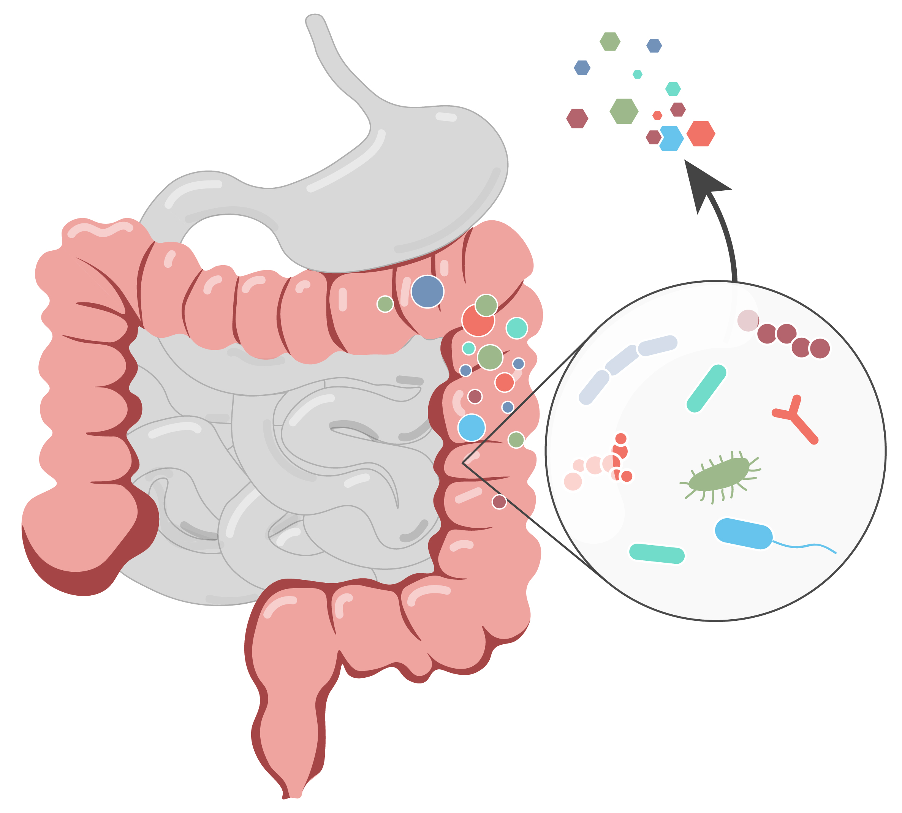
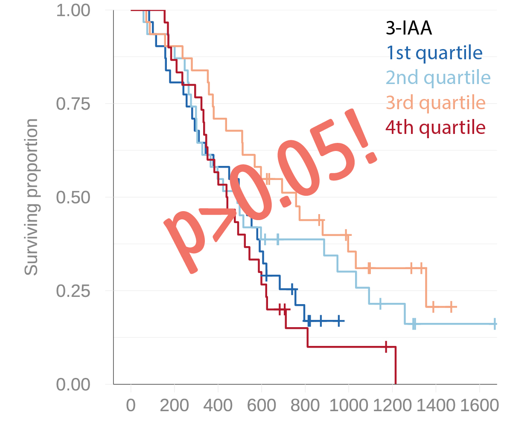

In this post I discuss the challenges that scientists face in publishing studies with negative and/or contradictory findings and how this relates to our tendency to favor information that aligns with our existing beliefs. I will exemplify this phenomenon with a study from our lab that has struggled to make it into print.

## The file drawer

Karl Popper told us about how scientific theories should be open to falsification, meaning that scientists should actively try to refute their hypotheses. Disproving scientific theories is in fact widely accepted as crucial for scientific innovation, strengthening of theories, and integrity.

Living by this ideal as a researcher is easier said than done, however, and the reasons are complex and numerous. One reason is that most of us suffer from **confirmation bias**: We tend to like results that confirm our hypotheses over those that refute them. It does not help that scientific journals prioritize statistically significant and positive results, leading to **publication bias**. It's discouraging enough to get negative results. And knowing that the results will be difficult to publish (negative results often struggle to find their way into print) incentives us to rather put the study in the *file drawer*.

But perhaps your research aim is to reproduce a published finding? Well, although it's admirable that you wish to make a valuable contribution to the scientific literature, you're probably less likely to get your project funded. Because funding agencies will favor projects that are likely to be published in high-impact scientific journals.

As a result, positive findings are far more common to find in the scientific literature than negative findings. Mining efforts of publication databases support this, including a [higher-than-expected](https://medianwatch.netlify.app/post/z_values/) frequency of statistically significant p-values and area-under-the-curve values [just above certain thresholds](https://doi.org/10.1186/s12916-023-03048-6). The lack of negative findings in the scientific literature muddies the waters for researchers aiming to get an overview of a field, reduces the reliability of meta-analyses, and hinders the scientific process.

Being an honest scientist you face a dilemma: You are evaluated by your publication records (although some institutions increasingly acknowledge [other, more meaningful metrics](https://sciencebusiness.net/news/universities/utrecht-university-withdraws-global-ranking-debate-quantitative-metrics-grows)), and a poor publication record reduces your chances of getting grants and tenure. It's *publish or perish* all day long. Do you stick to your guns, or do you run along?

Sadly it seems that many scientists choose the latter - and I'm not pointing fingers here. Because the system is *designed* to make scientists reluctant to spend time on publishing negative findings and pursue non-flashy replication studies. This further fuels confirmation bias, slows down research progress (how many awarded research grants aren't built upon sketchy, cherry-picked findings?), and leads many down the path of [research misconduct](https://peder.quarto.pub/blog/posts/negative_findings/www.retractionwatch.org) in search for novelty.

## A microbial metabolite improving chemotherapy effect in pancreatic cancer

::: grid
::: {.g-col-12 .g-col-md-6}
In our lab, we are enthusiastic about the influence of human gut-resident bacteria and their by-products on disease. These bugs, commonly termed the *gut microbiota*, feed on and process nutrients and xenobiotics entering your intestines (kind of illustrated to the right here). The intestines form a *window* between the external environment and the inside of our bodies. The resulting by-products from the gut microbiota shapes the mix of chemicals (metabolites) that end up in the portal blood. After a short pit stop in the liver, these chemicals enter the bloodstream from which they can reach your body's organs. Naturally, changes in the composition of the gut microbiome can lead to changes in this chemical cocktail.

No wonder that we were excited when a [**story broke in Nature**](https://www.nature.com/articles/s41586-023-05728-y) by Tintelnot and colleagues on a microbially produced metabolite, 3-indole acetate (3-IAA) which could augment chemotherapy efficacy in metastatic pancreatic cancer. Aside from many mechanistic studies, a key finding was that patients from two German cancer centers (totaling 47 patients) who had high blood levels of 3-IAA when they started chemotherapy **lived longer** than those with low 3-IAA.
:::

::: {.g-col-12 .g-col-md-6}

:::
:::

(To estimate the association between 3-IAA and survival, the authors actually used a simple Pearson correlation! Although there were few censored cases, I'm surprised this passed peer review...)

Blood levels of 3-IAA can theoretically be increased with a tryptophan-rich diet or fecal microbiota transplantation, meaning there is a possibility to modify 3-IAA in patients and thereby improve treatment effects. We reasoned that if the finding of Tintelnot and colleagues could generalize also to our Norwegian patients, this would lend more credence to their findings and possibly lead us one step closer to improving outcomes for this dreadful disease with no effective treatments and dismal prognoses. Furthermore, if a clinical trial testing the modification of 3-IAA in pancreatic cancer should be initiated, it would be of utmost importance to validate the findings by Tintelnot for several reasons. Firstly, the discovery may be erroneous. If this was the case, a clinical trial would be a waste of resources which could have been spent on testing the feasibility of other therapies. Secondly, even if the finding was true, the effect may be restricted to certain geographies, patient populations or disease stage. Finally, the effect size may be smaller than what was anticipated -- [optimism is common](https://onlinelibrary.wiley.com/doi/abs/10.1002/sim.7993) in prognostic factor research, which is at least partly driven by researcher's confirmation bias (as well as statistical illiteracy...).

### Our study

To see if we could possibly validate Tintelnot et al's findings, we reached out to a group in our hospital who specializes on pancreatic cancer, and to our delight they had prospectively collected blood samples from 123 patients who had started chemotherapy (mostly the same type of chemotherapy as was given in the German cohorts). The patients in this Norwegian cohort had locally advanced or borderline resectable pancreatic cancer, meaning they did not have metastatic disease like the patients in Tintelnot et al. We reasoned, however, that the if there was a potentiating effect of 3-IAA on chemotherapy it would also be present in this patient population (which was three times larger than the combined discovery cohorts) - a unique opportunity to explore the generalizability of the published findings.

A few years back we formed a collaboration with a group of expert biochemists at [BEVITAL](www.bevital.no) who specializes in measuring metabolites, including 3-IAA.

::: grid
::: {.g-col-12 .g-col-md-7}
Early in 2023 we started the process to validate the promising association between 3-IAA and chemotherapy response in the Norwegian pancreatic cancer cohort. A mere two weeks later we had the results. And they were not what we had hoped for: We found no evidence of an association between circulating 3-IAA and patient outcomes. And this was one of those cases where even the most optimistic data dredgers would struggle to find an effect. After discussing this negative finding with our expert colleagues on pancreatic cancer, we speculated that the discrepancy could be due to the differences in tumor load (metastatic vs non-metastatic). Although our study was not designed to answer this important question, that explanation in itself would be a valuable insight to anyone considering testing a 3-IAA-focused intervention in humans.

Or it could simply be that the effect of 3-IAA was not so general after all.
:::

::: {.g-col-12 .g-col-md-5}

:::
:::

One thing that caught our attention was that we measured ten times higher 3-IAA concentrations in our cohort than in Tintelnot. We used a robust LC-MS/MS-based method with internal standards, and are confident about both the identity and concentration of 3-IAA in our samples. Tintelnot et al on the other hand used an assay-based technology. Certainly this piece of information was important, and did introduce some doubt about the concentrations reported by Tintelnot and colleagues.

### An uphill battle

We believed that our study would be a notable addition that could add to a more nuanced view of the putative prognostic value of 3-IAA. We had a manuscript with potentially great influence at hand.

Motivated by our timely and important findings, we rapidly submitted a brief report to *Nature*, the journal where the original discovery was published. We rapidly received a desk reject, with the reason being that the editor felt that our results did not challenge the conclusions or clarified the understanding of the paper by Tintelnot et al. This was expected -- *Nature* is, deserved or not, the *crème de la crème* of scientific publishing, and need high impact findings to consolidate their position as a top publisher. Still, we were disappointed. Our study would perhaps not accumulate a high number of citations, but we had nonetheless hoped a publication in *Nature* would provide our work with the significant visibility it deserved.

### The next step, and the next step thereafter, and...

As all researchers do so so often, we rolled up our sleeves and attempted in another journal. Right before Christmas 2023 we submitted our brief report to *JAMA Oncology*, a high-ranked cancer-oriented journal, hoping that they would be interested in enlightening their readers on this important topic. Shortly after the holidays we yet again received a desk reject.

**The life of a scientist can be discouraging.** While we had anticipated that our negative findings would not be easy to get published, we had at the very least hoped that we would get the study past the editor's desk and receive some insightful reviewer comments from our scientific peers. Since we envisioned that this may take a while and that the results should be publicly available as soon as possible, we decided to submit our manuscript to [*medrXiv*](www.medrxiv.org), a pre-print server enabling rapid and free dissemination without peer review. We simultaneously submitted the manuscript to *NPJ Precision Oncology*, where we yet again received a reject without external peer review.

*Could we justify continuing to put more effort into publishing this important finding?* After all, we had many other projects ongoing, grants to prepare and lab work to do, and the study was available on a preprint server. We decided to lower our ambitions, and submitted to a Nordics-based journal, *Acta Oncologica* that undoubtedly has a more limited readership than the journals we had tried up until now. When we received news that the manuscript had gone into peer review, a wave of relief and encouragement swept over us. This time we would surely get lucky?

**Nope**. But at the very least we received honest reviewer comments. While one reviewer was positive, the other stated that a study with a negative outcome by itself is not a novel finding and is therefore of limited interest. In August 2024, after half a year of peer review in the *Scandinavian Journal of Gastroenterology*, we yet again received a reject.

Well, negative findings may not be as eye-catching and exciting as groundbreaking discoveries. They are probably also more subject to scrutiny and skepticism, which is fair enough - *all* studies should be handled this way. But, as our case illustrates, confirmation trumps scrutiny, and novelty trumps validation. Had our finding been positive and confirmatory, the study would likely have been met with great enthusiasm and would likely be online for months already.

### The breakthrough

We finally decided to submit our manuscript to *Frontiers in Oncology*, and after a swift peer review process, our article [finally got published!](https://www.frontiersin.org/journals/oncology/articles/10.3389/fonc.2024.1488749/full) The victory left us with a somewhat bitter taste: MDPI has [several issues](https://retractionwatch.com/category/by-publisher/mdpi-by-publisher/) and several of the Frontiers journals, including *Frontiers in Oncology*, were recently was [demoted to level 1 (the lowest level) in Finland](https://retractionwatch.com/2024/12/24/finland-publication-forum-will-downgrade-hundreds-of-frontiers-and-mdpi-journals/).

Tintelnot et al. elegantly support their epidemiological findings with preclinical models in the [original study](https://www.nature.com/articles/s41586-023-05728-y). Perhaps 3-IAA *does* have a potentiating effect on chemotherapy in pancreatic cancer, after all? 

As of today, the study has been accessed **68,000** times and has been cited **210** times.

