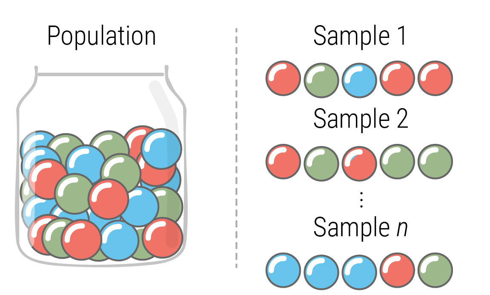
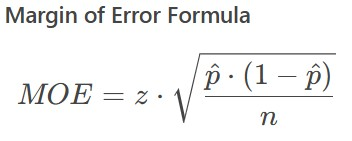

```{r setup, include = FALSE}
knitr::opts_chunk$set(message = FALSE, warning = FALSE)
library(sysfonts); library(ggtext); library(extrafont)
font_add_google(name = "Roboto", regular.wt = 400)
```

I love working with statistics. Aside from an introductory course in stats and a statistical modeling course, my studies were focused on biochemistry and molecular biology. During the final year of my PhD I realized that statistics is not some technique, like running a Western blot, but rather an entire field. I decided I wanted to learn more about statistics. But statistics is really difficult, and without formal training, learning statistics is like climbing a steep, slippery hill.

I think many people find themselves in my position. And apparently there is hope for us. Darren Dahly has a great blog post on the subject in [his blog](https://statsepi.substack.com/p/im-not-a-real-statistician-and-you):

*"(...) most of us receive some training in statistics, but it's often so shallow it does more harm than good (...) in practice, we wind up with lots of people knowing little about statistics, and few people, the "real" statisticians, who seem to know all of it. This is a problem."*

Most of us have had introductory courses in statistics, and yet we are expected to produce research with meaningful statistical analyses. No one would allow a statistician with an introductory course in surgery to perform a gastric bypass. Yet, surgeons are *expected* and allowed to use statistics to draw inferences from data, and you don't have to look for long to find poor statistical practice used in academic research. Of course, the surgeon doing statistics does not directly cause harm to humans. But it's still harmful. As Dahly discusses, statistical illiteracy ultimately leads to useless treatments being given to patients while useful treatments are delayed.

There are simply not enough statisticians to help us frustrated biologists and MDs with large gaps in our understanding of statistics. So what's the remedy? First, we should employ more statisticians at universities and research institutions. But we, the mere mortals, can also learn statistics and apply it correctly in our research. Bit by bit.

::: grid
::: {.g-col-12 .g-col-md-6}

I had an a-ha moment when I read [Andrew Heiss' blog post on probability math and simulation](https://www.andrewheiss.com/blog/2024/05/03/birthday-spans-simulation-sans-math/) a time back. He brings forth the problem about a jar filled with pebbles of different colors. You draw five pebbles from the jar, and want to calculate the probability that at least one pebble of each color will be selected. 

This problem can be solved using probability math. To me, this was always abstract, and the formulas never really made sense to me. Heiss shows that you can actually this probability using simulations in R. I'm pretty sure my university professors never explained this to me explicitly. Now, in hindsight, I wonder why I, myself, *have not* thought of this before.

::: 
::: {.g-col-12 .g-col-md-6}



:::
:::

Inspired by this blog post, I decided to do some simulations myself to answer these kinds of questions (simulating data is also great for other purposes such as testing whether your script does what it intends to do). I later made a Quarto presentation for a group meeting where I wanted to show some examples to inspire my colleagues. This blog post is an expanded version of that presentation. I will go through a couple of examples of how simulation and sampling can help to understand probabilities and uncertainty.

## Political party polling


How reliable is a poll? How was the polling conducted? By calling landline phones? Asking random people on Bluesky or people taking the subway during the rush hour? Certainly, these `samples` will capture different parts of the `population`, which can lead to `biased` estimates. If we had infinite time and resources, we could sample everyone. Then we would know the true value of the `population parameter` (here, the share of votes). This is not possible, of course, so we rather draw one or several samples from the population to *estimate* the population parameter and *hope* we are not too far off. In the current example, for the sake of simplicity, we assume that there is no sampling bias.


Let's create an artificial U.S. population where 35% vote for Dems and 65% vote for Repubs. Ignore the fact that this is an entirely unrealistic and depressing scenario. We now *know* the *true* population parameter. This analogous to a jar where we put 35 blue pebbles and 65 red ones. As we will see, we can draw pebbles from this jar to estimate how reliable future draws from the same jar will be to estimate the true fraction of blue and red pebbles.

We start off by creating an artificial dataset where *exactly* 35% of a population votes Dem:


```{r}
#| echo = TRUE
library(tidyverse); library(kableExtra)
set.seed(2024)
population <- 5.0*10^6 # Population size: 5 million
true_dem_share <- 0.35 # The true fraction of people who vote red
# Create a dataset with 5 million rows
vote_df <- tibble(
    vote = c(
        rep("democrat", population*true_dem_share), 
        rep("republican", population - (population*true_dem_share)))
    ) %>%
    mutate(person_n = c(1:population))
```

We can look at the data structure by filtering 10 random rows:

```{r}
#| echo = TRUE
library(scales)
vote_df %>%
    sample_n(size = population) %>%
    slice(1:10) %>%
    mutate(vote = cell_spec(vote, background=ifelse(vote == "democrat", "#009de0", "#e81502"))) %>% 
    select(person_n, vote) %>%
    mutate(person_n = scales::comma(person_n)) %>%
    kbl(booktabs = T, linesep = "", escape=FALSE, htmltable_class = "lightable-classic", align = "l") %>% 
    column_spec(2, color = "white") %>%
    kable_styling(bootstrap_options = "striped", font_size = 13, full_width = F)
```

Now we pretend we are a pollster and that we don't know the true share of democratic voters. Therefore we draw a random sample of `1000` people from our artificial population, calculate the percentage of people who vote for the Democratic party, and since we are an excellent pollster we know that our polling is perfect with no sampling bias:

```{r}
#| echo = TRUE
vote_df %>%
    sample_n(size = 1000, replace = FALSE) %>%
    group_by(vote) %>%
    summarize(n = n()) %>%
    mutate(percentage = n / sum(n) * 100) %>%
    filter(vote == "democrat") %>%
    pull(percentage)
```

34.2%. Not too far off from the true fraction of 35%. But as a pollster we do not know the true fraction, and will report the point estimate of 34.2%. Following the norm, we want to report the uncertainty in our estimate. As we will see, there are different ways to calculate this uncertainty. One is formula-based, and the other is simulation-based.

### Simulating the margin of error

What happens if we repeat this sampling, say, `1000` times? This is easy to do in R.

We loop over the the `1000` sample draws, each time storing the % of people who say they will vote for Dems:

```{r}
#| echo = TRUE
poll_size <- 1000
n_samples <- 1000
result_df <- tibble(
    simulation_n = numeric(), 
    dem_share = numeric(),
    dem_perc = character())
for(i in 1:n_samples){
# Draw a sample of NN voters
sample <- sample_n(vote_df, size = poll_size, 
                   replace = FALSE)
# Summarise result
result <- sample %>% count(vote)
democrat <- result$n[[1]]/poll_size
result_df <- result_df %>% 
    bind_rows(tibble(
        simulation_n = i, 
        dem_share = democrat) %>%
            mutate(dem_perc = paste0(democrat*100, "%")))
}

# Visualize the first 10 rows in a table
result_df_10 <- result_df[1:10,]
library(formattable)
result_df_10$dem_share <- formattable::color_bar("#ffd38b")(result_df_10$dem_share)

# Create the table
result_df_10 %>%
  kable("html", escape = F, html_font = "Roboto") %>%
  kable_paper() %>%
  # Specify width of the citations bar cells
  column_spec(2, width = "8cm") %>%
  kable_styling(bootstrap_options = "striped", font_size = 13, full_width = FALSE)

```

We observe that the different sample draws give different shares of voters for Dems. We can now look at the distribution for all the `1000` sample draws:

```{r}
# Define a reusable theme
theme_minimal_2 <- function() {theme_minimal(base_family = "Roboto", base_size = 16)+
    theme(
        plot.title = element_text(size = 20, family = "Roboto", face = "bold", 
                                  hjust = 0.5, color = "#444444"),
        plot.subtitle = element_text(hjust = 0.5, color = "#444444"),
        axis.title.y = element_text(color = "#444444"),
        axis.title.x = element_text(color = "#444444")
    )
}

theme_set(theme_minimal_2())

library(ggdist)
result_df %>%
    ggplot(aes(x = dem_share, y = 1))+
    geom_vline(xintercept = true_dem_share, size = 0.75, color = "#222222", linetype = "dashed")+
    ggdist::stat_dots(color = "#009de0", side = "top", binwidth = 0.00097, shape = 16)+
    theme(
        axis.title.y = element_blank(),
        panel.grid.major = element_blank(),
        panel.grid.minor = element_blank(),
        axis.text.y = element_blank(),
        axis.line.x = element_line(size = 0.2, color = "#222222"),
        axis.ticks.x = element_line(size = 0.2, color = "#222222")
    ) +
   scale_x_continuous(labels = scales::percent)+
   scale_y_continuous(expand = c(0.0,0))+
   labs(
        x = "Share of vote for Dems",
        title = paste0("Results from ", n_samples, " samplings"), 
        subtitle = "Each dot represents the share of votes for Dems in a drawn sample"
   )
```

We see that the most frequent estimates were around 35%, which is expected since this was the true population parameter. We also see that our initial sample (34.2%) was not an unexpected estimate. Using this distribution, we can calculate the range which contains 95% of the estimates:

```{r}
# Can calculate the margin of error
summary_stats <- 
result_df %>%
    summarise(
    mean = mean(dem_share),
    `2.5%` = quantile(dem_share, 0.025),
    `97.5%` = quantile(dem_share, 0.975)
  ) %>%
    mutate(`Margin of error` = (`97.5%` - `2.5%`) / 2)
summary_stats %>% 
    mutate_all(~sprintf("%.5f", .)) %>%
    kbl() %>%
    kable_styling(bootstrap_options = "striped", font_size = 13, full_width = FALSE)

```

The mean value for democrats from the `1000` samplings is 0.3501, which is essentially the true fraction 0.35. The 2.5% and 97.5% percentiles are 0.322--0.381, from which we can calculate a margin of error at the 95% confidence level as the difference between these two values divided by two, which equals 0.02951, or **2.95%**. We can visualize the percentiles using a density plot. We can annotate the plot with a line that goes from the $mean - MOE$ to the $mean + MOE$ (the red horizontal line). We observe that this line doesn't stop exactly at the 2.5% and 97.5% vertical lines. This occurs since the margin of error is based on the `Normal approximation`, and our distribution deviates slightly from this:

```{r}
simulated_moe <- summary_stats %>% pull(`Margin of error`)
lower <- summary_stats %>% pull(`2.5%`)
upper <- summary_stats %>% pull(`97.5%`)
mean <- summary_stats %>% pull(mean)
library(geomtextpath)
result_df %>%
    ggplot(aes(x = dem_share, y = 1))+
    stat_slab(aes(fill = after_stat(x < lower | x > upper))) +
    scale_fill_manual(values = c("#009de0", "#009de090"))+
    theme(
        axis.title.y = element_blank(),
        panel.grid.major = element_blank(),
        panel.grid.minor = element_blank(),
        axis.text.y = element_blank(),
        axis.line.x = element_line(size = 0.2, color = "#222222"),
        axis.ticks.x = element_line(size = 0.2, color = "#222222"),
        legend.position = "none"
    ) +
   scale_x_continuous(labels = scales::percent)+
    scale_y_continuous(expand = c(0.02,0))+
    labs(
        x = "Fraction democrats",
        title = "Distribution of sampling vote % for dems"
        ) +
    # Annotating the margin of error
    geom_textsegment(aes(x = lower, xend = lower, y = -Inf, yend = 1.95), linewidth = 0.20, color = "#222222", linetype = "dashed", label = "2.5%", size = 5) +
    geom_textsegment(aes(x = upper, xend = upper, y = -Inf, yend = 1.95), linewidth = 0.20, color = "#222222", linetype = "dashed", label = "97.5%", size = 5) +
    geom_textsegment(aes(x = mean, xend = mean, y = -Inf, yend = 1.95), linewidth = 0.30, color = "#222222", linetype = "dashed", label = "Mean", size = 5) +
    geom_segment(aes(x = mean - simulated_moe , xend = mean + simulated_moe, y = 1.2, yend = 1.2), size = 0.50, color = "#e81502", linetype = "solid")
```

### Calculating the theoretical margin of error

We can now calculate the theoretical margin of error and compare it to our simulated margin of error of 0.02951.

For proportions, the margin of error follows a `binomial distribution`

{width="30%"}

-   Where z is the Z-score, which for a 95% confidence interval is 1.96
-   $\hat{p}$ is the sample proportion (0.35, or the known share of democrats)
-   n is the sample size

```{r}
#| echo = TRUE
theoretical_moe <- 
    1.96 * sqrt((true_dem_share * (1 - true_dem_share))/poll_size)
round(theoretical_moe, 4)
```

That's really close to what our simulation gave. If we had increased the number of drawn samples, we would converge even closer to the theoretical margin of error. If we had reduced the poll size, the margin of error would increase:

```{r}
moe_res <- tibble(poll_size = numeric(), moe = numeric())
for(i in 50:5000){
    moe <- 1.96 * sqrt((true_dem_share * (1 - true_dem_share))/i)
    moe_res <- moe_res %>% bind_rows(tibble(poll_size = i, moe = moe))
}
moe_res %>%
    ggplot(aes(x = poll_size, y = moe))+
    geom_area(alpha = 0.85, fill = "#ff85a5")+
    geom_point(data = moe_res %>% 
                   filter(poll_size == 1000), aes(x = poll_size, y = moe),
               size = 2, shape = 21, color = "#222222", 
               fill = "white", stroke = 0.25)+
    theme(
        panel.grid.minor = element_blank(),
        panel.grid.major.x = element_blank()
    )+
    scale_x_continuous(expand = expansion(mult = c(0.02, 0.02)))+
    scale_y_continuous(breaks = seq(0, 0.14, 0.02))+
    labs(
        y = "Margin of error",
        x = "Poll size",
        title = "Effect of poll size on margin of error"
    )
```

Now what happens if we change the true percentage of Dem voters and hold the poll size constant at 1000?

```{r}
#| echo = TRUE
moe_res <- tibble(dem_share = numeric(), moe = numeric())
for(i in seq(0.0, 1, 0.02)){
    moe <- 1.96 * sqrt((i * (1 - i))/1000)
    moe_res <- moe_res %>% bind_rows(tibble(dem_share = i, moe = moe))
}
moe_res %>%
    ggplot(aes(x = dem_share, y = moe))+
    geom_col(alpha = 0.85, fill = "#ff85a5")+
    theme(
        panel.grid.minor = element_blank(),
        panel.grid.major.x = element_blank()
    )+
    scale_y_continuous(breaks = seq(0, 0.14, 0.02))+
    labs(
        y = "Margin of error",
        x = "True share of democratic voters",
        title = "Effect of the sample proportion p(hat)"
    )+
    scale_x_continuous(labels = percent)

```

So if you want a conservative estimate for a sample size calculation for a study aiming to estimate a proportion, you should go for p = 0.5, as this gives the highest margin of error.

## The birthday paradox

In a set of people, what is the chance that *at least* two will share the same birthday?

Perhaps surprisingly, it can be found that only **23** people are needed for that chance to exceed 50%.

We can check this using the `base::qbirthday()` function:

```{r}
#| echo = TRUE
qbirthday(
    prob = 0.5, # Probability 
    classes = 365, # Number of days per year
    coincident = 2 # 2 or more birthdays
    )
```

... indeed returns **23**.

We can actually use simulations to investigate whether this is true. (There are probably more efficient ways to code this.)

1.  We simulate rooms with 2, 3, ..., 70 people in them
2.  In each of these rooms, we check whether 2 or more people share the same birthday and calculate the "success" rate as a percentage
3.  We repeat steps 1-2 500 times (500 iterations)
4.  The resulting data frame contains simulated probabilities for at least two people sharing the same birthday in the rooms with 2, 3, ..., 70 people in them.

```{r}
#| echo = TRUE
# Outer result storage
outer_res <- data.frame(
  n_subjects = integer(),
  perc_success = numeric()
)

# Simulation parameters
n_it <- 500  # Number of iterations 500

# # Loop through different numbers of people (n) in the rooms
# for(n in seq(2, 70, 1)) {
# 
#   # Create a logical vector where we store whether duplicated birthdays
#   # exist in each iteration
#   overlap_bdays <- logical(n_it)
# 
#   # Run simulation for each subject group size (n)
#   for(i in 1:n_it) {
#     sim_res <-
#       data.frame(
#         person = 1:n,
#         # Create a random birthday (1:365) for all n subjects
#         bdates = sample(1:365, size = n, replace = TRUE)
#       ) %>%
#       group_by(bdates) %>%
#       summarise(count = n()) %>%
#       summarise(any_duplicates = any(count > 1))
# 
#     # Store whether any duplicated birthday dates exist
#     overlap_bdays[i] <- sim_res$any_duplicates
#   }
# 
#   # Calculate percentage of iterations with overlapping birthdays
#   perc_success <- (sum(overlap_bdays) / n_it) * 100
# 
#   # Append result to outer_res
#   outer_res <- rbind(outer_res, data.frame(n_subjects = n,
#                      perc_success = perc_success))
# }
# save(outer_res, file = "birthdays.RData")
load(file = "birthdays.RData")
```


We can now plot the number of subjects (`n_subjects`) against the success rate (`perc_success`):

```{r}
#| echo = TRUE
library(ggrounded); 
p_birthday <- 
outer_res %>%
    ggplot(aes(x = n_subjects, y = perc_success))+
    geom_col(data = tibble(x = c(1:70), y = c(rep(100, 70))), 
             aes(x = x, y = y), width = 0.65, fill = "#F0F0F0")+
    geom_col_rounded(width = 0.65, fill = "#ff85a5", 
                     radius = grid::unit(1, "pt"))+
    scale_x_continuous(breaks = seq(0, 70, 10))+
    scale_y_continuous(breaks = seq(0, 100, 10))+
    theme(
        panel.grid.major = element_blank(),
        panel.grid.minor = element_blank(),
        axis.text.x = element_text(margin = margin(t = -5)),
        axis.text.y = element_text(margin = margin(r = -15)),
        axis.title.x = element_text(hjust = 0.95, margin = margin(t = 5)),
        axis.title.y = element_text(hjust = 0.85, margin = margin(r = 5)),
        )+
    geom_hline(yintercept = seq(10, 90, 10), color = "white", 
               size = 0.2, alpha = 0.5)+
    labs(
        x = "Number of people in the room",
        y = "P(two or more shared birthdays)",
        title = "The birthday paradox"
    ) +
     geom_textsegment(aes(x = 1, xend = 23, y = 50, yend = 50), 
                      linetype = "dashed", linewidth = 0.4, 
                      label = "50% probability", color = "#444444", 
                      size = 4.5)+
    geom_segment(aes(x = 23, xend = 23, y = 50, yend = 1), linetype = "dashed", 
                 size = 0.4, color = "#444444")
p_birthday
```

We see that the horizontal line crossing the y-axis at 50% meets the bar that corresponds to 23 people in the room. 

We can also add the theoretical values for each of the 70 room sizes by looping over different probabilities using the `qbirthday` function

```{r}
#| echo = TRUE
# We can also derive the "actual" probabilities using qbirthday
qbd_res <- tibble(prob = as.numeric(), n = as.numeric())
for(i in seq(0.03, 0.97, 0.001)){
    n <- qbirthday(i, 365, 2)
    qbd_res <- qbd_res %>%
        bind_rows(tibble(prob = i, n = n))
}

p_birthday + 
    geom_textsmooth(data = qbd_res %>% mutate(prob = prob*100), 
                    aes(x = n, y = prob), label = "Theoretical association", 
                    hjust = 0.7, shape = 22, color = "#222222", fill = NA, 
                    size = 5, linewidth = 0.75, family = "Roboto")
```

We could adjust our code to investigate specific questions, such as the probability of exactly four people sharing the same birthday in a room of 50 people, or the probability of no one shares the same birthday in a room of 10 people. Although I will not do that here, the gist is the same: Generate multiple samples and count the P(two or more shared birthdays). The more samples you generate, the closer you will get to the theoretical probability.

## Resampling with replacement

With the rise of the -omics technologies, researchers commonly face the situation where the number of measured variables (e.g. genes, proteins, metabolites, ...) far exceeds the number of samples* (P>>n). The analyst may aim to identify a model (such as a set of variables measured using an -omics technology) which explains a phenotype (e.g. disease vs healthy, an outcome of interest, etc.). In situations where the sample size is not extremely large there is a high risk to arrive at an overly complex (overfitted) model. 

::: callout-note
# *On the word 'sample'
A sample may both refer to a biological specimen as well as a subset drawn from a population.
:::

Another common situation is that the researcher wants to *rank* the measured features by some "importance" metric. If we keep in mind that we aim to draw inferences about a population but only have access to one drawn sample, we should also estimate the uncertainty in our feature ranking. **This is one of the key concepts of statistics: understanding and quantifying uncertainty.** The top ranked feature in our drawn sample may not reflect its' true ranking in the population, especially when the sample size is small. To estimate the theoretical uncertainty will likely be extremely complex in a situation like this. This is where resampling techniques come in as a handy tool.

Professor Frank Harrell has a nice [blog post on this topic](https://www.fharrell.com/post/badb/#bootstrap-ranking-example). He shows that when sample sizes are low, ranking metrics are extremely unstable. How?

By performing resampling (repeated sampling) with replacement (bootstrapping), we can simulate "example" datasets of the same size of the original sample. These example datasets reflect plausible new draws from the population. If we compute the ranking metric in each of these example datasets, we can derive a `distribution` of the ranks for each feature. We can compute "compatibility" intervals of the ranks. If these intervals are narrow, it indicates that the rankings are reliable and may translate well into unseen data. If the intervals are wide, however, that indicates that the "winners" are unlikely to validate. 

Thus, we can use **bootstrapping to investigate uncertainty when theoretical formulas are difficult to apply**.

In my example, we've used untargeted metabolomics to measure levels of metabolites in people with a rare disease called primary sclerosing cholangitis (PSC). People with PSC have bile duct strictures which causes liver fibrosis which over time can cause liver failure. There are no medical treatments availabile to slow the progression of PSC, and liver transplantation is the only available treatment.

I've subsampled the original sample to n=60 and the number of measured metabolites to 200. For each metabolite we estimate their prognostic potential using Cox proportional hazards and rank the the metabolites so that the top ranked metabolites is the strongest predictor of liver transplantation-free survival. There are many missing data, but for simplicity I skip imputations and rather use complete case analysis.

```{r}
#| echo = TRUE
library(survival)
# Load data
load("blog_subset.RData")
set.seed(042024)
# Subsample the dataset to a typical omics (p>>N) study
n_subsample <- 60
df_subsample <- sample_n(df, n_subsample, replace = FALSE)
df_subsample[1:10, 1:7] %>%
    kbl(booktabs = T, linesep = "", escape=FALSE, align = "l") %>% 
    kable_styling(bootstrap_options = "striped", font_size = 13, full_width = FALSE)

# time denotes time to the outcome, and endpoint denotes the 
# outcome (liver transplantation or PSC-related mortality)
```

We can now determine the apparent "winning" metabolites by ranking using the $\chi^2$ statistic. 

```{r}
#| echo = TRUE
# Loop over each analyte, calculate the CoxPH chisquared R2 (apparent prognostic potential)
chisq_res_app <- tibble(metabolite = character(), rsq = numeric())
metab <- names(df_subsample %>% select(starts_with("bld")))

# Loop over each metab
for(i in 1:length(metab)) {
  metabolite <- metab[i]
  formula <- as.formula(paste("Surv(time, endpoint) ~ log2(", metabolite, ")"))
  fit <- coxph(formula, data = df_subsample)
  rsq <- summary(fit)$rsq[[1]]
  tmp_df <- tibble(metabolite = metabolite, rsq = rsq)
  chisq_res_app <- bind_rows(chisq_res_app, tmp_df)
}

# Arrange by descending R-squared value and add apparent_rank column
chisq_res_app <- chisq_res_app %>%
  arrange(desc(rsq)) %>%
  mutate(apparent_rank = row_number()) %>%
    select(apparent_rank, metabolite, `chi squared statistic` = rsq)
    
chisq_res_app[1:10,] %>% 
    kbl(booktabs = T, linesep = "", escape=FALSE, htmltable_class = "lightable-classic", align = "l") %>% 
    kable_paper(full_width = F) %>%
    kable_styling(bootstrap_options = "striped", font_size = 13)
```

Now we wish to estimate how reliable these ranks are using the bootstrap. 

-   We draw random samples from our sample (with replacement). 
-   For each sample, we store each metabolite's rank
-   We repeat the sampling + ranking multiple times

```{r}
# Set the number of bootstrap iterations
B <- 200

# # Create an empty dataframe to store bootstrapped results
# boot_res <- tibble(metabolite = character(), rsq = numeric(), bootstrapped_rank = integer())
# 
# # Loop over each bootstrap iteration (took me around 5 minutes to run)
# for (b in 1:B) {
#   # Resample with replacement, maintaining n_subsample samples within each bootstrap
#   boot_sample <- sample_n(df_subsample, n_subsample, replace = TRUE)
# 
#   chisq_res_b <- tibble(metabolite = character(), rsq = numeric())
# 
#   for (i in 1:length(metab)) {
#     metabolite <- metab[i]
#     formula <- as.formula(paste("Surv(time, endpoint) ~ log2(", metabolite, ")"))
#     fit <- coxph(formula, data = boot_sample)
#     rsq <- summary(fit)$rsq[[1]]
#     tmp_df <- tibble(metabolite = metabolite, rsq = rsq)
#     chisq_res_b <- bind_rows(chisq_res_b, tmp_df)
#   }
# chisq_res_b <- mutate(chisq_res_b, bootstrapped_rank = rank(desc(rsq)))
# # Append the bootstrapped results to the overall boot_res dataframe
# boot_res <- bind_rows(boot_res, chisq_res_b)
# }
# save(boot_res, file = "boot_res.RData")
# Load saved file (the bootstrap takes some time to run...)
load(file = "boot_res.RData")

# Show only markers with apparent rank top 20
top10 <- (chisq_res_app[1:10, ])$metabolite
top10_df <-
  tibble(
    metabolite = top10,
    rank = 1:10
  ) %>%
  mutate(rank = sprintf("%02d", rank)) %>%
  mutate(rank = paste0("Rank ", rank))


# Calculate 2.5 and 97.5 percentiles
perc <-
  boot_res %>%
  filter(metabolite %in% top10) %>%
  left_join(top10_df) %>%
  mutate(rank = factor(rank, levels = rev(top10_df$rank))) %>%
  group_by(rank) %>%
  summarise(
    `2.5th percentile` = quantile(bootstrapped_rank, probs = 0.025, na.rm = TRUE),
    `97.5th percentile` = quantile(bootstrapped_rank, probs = 0.975, na.rm = TRUE)
  )

# Colors for the percentiles
library(RColorBrewer)
cols <- brewer.pal(9, "Oranges")
cols <- cols[c(3, 6, 9)]

# Plot!
boot_res %>%
  filter(metabolite %in% top10) %>%
  left_join(top10_df) %>%
  mutate(rank = factor(rank, levels = rev(top10_df$rank))) %>%
  ggplot(aes(x = bootstrapped_rank, y = rank)) +
  ggdist::stat_dist_interval(size = 2.5) +
  scale_color_manual(values = cols) +
  labs(
    x = "Bootstrap intervals of ranks",
    color = "Percentiles of bootstrapped ranks:"
  ) +
  theme(
      panel.grid.major.y = element_blank(),
      panel.grid.minor.y = element_blank(),
      axis.title.y = element_blank(),
      legend.position = "top",
      legend.title.position = "top",
      legend.key.width = unit(25, "mm"),
      legend.key.spacing.y = unit(1, "mm"),
      legend.key.height = unit(3, "mm")
      )+
  scale_x_continuous(limits = c(0, 200), breaks = c(1, seq(20, 200, 20)), 
                     expand = c(0, 0)) +
  coord_cartesian(clip = "off")+
    guides(color = guide_legend(label.position = "bottom"))

```

We see that the top ranked metabolite has many "plausible" ranks. In fact, in the majority of the bootstrap samples, the apparent top ranked metabolite is not top ranked!

This indicates that if we were to re-do our experiment on another sample from the population (a validation study), we might expect a different set of winners. 

Hence, if we were to initiate an experimental agenda based on the winning metabolite above, we could end up focusing on the "wrong" metabolite. A possible next step would be to perform an external validation study. One should probably also use domain knowledge on the field or literature searches to guide the decision for which metabolite(s) to move forward with.

